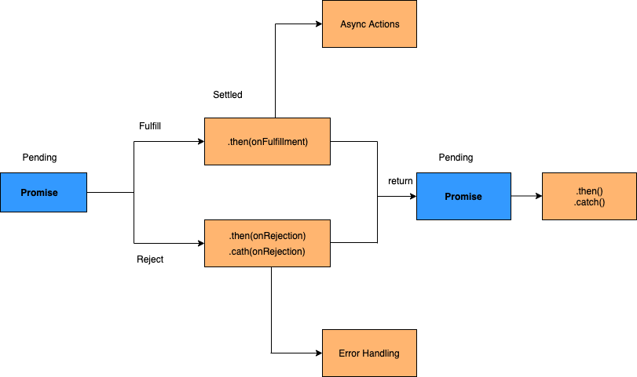
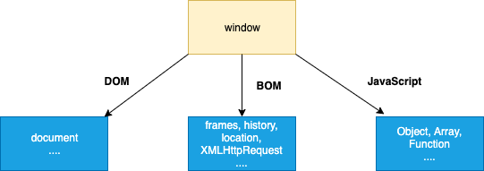
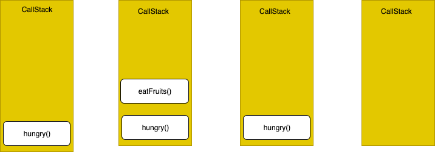
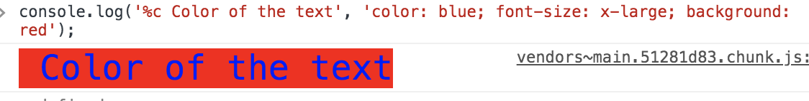
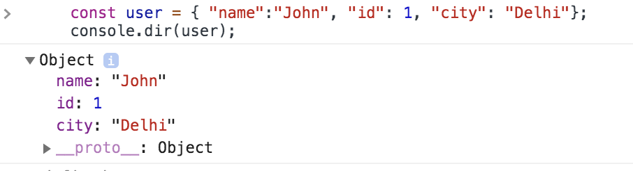
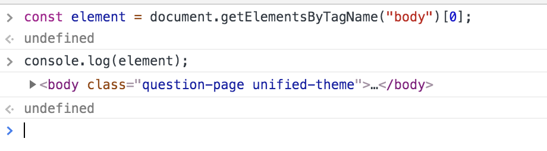
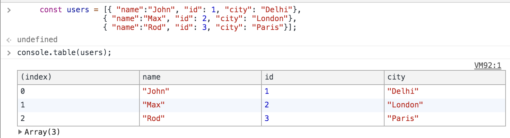
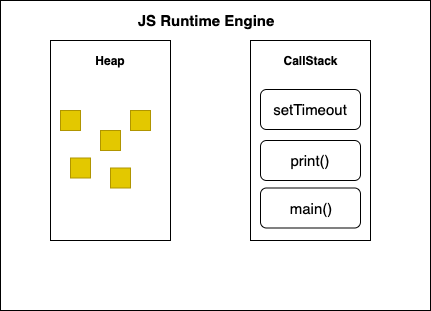
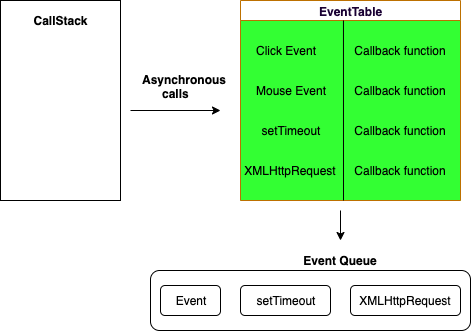
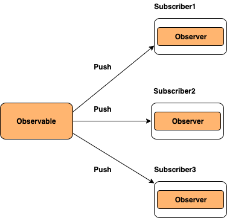

# JavaScript Interview Questions & Answers

> Click :star:if you like the project and follow [@SudheerJonna](https://twitter.com/SudheerJonna) for more updates. Coding questions available [here](#coding-exercise). PDF and Epub versions available at [actions tab](https://github.com/sudheerj/JavaScript-Interview-Questions/actions).

---

<p align="center">
  <a href=https://zerotomastery.io/?utm_source=github&utm_medium=sponsor&utm_campaign=javascript-interview-questions>
    
  </a>
  <p align="center">
    <ol>
    <li>Take this <a href=https://links.zerotomastery.io/jsp_sudheer>JavaScript Projects</a> course to go from a JS beginner to confidently building your own projects</li>
    <li>Take this <a href=https://links.zerotomastery.io/mci_sudheer2>coding interview bootcamp</a> if you’re serious about getting hired and don’t have a CS degree</li>
    <li>Take this <a href=https://links.zerotomastery.io/ajs_sudheer>Advanced JavaScript Course</a> to learn advanced JS concepts and become a top JS developer</li>
    </ol>
  </p>
</p>

---

### Table of Contents

| No. | Questions                                                                                                                                                     |
| --- | ------------------------------------------------------------------------------------------------------------------------------------------------------------- |
| 1   | [What are the possible ways to create objects in JavaScript](#what-are-the-possible-ways-to-create-objects-in-javascript)                                     |
| 2   | [What is a prototype chain](#what-is-a-prototype-chain)                                                                                                       |
| 3   | [What is the difference between Call, Apply and Bind](#what-is-the-difference-between-call-apply-and-bind)                                                    |
| 4   | [What is JSON and its common operations](#what-is-json-and-its-common-operations)                                                                             |
| 5   | [What is the purpose of the array slice method](#what-is-the-purpose-of-the-array-slice-method)                                                               |
| 6   | [What is the purpose of the array splice method](#what-is-the-purpose-of-the-array-splice-method)                                                             |
| 7   | [What is the difference between slice and splice](#what-is-the-difference-between-slice-and-splice)                                                           |
| 8   | [How do you compare an Object with a Map](#how-do-you-compare-object-and-map)                                                                                 |
| 9   | [What is the difference between == and === operators](#what-is-the-difference-between--and--operators)                                                        |
| 10  | [What are lambda or arrow functions](#what-are-lambda-or-arrow-functions)                                                                                     |
| 11  | [What is a first class function](#what-is-a-first-class-function)                                                                                             |
| 12  | [What is a first order function](#what-is-a-first-order-function)                                                                                             |
| 13  | [What is a higher order function](#what-is-a-higher-order-function)                                                                                           |
| 14  | [What is a unary function](#what-is-a-unary-function)                                                                                                         |
| 15  | [What is the currying function](#what-is-the-currying-function)                                                                                               |
| 16  | [What is a pure function](#what-is-a-pure-function)                                                                                                           |
| 17  | [What is the purpose of the let keyword](#what-is-the-purpose-of-the-let-keyword)                                                                             |
| 18  | [What is the difference between let and var](#what-is-the-difference-between-let-and-var)                                                                     |
| 19  | [What is the reason to choose the name let as a keyword](#what-is-the-reason-to-choose-the-name-let-as-a-keyword)                                             |
| 20  | [How do you redeclare variables in switch block without an error](#how-do-you-redeclare-variables-in-switch-block-without-an-error)                           |
| 21  | [What is the Temporal Dead Zone](#what-is-the-temporal-dead-zone)                                                                                             |
| 22  | [What is IIFE(Immediately Invoked Function Expression)](#what-is-iifeimmediately-invoked-function-expression)                                                 |
| 23  | [How do you decode or encode a URL in JavaScript?](#how-do-you-decode-or-encode-a-url-in-javascript)                                                          |
| 24  | [What is memoization](#what-is-memoization)                                                                                                                   |
| 25  | [What is Hoisting](#what-is-hoisting)                                                                                                                         |
| 26  | [What are classes in ES6](#what-are-classes-in-es6)                                                                                                           |
| 27  | [What are closures](#what-are-closures)                                                                                                                       |
| 28  | [What are modules](#what-are-modules)                                                                                                                         |
| 29  | [Why do you need modules](#why-do-you-need-modules)                                                                                                           |
| 30  | [What is scope in javascript](#what-is-scope-in-javascript)                                                                                                   |
| 31  | [What is a service worker](#what-is-a-service-worker)                                                                                                         |
| 32  | [How do you manipulate DOM using a service worker](#how-do-you-manipulate-dom-using-a-service-worker)                                                         |
| 33  | [How do you reuse information across service worker restarts](#how-do-you-reuse-information-across-service-worker-restarts)                                   |
| 34  | [What is IndexedDB](#what-is-indexeddb)                                                                                                                       |
| 35  | [What is web storage](#what-is-web-storage)                                                                                                                   |
| 36  | [What is a post message](#what-is-a-post-message)                                                                                                             |
| 37  | [What is a cookie](#what-is-a-cookie)                                                                                                                         |
| 38  | [Why do you need a Cookie](#why-do-you-need-a-cookie)                                                                                                         |
| 39  | [What are the options in a cookie](#what-are-the-options-in-a-cookie)                                                                                         |
| 40  | [How do you delete a cookie](#how-do-you-delete-a-cookie)                                                                                                     |
| 41  | [What are the differences between cookie, local storage and session storage](#What-are-the-differences-between-cookie-local-storage-and-session-storage)      |
| 42  | [What is the main difference between localStorage and sessionStorage](#what-is-the-main-difference-between-localstorage-and-sessionstorage)                   |
| 43  | [How do you access web storage](#how-do-you-access-web-storage)                                                                                               |
| 44  | [What are the methods available on session storage](#what-are-the-methods-available-on-session-storage)                                                       |
| 45  | [What is a storage event and its event handler](#what-is-a-storage-event-and-its-event-handler)                                                               |
| 46  | [Why do you need web storage](#why-do-you-need-web-storage)                                                                                                   |
| 47  | [How do you check web storage browser support](#how-do-you-check-web-storage-browser-support)                                                                 |
| 48  | [How do you check web workers browser support](#how-do-you-check-web-workers-browser-support)                                                                 |
| 49  | [Give an example of a web worker](#give-an-example-of-a-web-worker)                                                                                           |
| 50  | [What are the restrictions of web workers on DOM](#what-are-the-restrictions-of-web-workers-on-dom)                                                           |
| 51  | [What is a promise](#what-is-a-promise)                                                                                                                       |
| 52  | [Why do you need a promise](#why-do-you-need-a-promise)                                                                                                       |
| 53  | [What are the three states of promise](#what-are-the-three-states-of-promise)                                                                                 |
| 54  | [What is a callback function](#what-is-a-callback-function)                                                                                                   |
| 55  | [Why do we need callbacks](#why-do-we-need-callbacks)                                                                                                         |
| 56  | [What is a callback hell](#what-is-a-callback-hell)                                                                                                           |
| 57  | [What are server-sent events](#what-are-server-sent-events)                                                                                                   |
| 58  | [How do you receive server-sent event notifications](#how-do-you-receive-server-sent-event-notifications)                                                     |
| 59  | [How do you check browser support for server-sent events](#how-do-you-check-browser-support-for-server-sent-events)                                           |
| 60  | [What are the events available for server sent events](#what-are-the-events-available-for-server-sent-events)                                                 |
| 61  | [What are the main rules of promise](#what-are-the-main-rules-of-promise)                                                                                     |
| 62  | [What is callback in callback](#what-is-callback-in-callback)                                                                                                 |
| 63  | [What is promise chaining](#what-is-promise-chaining)                                                                                                         |
| 64  | [What is promise.all](#what-is-promiseall)                                                                                                                    |
| 65  | [What is the purpose of the race method in promise](#what-is-the-purpose-of-the-race-method-in-promise)                                                       |
| 66  | [What is a strict mode in javascript](#what-is-a-strict-mode-in-javascript)                                                                                   |
| 67  | [Why do you need strict mode](#why-do-you-need-strict-mode)                                                                                                   |
| 68  | [How do you declare strict mode](#how-do-you-declare-strict-mode)                                                                                             |
| 69  | [What is the purpose of double exclamation](#what-is-the-purpose-of-double-exclamation)                                                                       |
| 70  | [What is the purpose of the delete operator](#what-is-the-purpose-of-the-delete-operator)                                                                     |
| 71  | [What is typeof operator](#what-is-typeof-operator)                                                                                                           |
| 72  | [What is undefined property](#what-is-undefined-property)                                                                                                     |
| 73  | [What is null value](#what-is-null-value)                                                                                                                     |
| 74  | [What is the difference between null and undefined](#what-is-the-difference-between-null-and-undefined)                                                       |
| 75  | [What is eval](#What-is-eval)                                                                                                                                 |
| 76  | [What is the difference between window and document](#what-is-the-difference-between-window-and-document)                                                     |
| 77  | [How do you access history in javascript](#how-do-you-access-history-in-javascript)                                                                           |
| 78  | [How do you detect caps lock key turned on or not](#how-do-you-detect-caps-lock-key-turned-on-or-not)                                                         |
| 79  | [What is isNaN](#what-is-isnan)                                                                                                                               |
| 80  | [What are the differences between undeclared and undefined variables](#what-are-the-differences-between-undeclared-and-undefined-variables)                   |
| 81  | [What are global variables](#what-are-global-variables)                                                                                                       |
| 82  | [What are the problems with global variables](#what-are-the-problems-with-global-variables)                                                                   |
| 83  | [What is NaN property](#what-is-nan-property)                                                                                                                 |
| 84  | [What is the purpose of isFinite function](#what-is-the-purpose-of-isfinite-function)                                                                         |
| 85  | [What is an event flow](#what-is-an-event-flow)                                                                                                               |
| 86  | [What is event bubbling](#what-is-event-bubbling)                                                                                                             |
| 87  | [What is event capturing](#what-is-event-capturing)                                                                                                           |
| 88  | [How do you submit a form using JavaScript](#how-do-you-submit-a-form-using-javascript)                                                                       |
| 89  | [How do you find operating system details](#how-do-you-find-operating-system-details)                                                                         |
| 90  | [What is the difference between document load and DOMContentLoaded events](#what-is-the-difference-between-document-load-and-domcontentloaded-events)         |
| 91  | [What is the difference between native, host and user objects](#what-is-the-difference-between-native-host-and-user-objects)                                  |
| 92  | [What are the tools or techniques used for debugging JavaScript code](#what-are-the-tools-or-techniques-used-for-debugging-javascript-code)                   |
| 93  | [What are the pros and cons of promises over callbacks](#what-are-the-pros-and-cons-of-promises-over-callbacks)                                               |
| 94  | [What is the difference between an attribute and a property](#what-is-the-difference-between-an-attribute-and-a-property)                                     |
| 95  | [What is same-origin policy](#what-is-same-origin-policy)                                                                                                     |
| 96  | [What is the purpose of void 0](#what-is-the-purpose-of-void-0)                                                                                               |
| 97  | [Is JavaScript a compiled or interpreted language](#is-javascript-a-compiled-or-interpreted-language)                                                         |
| 98  | [Is JavaScript a case-sensitive language](#is-javascript-a-case-sensitive-language)                                                                           |
| 99  | [Is there any relation between Java and JavaScript](#is-there-any-relation-between-java-and-javascript)                                                       |
| 100 | [What are events](#what-are-events)                                                                                                                           |
| 101 | [Who created javascript](#who-created-javascript)                                                                                                             |
| 102 | [What is the use of preventDefault method](#what-is-the-use-of-preventdefault-method)                                                                         |
| 103 | [What is the use of stopPropagation method](#what-is-the-use-of-stoppropagation-method)                                                                       |
| 104 | [What are the steps involved in return false usage](#what-are-the-steps-involved-in-return-false-usage)                                                       |
| 105 | [What is BOM](#what-is-bom)                                                                                                                                   |
| 106 | [What is the use of setTimeout](#what-is-the-use-of-settimeout)                                                                                               |
| 107 | [What is the use of setInterval](#what-is-the-use-of-setinterval)                                                                                             |
| 108 | [Why is JavaScript treated as Single threaded](#why-is-javascript-treated-as-single-threaded)                                                                 |
| 109 | [What is an event delegation](#what-is-an-event-delegation)                                                                                                   |
| 110 | [What is ECMAScript](#what-is-ecmascript)                                                                                                                     |
| 111 | [What is JSON](#what-is-json)                                                                                                                                 |
| 112 | [What are the syntax rules of JSON](#what-are-the-syntax-rules-of-json)                                                                                       |
| 113 | [What is the purpose JSON stringify](#what-is-the-purpose-json-stringify)                                                                                     |
| 114 | [How do you parse JSON string](#how-do-you-parse-json-string)                                                                                                 |
| 115 | [Why do you need JSON](#why-do-you-need-json)                                                                                                                 |
| 116 | [What are PWAs](#what-are-pwas)                                                                                                                               |
| 117 | [What is the purpose of clearTimeout method](#what-is-the-purpose-of-cleartimeout-method)                                                                     |
| 118 | [What is the purpose of clearInterval method](#what-is-the-purpose-of-clearinterval-method)                                                                   |
| 119 | [How do you redirect new page in javascript](#how-do-you-redirect-new-page-in-javascript)                                                                     |
| 120 | [How do you check whether a string contains a substring](#how-do-you-check-whether-a-string-contains-a-substring)                                             |
| 121 | [How do you validate an email in javascript](#how-do-you-validate-an-email-in-javascript)                                                                     |
| 122 | [How do you get the current url with javascript](#how-do-you-get-the-current-url-with-javascript)                                                             |
| 123 | [What are the various url properties of location object](#what-are-the-various-url-properties-of-location-object)                                             |
| 124 | [How do get query string values in javascript](#how-do-get-query-string-values-in-javascript)                                                                 |
| 125 | [How do you check if a key exists in an object](#how-do-you-check-if-a-key-exists-in-an-object)                                                               |
| 126 | [How do you loop through or enumerate javascript object](#how-do-you-loop-through-or-enumerate-javascript-object)                                             |
| 127 | [How do you test for an empty object](#how-do-you-test-for-an-empty-object)                                                                                   |
| 128 | [What is an arguments object](#what-is-an-arguments-object)                                                                                                   |
| 129 | [How do you convert the first letter of a string to uppercase](#how-do-you-make-first-letter-of-the-string-in-an-uppercase)                                   |
| 130 | [What are the pros and cons of for loop](#what-are-the-pros-and-cons-of-for-loop)                                                                             |
| 131 | [How do you display the current date in javascript](#how-do-you-display-the-current-date-in-javascript)                                                       |
| 132 | [How do you compare two date objects](#how-do-you-compare-two-date-objects)                                                                                   |
| 133 | [How do you check if a string starts with another string](#how-do-you-check-if-a-string-starts-with-another-string)                                           |
| 134 | [How do you trim a string in javascript](#how-do-you-trim-a-string-in-javascript)                                                                             |
| 135 | [How do you add a key value pair in javascript](#how-do-you-add-a-key-value-pair-in-javascript)                                                               |
| 136 | [Is the '!--' notation represents a special operator](#is-the----notation-represents-a-special-operator)                                                      |
| 137 | [How do you assign default values to variables](#how-do-you-assign-default-values-to-variables)                                                               |
| 138 | [How do you define multiline strings](#how-do-you-define-multiline-strings)                                                                                   |
| 139 | [What is an app shell model](#what-is-an-app-shell-model)                                                                                                     |
| 140 | [Can we define properties for functions](#can-we-define-properties-for-functions)                                                                             |
| 141 | [What is the way to find the number of parameters expected by a function](#what-is-the-way-to-find-the-number-of-parameters-expected-by-a-function)           |
| 142 | [What is a polyfill](#what-is-a-polyfill)                                                                                                                     |
| 143 | [What are break and continue statements](#what-are-break-and-continue-statements)                                                                             |
| 144 | [What are js labels](#what-are-js-labels)                                                                                                                     |
| 145 | [What are the benefits of keeping declarations at the top](#what-are-the-benefits-of-keeping-declarations-at-the-top)                                         |
| 146 | [What are the benefits of initializing variables](#what-are-the-benefits-of-initializing-variables)                                                           |
| 147 | [What are the recommendations to create new object](#what-are-the-recommendations-to-create-new-object)                                                       |
| 148 | [How do you define JSON arrays](#how-do-you-define-json-arrays)                                                                                               |
| 149 | [How do you generate random integers](#how-do-you-generate-random-integers)                                                                                   |
| 150 | [Can you write a random integers function to print integers with in a range](#can-you-write-a-random-integers-function-to-print-integers-with-in-a-range)     |
| 151 | [What is tree shaking](#what-is-tree-shaking)                                                                                                                 |
| 152 | [What is the need of tree shaking](#what-is-the-need-of-tree-shaking)                                                                                         |
| 153 | [Is it recommended to use eval](#is-it-recommended-to-use-eval)                                                                                               |
| 154 | [What is a Regular Expression](#what-is-a-regular-expression)                                                                                                 |
| 155 | [What are the string methods available in Regular expression](#what-are-the-string-methods-available-in-regular-expression)                                   |
| 156 | [What are modifiers in regular expression](#what-are-modifiers-in-regular-expression)                                                                         |
| 157 | [What are regular expression patterns](#what-are-regular-expression-patterns)                                                                                 |
| 158 | [What is a RegExp object](#what-is-a-regexp-object)                                                                                                           |
| 159 | [How do you search a string for a pattern](#how-do-you-search-a-string-for-a-pattern)                                                                         |
| 160 | [What is the purpose of exec method](#what-is-the-purpose-of-exec-method)                                                                                     |
| 161 | [How do you change the style of a HTML element](#how-do-you-change-the-style-of-a-html-element)                                                               |
| 162 | [What would be the result of 1+2+'3'](#what-would-be-the-result-of-123)                                                                                       |
| 163 | [What is a debugger statement](#what-is-a-debugger-statement)                                                                                                 |
| 164 | [What is the purpose of breakpoints in debugging](#what-is-the-purpose-of-breakpoints-in-debugging)                                                           |
| 165 | [Can I use reserved words as identifiers](#can-i-use-reserved-words-as-identifiers)                                                                           |
| 166 | [How do you detect a mobile browser](#how-do-you-detect-a-mobile-browser)                                                                                     |
| 167 | [How do you detect a mobile browser without regexp](#how-do-you-detect-a-mobile-browser-without-regexp)                                                       |
| 168 | [How do you get the image width and height using JS](#how-do-you-get-the-image-width-and-height-using-js)                                                     |
| 169 | [How do you make synchronous HTTP request](#how-do-you-make-synchronous-http-request)                                                                         |
| 170 | [How do you make asynchronous HTTP request](#how-do-you-make-asynchronous-http-request)                                                                       |
| 171 | [How do you convert date to another timezone in javascript](#how-do-you-convert-date-to-another-timezone-in-javascript)                                       |
| 172 | [What are the properties used to get size of window](#what-are-the-properties-used-to-get-size-of-window)                                                     |
| 173 | [What is a conditional operator in javascript](#what-is-a-conditional-operator-in-javascript)                                                                 |
| 174 | [Can you apply chaining on conditional operator](#Can-you-apply-chaining-on-conditional-operator)                                                             |
| 175 | [What are the ways to execute javascript after page load](#what-are-the-ways-to-execute-javascript-after-page-load)                                           |
| 176 | [What is the difference between proto and prototype](#what-is-the-difference-between-proto-and-prototype)                                                     |
| 177 | [Give an example where do you really need semicolon](#give-an-example-where-do-you-really-need-semicolon)                                                     |
| 178 | [What is a freeze method](#what-is-a-freeze-method)                                                                                                           |
| 179 | [What is the purpose of freeze method](#what-is-the-purpose-of-freeze-method)                                                                                 |
| 180 | [Why do I need to use freeze method](#why-do-i-need-to-use-freeze-method)                                                                                     |
| 181 | [How do you detect a browser language preference](#how-do-you-detect-a-browser-language-preference)                                                           |
| 182 | [How to convert string to title case with javascript](#how-to-convert-string-to-title-case-with-javascript)                                                   |
| 183 | [How do you detect javascript disabled in the page](#how-do-you-detect-javascript-disabled-in-the-page)                                                       |
| 184 | [What are various operators supported by javascript](#what-are-various-operators-supported-by-javascript)                                                     |
| 185 | [What is a rest parameter](#what-is-a-rest-parameter)                                                                                                         |
| 186 | [What happens if you do not use rest parameter as a last argument](#what-happens-if-you-do-not-use-rest-parameter-as-a-last-argument)                         |
| 187 | [What are the bitwise operators available in javascript](#what-are-the-bitwise-operators-available-in-javascript)                                             |
| 188 | [What is a spread operator](#what-is-a-spread-operator)                                                                                                       |
| 189 | [How do you determine whether object is frozen or not](#how-do-you-determine-whether-object-is-frozen-or-not)                                                 |
| 190 | [How do you determine two values same or not using object](#how-do-you-determine-two-values-same-or-not-using-object)                                         |
| 191 | [What is the purpose of using object is method](#what-is-the-purpose-of-using-object-is-method)                                                               |
| 192 | [How do you copy properties from one object to other](#how-do-you-copy-properties-from-one-object-to-other)                                                   |
| 193 | [What are the applications of assign method](#what-are-the-applications-of-assign-method)                                                                     |
| 194 | [What is a proxy object](#what-is-a-proxy-object)                                                                                                             |
| 195 | [What is the purpose of seal method](#what-is-the-purpose-of-seal-method)                                                                                     |
| 196 | [What are the applications of seal method](#what-are-the-applications-of-seal-method)                                                                         |
| 197 | [What are the differences between freeze and seal methods](#what-are-the-differences-between-freeze-and-seal-methods)                                         |
| 198 | [How do you determine if an object is sealed or not](#how-do-you-determine-if-an-object-is-sealed-or-not)                                                     |
| 199 | [How do you get enumerable key and value pairs](#how-do-you-get-enumerable-key-and-value-pairs)                                                               |
| 200 | [What is the main difference between Object.values and Object.entries method](#what-is-the-main-difference-between-objectvalues-and-objectentries-method)     |
| 201 | [How can you get the list of keys of any object](#how-can-you-get-the-list-of-keys-of-any-object)                                                             |
| 202 | [How do you create an object with prototype](#how-do-you-create-an-object-with-prototype)                                                                     |
| 203 | [What is a WeakSet](#what-is-a-weakset)                                                                                                                       |
| 204 | [What are the differences between a WeakSet and a Set](#what-are-the-differences-between-weakset-and-set)                                                     |
| 205 | [List down the collection of methods available on WeakSet](#list-down-the-collection-of-methods-available-on-weakset)                                         |
| 206 | [What is a WeakMap](#what-is-a-weakmap)                                                                                                                       |
| 207 | [What are the differences between a WeakMap and a Map](#what-are-the-differences-between-weakmap-and-map)                                                     |
| 208 | [List down the collection of methods available on WeakMap](#list-down-the-collection-of-methods-available-on-weakmap)                                         |
| 209 | [What is the purpose of uneval](#what-is-the-purpose-of-uneval)                                                                                               |
| 210 | [How do you encode an URL](#how-do-you-encode-an-url)                                                                                                         |
| 211 | [How do you decode an URL](#how-do-you-decode-an-url)                                                                                                         |
| 212 | [How do you print the contents of web page](#how-do-you-print-the-contents-of-web-page)                                                                       |
| 213 | [What is the difference between uneval and eval](#what-is-the-difference-between-uneval-and-eval)                                                             |
| 214 | [What is an anonymous function](#what-is-an-anonymous-function)                                                                                               |
| 215 | [What is the precedence order between local and global variables](#what-is-the-precedence-order-between-local-and-global-variables)                           |
| 216 | [What are javascript accessors](#what-are-javascript-accessors)                                                                                               |
| 217 | [How do you define property on Object constructor](#how-do-you-define-property-on-object-constructor)                                                         |
| 218 | [What is the difference between get and defineProperty](#what-is-the-difference-between-get-and-defineproperty)                                               |
| 219 | [What are the advantages of Getters and Setters](#what-are-the-advantages-of-getters-and-setters)                                                             |
| 220 | [Can I add getters and setters using defineProperty method](#can-i-add-getters-and-setters-using-defineproperty-method)                                       |
| 221 | [What is the purpose of switch-case](#what-is-the-purpose-of-switch-case)                                                                                     |
| 222 | [What are the conventions to be followed for the usage of switch case](#what-are-the-conventions-to-be-followed-for-the-usage-of-switch-case)                 |
| 223 | [What are primitive data types](#what-are-primitive-data-types)                                                                                               |
| 224 | [What are the different ways to access object properties](#what-are-the-different-ways-to-access-object-properties)                                           |
| 225 | [What are the function parameter rules](#what-are-the-function-parameter-rules)                                                                               |
| 226 | [What is an error object](#what-is-an-error-object)                                                                                                           |
| 227 | [When you get a syntax error](#when-you-get-a-syntax-error)                                                                                                   |
| 228 | [What are the different error names from error object](#what-are-the-different-error-names-from-error-object)                                                 |
| 229 | [What are the various statements in error handling](#what-are-the-various-statements-in-error-handling)                                                       |
| 230 | [What are the two types of loops in javascript](#what-are-the-two-types-of-loops-in-javascript)                                                               |
| 231 | [What is nodejs](#what-is-nodejs)                                                                                                                             |
| 232 | [What is an Intl object](#what-is-an-intl-object)                                                                                                             |
| 233 | [How do you perform language specific date and time formatting](#how-do-you-perform-language-specific-date-and-time-formatting)                               |
| 234 | [What is an Iterator](#what-is-an-iterator)                                                                                                                   |
| 235 | [How does the synchronous iteration work](#how-does-synchronous-iteration-works)                                                                              |
| 236 | [What is an event loop](#what-is-an-event-loop)                                                                                                               |
| 237 | [What is call stack](#what-is-call-stack)                                                                                                                     |
| 238 | [What is an event queue](#what-is-an-event-queue)                                                                                                             |
| 239 | [What is a decorator](#what-is-a-decorator)                                                                                                                   |
| 240 | [What are the properties of Intl object](#what-are-the-properties-of-intl-object)                                                                             |
| 241 | [What is an Unary operator](#what-is-an-unary-operator)                                                                                                       |
| 242 | [How do you sort elements in an array](#how-do-you-sort-elements-in-an-array)                                                                                 |
| 243 | [What is the purpose of compareFunction while sorting arrays](#what-is-the-purpose-of-comparefunction-while-sorting-arrays)                                   |
| 244 | [How do you reversing an array](#how-do-you-reversing-an-array)                                                                                               |
| 245 | [How do you find min and max value in an array](#how-do-you-find-min-and-max-value-in-an-array)                                                               |
| 246 | [How do you find min and max values without Math functions](#how-do-you-find-min-and-max-values-without-math-functions)                                       |
| 247 | [What is an empty statement and purpose of it](#what-is-an-empty-statement-and-purpose-of-it)                                                                 |
| 248 | [How do you get metadata of a module](#how-do-you-get-metadata-of-a-module)                                                                                   |
| 249 | [What is a comma operator](#what-is-a-comma-operator)                                                                                                         |
| 250 | [What is the advantage of a comma operator](#what-is-the-advantage-of-a-comma-operator)                                                                       |
| 251 | [What is typescript](#what-is-typescript)                                                                                                                     |
| 252 | [What are the differences between javascript and typescript](#what-are-the-differences-between-javascript-and-typescript)                                     |
| 253 | [What are the advantages of typescript over javascript](#what-are-the-advantages-of-typescript-over-javascript)                                               |
| 254 | [What is an object initializer](#what-is-an-object-initializer)                                                                                               |
| 255 | [What is a constructor method](#what-is-a-constructor-method)                                                                                                 |
| 256 | [What happens if you write constructor more than once in a class](#what-happens-if-you-write-constructor-more-than-once-in-a-class)                           |
| 257 | [How do you call the constructor of a parent class](#how-do-you-call-the-constructor-of-a-parent-class)                                                       |
| 258 | [How do you get the prototype of an object](#how-do-you-get-the-prototype-of-an-object)                                                                       |
| 259 | [What happens If I pass string type for getPrototype method](#what-happens-if-i-pass-string-type-for-getprototype-method)                                     |
| 260 | [How do you set prototype of one object to another](#how-do-you-set-prototype-of-one-object-to-another)                                                       |
| 261 | [How do you check whether an object can be extendable or not](#how-do-you-check-whether-an-object-can-be-extendable-or-not)                                   |
| 262 | [How do you prevent an object to extend](#how-do-you-prevent-an-object-to-extend)                                                                             |
| 263 | [What are the different ways to make an object non-extensible](#what-are-the-different-ways-to-make-an-object-non-extensible)                                 |
| 264 | [How do you define multiple properties on an object](#how-do-you-define-multiple-properties-on-an-object)                                                     |
| 265 | [What is MEAN in javascript](#what-is-mean-in-javascript)                                                                                                     |
| 266 | [What Is Obfuscation in javascript](#what-is-obfuscation-in-javascript)                                                                                       |
| 267 | [Why do you need Obfuscation](#why-do-you-need-obfuscation)                                                                                                   |
| 268 | [What is Minification](#what-is-minification)                                                                                                                 |
| 269 | [What are the advantages of minification](#what-are-the-advantages-of-minification)                                                                           |
| 270 | [What are the differences between Obfuscation and Encryption](#what-are-the-differences-between-obfuscation-and-encryption)                                   |
| 271 | [What are the common tools used for minification](#what-are-the-common-tools-used-for-minification)                                                           |
| 272 | [How do you perform form validation using javascript](#how-do-you-perform-form-validation-using-javascript)                                                   |
| 273 | [How do you perform form validation without javascript](#how-do-you-perform-form-validation-without-javascript)                                               |
| 274 | [What are the DOM methods available for constraint validation](#what-are-the-dom-methods-available-for-constraint-validation)                                 |
| 275 | [What are the available constraint validation DOM properties](#what-are-the-available-constraint-validation-dom-properties)                                   |
| 276 | [What are the list of validity properties](#what-are-the-list-of-validity-properties)                                                                         |
| 277 | [Give an example usage of rangeOverflow property](#give-an-example-usage-of-rangeoverflow-property)                                                           |
| 278 | [Is enums feature available in javascript](#is-enums-feature-available-in-javascript)                                                                         |
| 279 | [What is an enum](#What-is-an-enum)                                                                                                                           |
| 280 | [How do you list all properties of an object](#how-do-you-list-all-properties-of-an-object)                                                                   |
| 281 | [How do you get property descriptors of an object](#how-do-you-get-property-descriptors-of-an-object)                                                         |
| 282 | [What are the attributes provided by a property descriptor](#what-are-the-attributes-provided-by-a-property-descriptor)                                       |
| 283 | [How do you extend classes](#how-do-you-extend-classes)                                                                                                       |
| 284 | [How do I modify the url without reloading the page](#how-do-i-modify-the-url-without-reloading-the-page)                                                     |
| 285 | [How do you check whether an array includes a particular value or not](#how-do-you-check-whether-an-array-includes-a-particular-value-or-not)                 |
| 286 | [How do you compare scalar arrays](#how-do-you-compare-scalar-arrays)                                                                                         |
| 287 | [How to get the value from get parameters](#how-to-get-the-value-from-get-parameters)                                                                         |
| 288 | [How do you print numbers with commas as thousand separators](#how-do-you-print-numbers-with-commas-as-thousand-separators)                                   |
| 289 | [What is the difference between java and javascript](#what-is-the-difference-between-java-and-javascript)                                                     |
| 290 | [Does javascript supports namespace](#does-javascript-supports-namespace)                                                                                     |
| 291 | [How do you declare namespace](#how-do-you-declare-namespace)                                                                                                 |
| 292 | [How do you invoke javascript code in an iframe from parent page](#how-do-you-invoke-javascript-code-in-an-iframe-from-parent-page)                           |
| 293 | [How do get the timezone offset from date](#how-do-get-the-timezone-offset-from-date)                                                                         |
| 294 | [How do you load CSS and JS files dynamically](#how-do-you-load-css-and-js-files-dynamically)                                                                 |
| 295 | [What are the different methods to find HTML elements in DOM](#what-are-the-different-methods-to-find-html-elements-in-dom)                                   |
| 296 | [What is jQuery](#what-is-jquery)                                                                                                                             |
| 297 | [What is V8 JavaScript engine](#what-is-v8-javascript-engine)                                                                                                 |
| 298 | [Why do we call javascript as dynamic language](#why-do-we-call-javascript-as-dynamic-language)                                                               |
| 299 | [What is a void operator](#what-is-a-void-operator)                                                                                                           |
| 300 | [How to set the cursor to wait](#how-to-set-the-cursor-to-wait)                                                                                               |
| 301 | [How do you create an infinite loop](#how-do-you-create-an-infinite-loop)                                                                                     |
| 302 | [Why do you need to avoid with statement](#why-do-you-need-to-avoid-with-statement)                                                                           |
| 303 | [What is the output of below for loops](#what-is-the-output-of-below-for-loops)                                                                               |
| 304 | [List down some of the features of ES6](#list-down-some-of-the-features-of-es6)                                                                               |
| 305 | [What is ES6](#what-is-es6)                                                                                                                                   |
| 306 | [Can I redeclare let and const variables](#can-I-redeclare-let-and-const-variables)                                                                           |
| 307 | [Is const variable makes the value immutable](#is-const-variable-makes-the-value-immutable)                                                                   |
| 308 | [What are default parameters](#what-are-default-parameters)                                                                                                   |
| 309 | [What are template literals](#what-are-template-literals)                                                                                                     |
| 310 | [How do you write multi-line strings in template literals](#how-do-you-write-multi-line-strings-in-template-literals)                                         |
| 311 | [What are nesting templates](#what-are-nesting-templates)                                                                                                     |
| 312 | [What are tagged templates](#what-are-tagged-templates)                                                                                                       |
| 313 | [What are raw strings](#what-are-raw-strings)                                                                                                                 |
| 314 | [What is destructuring assignment](#what-is-destructuring-assignment)                                                                                         |
| 315 | [What are default values in destructuring assignment](#what-are-default-values-in-destructuring-assignment)                                                   |
| 316 | [How do you swap variables in destructuring assignment](#how-do-you-swap-variables-in-destructuring-assignment)                                               |
| 317 | [What are enhanced object literals](#what-are-enhanced-object-literals)                                                                                       |
| 318 | [What are dynamic imports](#what-are-dynamic-imports)                                                                                                         |
| 319 | [What are the use cases for dynamic imports](#what-are-the-use-cases-for-dynamic-imports)                                                                     |
| 320 | [What are typed arrays](#what-are-typed-arrays)                                                                                                               |
| 321 | [What are the advantages of module loaders](#what-are-the-advantages-of-module-loaders)                                                                       |
| 322 | [What is collation](#what-is-collation)                                                                                                                       |
| 323 | [What is for...of statement](#what-is-forof-statement)                                                                                                        |
| 324 | [What is the output of below spread operator array](#what-is-the-output-of-below-spread-operator-array)                                                       |
| 325 | [Is PostMessage secure](#is-postmessage-secure)                                                                                                               |
| 326 | [What are the problems with postmessage target origin as wildcard](#what-are-the-problems-with-postmessage-target-origin-as-wildcard)                         |
| 327 | [How do you avoid receiving postMessages from attackers](#how-do-you-avoid-receiving-postmessages-from-attackers)                                             |
| 328 | [Can I avoid using postMessages completely](#can-i-avoid-using-postmessages-completely)                                                                       |
| 329 | [Is postMessages synchronous](#is-postmessages-synchronous)                                                                                                   |
| 330 | [What paradigm is Javascript](#what-paradigm-is-javascript)                                                                                                   |
| 331 | [What is the difference between internal and external javascript](#what-is-the-difference-between-internal-and-external-javascript)                           |
| 332 | [Is JavaScript faster than server side script](#is-javascript-faster-than-server-side-script)                                                                 |
| 333 | [How do you get the status of a checkbox](#how-do-you-get-the-status-of-a-checkbox)                                                                           |
| 334 | [What is the purpose of double tilde operator](#what-is-the-purpose-of-double-tilde-operator)                                                                 |
| 335 | [How do you convert character to ASCII code](#how-do-you-convert-character-to-ascii-code)                                                                     |
| 336 | [What is ArrayBuffer](#what-is-arraybuffer)                                                                                                                   |
| 337 | [What is the output of below string expression](#what-is-the-output-of-below-string-expression)                                                               |
| 338 | [What is the purpose of Error object](#what-is-the-purpose-of-error-object)                                                                                   |
| 339 | [What is the purpose of EvalError object](#what-is-the-purpose-of-evalerror-object)                                                                           |
| 340 | [What are the list of cases error thrown from non-strict mode to strict mode](#what-are-the-list-of-cases-error-thrown-from-non-strict-mode-to-strict-mode)   |
| 341 | [Do all objects have prototypes](#do-all-objects-have-prototypes)                                                                                             |
| 342 | [What is the difference between a parameter and an argument](#what-is-the-difference-between-a-parameter-and-an-argument)                                     |
| 343 | [What is the purpose of some method in arrays](#what-is-the-purpose-of-some-method-in-arrays)                                                                 |
| 344 | [How do you combine two or more arrays](#how-do-you-combine-two-or-more-arrays)                                                                               |
| 345 | [What is the difference between Shallow and Deep copy](#what-is-the-difference-between-shallow-and-deep-copy)                                                 |
| 346 | [How do you create specific number of copies of a string](#how-do-you-create-specific-number-of-copies-of-a-string)                                           |
| 347 | [How do you return all matching strings against a regular expression](#how-do-you-return-all-matching-strings-against-a-regular-expression)                   |
| 348 | [How do you trim a string at the beginning or ending](#how-do-you-trim-a-string-at-the-beginning-or-ending)                                                   |
| 349 | [What is the output of below console statement with unary operator](#what-is-the-output-of-below-console-statement-with-unary-operator)                       |
| 350 | [Does javascript uses mixins](#does-javascript-uses-mixins)                                                                                                   |
| 351 | [What is a thunk function](#what-is-a-thunk-function)                                                                                                         |
| 352 | [What are asynchronous thunks](#what-are-asynchronous-thunks)                                                                                                 |
| 353 | [What is the output of below function calls](#what-is-the-output-of-below-function-calls)                                                                     |
| 354 | [How to remove all line breaks from a string](#how-to-remove-all-line-breaks-from-a-string)                                                                   |
| 355 | [What is the difference between reflow and repaint](#what-is-the-difference-between-reflow-and-repaint)                                                       |
| 356 | [What happens with negating an array](#what-happens-with-negating-an-array)                                                                                   |
| 357 | [What happens if we add two arrays](#what-happens-if-we-add-two-arrays)                                                                                       |
| 358 | [What is the output of prepend additive operator on falsy values](#what-is-the-output-of-prepend-additive-operator-on-falsy-values)                           |
| 359 | [How do you create self string using special characters](#how-do-you-create-self-string-using-special-characters)                                             |
| 360 | [How do you remove falsy values from an array](#how-do-you-remove-falsy-values-from-an-array)                                                                 |
| 361 | [How do you get unique values of an array](#how-do-you-get-unique-values-of-an-array)                                                                         |
| 362 | [What is destructuring aliases](#what-is-destructuring-aliases)                                                                                               |
| 363 | [How do you map the array values without using map method](#how-do-you-map-the-array-values-without-using-map-method)                                         |
| 364 | [How do you empty an array](#how-do-you-empty-an-array)                                                                                                       |
| 365 | [How do you round numbers to certain decimals](#how-do-you-rounding-numbers-to-certain-decimals)                                                              |
| 366 | [What is the easiest way to convert an array to an object](#what-is-the-easiest-way-to-convert-an-array-to-an-object)                                         |
| 367 | [How do you create an array with some data](#how-do-you-create-an-array-with-some-data)                                                                       |
| 368 | [What are the placeholders from console object](#what-are-the-placeholders-from-console-object)                                                               |
| 369 | [Is it possible to add CSS to console messages](#is-it-possible-to-add-css-to-console-messages)                                                               |
| 370 | [What is the purpose of dir method of console object](#what-is-the-purpose-of-dir-method-of-console-object)                                                   |
| 371 | [Is it possible to debug HTML elements in console](#is-it-possible-to-debug-html-elements-in-console)                                                         |
| 372 | [How do you display data in a tabular format using console object](#how-do-you-display-data-in-a-tabular-format-using-console-object)                         |
| 373 | [How do you verify that an argument is a Number or not](#how-do-you-verify-that-an-argument-is-a-number-or-not)                                               |
| 374 | [How do you create copy to clipboard button](#how-do-you-create-copy-to-clipboard-button)                                                                     |
| 375 | [What is the shortcut to get timestamp](#what-is-the-shortcut-to-get-timestamp)                                                                               |
| 376 | [How do you flattening multi dimensional arrays](#how-do-you-flattening-multi-dimensional-arrays)                                                             |
| 377 | [What is the easiest multi condition checking](#what-is-the-easiest-multi-condition-checking)                                                                 |
| 378 | [How do you capture browser back button](#how-do-you-capture-browser-back-button)                                                                             |
| 379 | [How do you disable right click in the web page](#how-do-you-disable-right-click-in-the-web-page)                                                             |
| 380 | [What are wrapper objects](#what-are-wrapper-objects)                                                                                                         |
| 381 | [What is AJAX](#what-is-ajax)                                                                                                                                 |
| 382 | [What are the different ways to deal with Asynchronous Code](#what-are-the-different-ways-to-deal-with-asynchronous-code)                                     |
| 383 | [How to cancel a fetch request](#how-to-cancel-a-fetch-request)                                                                                               |
| 384 | [What is web speech API](#what-is-web-speech-api)                                                                                                             |
| 385 | [What is minimum timeout throttling](#what-is-minimum-timeout-throttling)                                                                                     |
| 386 | [How do you implement zero timeout in modern browsers](#how-do-you-implement-zero-timeout-in-modern-browsers)                                                 |
| 387 | [What are tasks in event loop](#what-are-tasks-in-event-loop)                                                                                                 |
| 388 | [What is microtask](#what-is-microtask)                                                                                                                       |
| 389 | [What are different event loops](#what-are-different-event-loops)                                                                                             |
| 390 | [What is the purpose of queueMicrotask](#what-is-the-purpose-of-queuemicrotask)                                                                               |
| 391 | [How do you use javascript libraries in typescript file](#how-do-you-use-javascript-libraries-in-typescript-file)                                             |
| 392 | [What are the differences between promises and observables](#what-are-the-differences-between-promises-and-observables)                                       |
| 393 | [What is heap](#what-is-heap)                                                                                                                                 |
| 394 | [What is an event table](#what-is-an-event-table)                                                                                                             |
| 395 | [What is a microTask queue](#what-is-a-microtask-queue)                                                                                                       |
| 396 | [What is the difference between shim and polyfill](#what-is-the-difference-between-shim-and-polyfill)                                                         |
| 397 | [How do you detect primitive or non primitive value type](#how-do-you-detect-primitive-or-non-primitive-value-type)                                           |
| 398 | [What is babel](#what-is-babel)                                                                                                                               |
| 399 | [Is Node.js completely single threaded](#is-nodejs-completely-single-threaded)                                                                                |
| 400 | [What are the common use cases of observables](#what-are-the-common-use-cases-of-observables)                                                                 |
| 401 | [What is RxJS](#what-is-rxjs)                                                                                                                                 |
| 402 | [What is the difference between Function constructor and function declaration](#what-is-the-difference-between-function-constructor-and-function-declaration) |
| 403 | [What is a Short circuit condition](#what-is-a-short-circuit-condition)                                                                                       |
| 404 | [What is the easiest way to resize an array](#what-is-the-easiest-way-to-resize-an-array)                                                                     |
| 405 | [What is an observable](#what-is-an-observable)                                                                                                               |
| 406 | [What is the difference between function and class declarations](#what-is-the-difference-between-function-and-class-declarations)                             |
| 407 | [What is an async function](#what-is-an-async-function)                                                                                                       |
| 408 | [How do you prevent promises swallowing errors](#how-do-you-prevent-promises-swallowing-errors)                                                               |
| 409 | [What is deno](#what-is-deno)                                                                                                                                 |
| 410 | [How do you make an object iterable in javascript](#how-do-you-make-an-object-iterable-in-javascript)                                                         |
| 411 | [What is a Proper Tail Call](#what-is-a-proper-tail-call)                                                                                                     |
| 412 | [How do you check an object is a promise or not](#how-do-you-check-an-object-is-a-promise-or-not)                                                             |
| 413 | [How to detect if a function is called as constructor](#how-to-detect-if-a-function-is-called-as-constructor)                                                 |
| 414 | [What are the differences between arguments object and rest parameter](#what-are-the-differences-between-arguments-object-and-rest-parameter)                 |
| 415 | [What are the differences between spread operator and rest parameter](#what-are-the-differences-between-spread-operator-and-rest-parameter)                   |
| 416 | [What are the different kinds of generators](#what-are-the-different-kinds-of-generators)                                                                     |
| 417 | [What are the built-in iterables](#what-are-the-built-in-iterables)                                                                                           |
| 418 | [What are the differences between for...of and for...in statements](#what-are-the-differences-between-forof-and-forin-statements)                             |
| 419 | [How do you define instance and non-instance properties](#how-do-you-define-instance-and-non-instance-properties)                                             |
| 420 | [What is the difference between isNaN and Number.isNaN?](#what-is-the-difference-between-isnan-and-numberisnan)                                               |
| 421 | [How to invoke an IIFE without any extra brackets?](#how-to-invoke-an-iife-without-any-extra-brackets)                                                        |
| 422 | [Is that possible to use expressions in switch cases?](#is-that-possible-to-use-expressions-in-switch-cases)                                                  |
| 423 | [What is the easiest way to ignore promise errors?](#what-is-the-easiest-way-to-ignore-promise-errors)                                                        |
| 424 | [How do style the console output using CSS?](#how-do-style-the-console-output-using-css)                                                                      |
| 425 | [What is nullish coalescing operator (??)?](#what-is-nullish-coalescing-operator)                                                                             |
| 426 | [How do you group and nest console output?](#how-do-you-group-and-nest-console-output)                                                                        |
| 427 | [What is the difference between dense and sparse arrays?](#what-is-the-difference-between-dense-and-sparse-arrays)                                            |
| 428 | [What are the different ways to create sparse arrays?](#what-are-the-different-ways-to-create-sparse-arrays)                                                  |
| 429 | [What is the difference between setTimeout, setImmediate and process.nextTick?](#what-is-the-difference-between-settimeout-setimmediate-and-processnexttick)  |
| 430 | [How do you reverse an array without modifying original array?](#how-do-you-reverse-an-array-without-modifying-original-array)                                |
| 431 | [How do you create custom HTML element?](#how-do-you-create-custom-html-element)                                                                              |
| 432 | [What is global execution context?](#what-is-global-execution-context)                                                                                        |
| 433 | [What is function execution context?](#what-is-function-execution-context)                                                                                    |
| 434 | [What is debouncing?](#what-is-debouncing)                                                                                                                    |
| 435 | [What is throttling?](#what-is-throttling)                                                                                                                    |
| 436 | [What is optional chaining?](#what-is-optional-chaining)                                                                                                      |
| 437 | [What is an environment record?](#what-is-an-environment-record)                                                                                              |
| 438 | [How to verify if a variable is an array?](#how-to-verify-if-a-variable-is-an-array)                                                                          |
| 439 | [What is pass by value and pass by reference?](#what-is-pass-by-value-and-pass-by-reference)                                                                  |
| 440 | [What are the differences between primitives and non-primitives?](#what-are-the-differences-between-primitives-and-non-primitives)                            |
| 441 | [What are hidden classes?](#what-are-hidden-classes)                                                                                                          |
| 442 | [What is inline caching?](#what-is-inline-caching)                                                                                                            |
| 443 | [How do you create your own bind method using either call or apply method?](#how-do-you-create-your-own-bind-method-using-either-call-or-apply-method)        |
| 444 | [What are the differences between pure and impure functions?](#what-are-the-differences-between-pure-and-impure-functions?)                                   |
| 445 | [What is referential transparency?](#what-is-referential-transparency)                                                                                        |
| 446 | [What are the possible side-effects in javascript?](#what-are-the-possible-side-effects-in-javascript)                                                        |
| 447 | [What are compose and pipe functions?](#what-are-compose-and-pipe-functions)                                                                                  |
| 448 | [What is module pattern?](#what-is-module-pattern)                                                                                                            |
| 449 | [What is Function Composition?](#what-is-function-composition)                                                                                                |
| 450 | [How to use await outside of async function prior to ES2022?](#how-to-use-await-outside-of-async-function-prior-to-es2022)                                    |
| 451 | [What is the purpose of the this keyword in JavaScript?](#what_is_the_purpose_of_the_this_keyword_in_javascript?)                                             |

1. ### What are the possible ways to create objects in JavaScript

   There are many ways to create objects in javascript as mentioned below:

   1. **Object literal syntax:**

      The object literal syntax (or object initializer), is a comma-separated set of name-value pairs wrapped in curly braces.

      ```javascript
      var object = {
           name: "Sudheer",
           age: 34
      };

      Object literal property values can be of any data type, including array, function, and nested object.
      ```

      **Note:** This is one of the easiest ways to create an object.

   2. **Object constructor:**

      The simplest way to create an empty object is using the `Object` constructor. Currently this approach is not recommended.

      ```javascript
      var object = new Object();
      ```

      The `Object()` is a built-in constructor function so "new" keyword is not required. The above code snippet can be re-written as:

      ```javascript
      var object = Object();
      ```

   3. **Object's create method:**

      The create method of Object is used to create a new object by passing the specificied prototype object and properties as arguments, i.e., this pattern is helpful to create new objects based on existing objects.
      The second argument is optional and it is used to create properties on a newly created object.

      The following code creates a new empty object whose prototype is null.

      ```javascript
      var object = Object.create(null);
      ```

   4. **Function constructor:**

      In this approach, create any function and apply the new operator to create object instances.

      ```javascript
      function Person(name) {
        this.name = name;
        this.age = 21;
      }
      var object = new Person("Sudheer");
      ```

   5. **Function constructor with prototype:**

      This is similar to function constructor but it uses prototype for their properties and methods,

      ```javascript
      function Person() {}
      Person.prototype.name = "Sudheer";
      var object = new Person();
      ```

      This is equivalent to creating an instance with Object.create method with a function prototype and then calling that function with an instance and parameters as arguments.

      ```javascript
      function func() {}

      new func(x, y, z);
      ```

      **(OR)**

      ```javascript
      // Create a new instance using function prototype.
      var newInstance = Object.create(func.prototype)

      // Call the function
      var result = func.call(newInstance, x, y, z),

      // If the result is a non-null object then use it otherwise just use the new instance.
      console.log(result && typeof result === 'object' ? result : newInstance);
      ```

   6. **ES6 Class syntax:**

      ES6 introduces class feature to create objects.

      ```javascript
      class Person {
        constructor(name) {
          this.name = name;
        }
      }

      var object = new Person("Sudheer");
      ```

   7. **Singleton pattern:**

      A Singleton is an object which can only be instantiated one time. Repeated calls to its constructor return the same instance. This way one can ensure that they don't accidentally create multiple instances.

      ```javascript
      var object = new (function () {
        this.name = "Sudheer";
      })();
      ```

      **[⬆ Back to Top](#table-of-contents)**

2. ### What is a prototype chain

   **Prototype chaining** is used to build new types of objects based on existing ones. It is similar to inheritance in a class based language.

   The prototype on object instance is available through **Object.getPrototypeOf(object)** or **\_\_proto\_\_** property whereas prototype on constructors function is available through **Object.prototype**.

   

   **[⬆ Back to Top](#table-of-contents)**

3. ### What is the difference between Call, Apply and Bind

   The difference between Call, Apply and Bind can be explained with below examples,

   **Call:** The call() method invokes a function with a given `this` value and arguments provided one by one

   ```javascript
   var employee1 = { firstName: "John", lastName: "Rodson" };
   var employee2 = { firstName: "Jimmy", lastName: "Baily" };

   function invite(greeting1, greeting2) {
     console.log(
       greeting1 + " " + this.firstName + " " + this.lastName + ", " + greeting2
     );
   }

   invite.call(employee1, "Hello", "How are you?"); // Hello John Rodson, How are you?
   invite.call(employee2, "Hello", "How are you?"); // Hello Jimmy Baily, How are you?
   ```

   **Apply:** Invokes the function with a given `this` value and allows you to pass in arguments as an array

   ```javascript
   var employee1 = { firstName: "John", lastName: "Rodson" };
   var employee2 = { firstName: "Jimmy", lastName: "Baily" };

   function invite(greeting1, greeting2) {
     console.log(
       greeting1 + " " + this.firstName + " " + this.lastName + ", " + greeting2
     );
   }

   invite.apply(employee1, ["Hello", "How are you?"]); // Hello John Rodson, How are you?
   invite.apply(employee2, ["Hello", "How are you?"]); // Hello Jimmy Baily, How are you?
   ```

   **Bind:** returns a new function, allowing you to pass any number of arguments

   ```javascript
   var employee1 = { firstName: "John", lastName: "Rodson" };
   var employee2 = { firstName: "Jimmy", lastName: "Baily" };

   function invite(greeting1, greeting2) {
     console.log(
       greeting1 + " " + this.firstName + " " + this.lastName + ", " + greeting2
     );
   }

   var inviteEmployee1 = invite.bind(employee1);
   var inviteEmployee2 = invite.bind(employee2);
   inviteEmployee1("Hello", "How are you?"); // Hello John Rodson, How are you?
   inviteEmployee2("Hello", "How are you?"); // Hello Jimmy Baily, How are you?
   ```

   Call and Apply are pretty much interchangeable. Both execute the current function immediately. You need to decide whether it’s easier to send in an array or a comma separated list of arguments. You can remember by treating Call is for **comma** (separated list) and Apply is for **Array**.

   Bind creates a new function that will have `this` set to the first parameter passed to bind().

   **[⬆ Back to Top](#table-of-contents)**

4. ### What is JSON and its common operations

   **JSON** is a text-based data format following JavaScript object syntax, which was popularized by `Douglas Crockford`. It is useful when you want to transmit data across a network. It is basically just a text file with an extension of .json, and a MIME type of application/json

   **Parsing:** Converting a string to a native object

   ```javascript
   JSON.parse(text);
   ```

   **Stringification:** Converting a native object to a string so that it can be transmitted across the network

   ```javascript
   JSON.stringify(object);
   ```

   **[⬆ Back to Top](#table-of-contents)**

5. ### What is the purpose of the array slice method

   The **slice()** method returns the selected elements in an array as a new array object. It selects the elements starting at the given start argument, and ends at the given optional end argument without including the last element. If you omit the second argument then it selects till the end of the array.

   Some of the examples of this method are,

   ```javascript
   let arrayIntegers = [1, 2, 3, 4, 5];
   let arrayIntegers1 = arrayIntegers.slice(0, 2); // returns [1,2]
   let arrayIntegers2 = arrayIntegers.slice(2, 3); // returns [3]
   let arrayIntegers3 = arrayIntegers.slice(4); //returns [5]
   ```

   **Note:** Slice method doesn't mutate the original array but it returns the subset as a new array.

   **[⬆ Back to Top](#table-of-contents)**

6. ### What is the purpose of the array splice method

   The **splice()** method adds/removes items to/from an array, and then returns the removed item. The first argument specifies the array position/index for insertion or deletion whereas the optional second argument indicates the number of elements to be deleted. Each additional argument is added to the array.

   Some of the examples of this method are:

   ```javascript
   let arrayIntegersOriginal1 = [1, 2, 3, 4, 5];
   let arrayIntegersOriginal2 = [1, 2, 3, 4, 5];
   let arrayIntegersOriginal3 = [1, 2, 3, 4, 5];

   let arrayIntegers1 = arrayIntegersOriginal1.splice(0, 2); // returns [1, 2]; original array: [3, 4, 5]
   let arrayIntegers2 = arrayIntegersOriginal2.splice(3); // returns [4, 5]; original array: [1, 2, 3]
   let arrayIntegers3 = arrayIntegersOriginal3.splice(3, 1, "a", "b", "c"); //returns [4]; original array: [1, 2, 3, "a", "b", "c", 5]
   ```

   **Note:** Splice method modifies the original array and returns the deleted array.

   **[⬆ Back to Top](#table-of-contents)**

7. ### What is the difference between slice and splice

   Some of the major differences in a tabular form:

   | Slice                                        | Splice                                          |
   | -------------------------------------------- | ----------------------------------------------- |
   | Doesn't modify the original array(immutable) | Modifies the original array(mutable)            |
   | Returns the subset of original array         | Returns the deleted elements as array           |
   | Used to pick the elements from array         | Used to insert/delete elements to/from array |

   **[⬆ Back to Top](#table-of-contents)**

8. ### How do you compare Object and Map

   **Objects** are similar to **Maps** in that both let you set keys to values, retrieve those values, delete keys, and detect whether something is stored at a key. Due to this reason, Objects have been used as Maps historically. But there are important differences that make using a Map preferable in certain cases:

   1. The keys of an Object can be Strings and Symbols, whereas they can be any value for a Map, including functions, objects, and any primitive.
   2. The keys in a Map are ordered while keys added to Object are not. Thus, when iterating over it, a Map object returns keys in the order of insertion.
   3. You can get the size of a Map easily with the size property, while the number of properties in an Object must be determined manually.
   4. A Map is an iterable and can thus be directly iterated, whereas iterating over an Object requires obtaining its keys in some fashion and iterating over them.
   5. An Object has a prototype, so there are default keys in an object that could collide with your keys if you're not careful. As of ES5 this can be bypassed by creating an object(which can be called a map) using `Object.create(null)`, but this practice is seldom done.
   6. A Map may perform better in scenarios involving frequent addition and removal of key pairs.

   **[⬆ Back to Top](#table-of-contents)**

9. ### What is the difference between == and === operators

   JavaScript provides both strict(===, !==) and type-converting(==, !=) equality comparison. The strict operators take type of variable in consideration, while non-strict operators make type correction/conversion based upon values of variables. The strict operators follow the below conditions for different types,

   1. Two strings are strictly equal when they have the same sequence of characters, same length, and same characters in corresponding positions.
   2. Two numbers are strictly equal when they are numerically equal, i.e., having the same number value.
      There are two special cases in this,
      1. NaN is not equal to anything, including NaN.
      2. Positive and negative zeros are equal to one another.
   3. Two Boolean operands are strictly equal if both are true or both are false.
   4. Two objects are strictly equal if they refer to the same Object.
   5. Null and Undefined types are not equal with ===, but equal with ==, i.e,
      null===undefined --> false, but null==undefined --> true

   Some of the example which covers the above cases:

   ```javascript
   0 == false   // true
   0 === false  // false
   1 == "1"     // true
   1 === "1"    // false
   null == undefined // true
   null === undefined // false
   '0' == false // true
   '0' === false // false
   []==[] or []===[] //false, refer different objects in memory
   {}=={} or {}==={} //false, refer different objects in memory
   ```

   **[⬆ Back to Top](#table-of-contents)**

10. ### What are lambda or arrow functions

    An arrow function is a shorter syntax for a function expression and does not have its own **this, arguments, super, or new.target**. These functions are best suited for non-method functions, and they cannot be used as constructors.

    **[⬆ Back to Top](#table-of-contents)**

11. ### What is a first class function

    In Javascript, functions are first class objects. First-class functions means when functions in that language are treated like any other variable.

    For example, in such a language, a function can be passed as an argument to other functions, can be returned by another function and can be assigned as a value to a variable. For example, in the below example, handler functions assigned to a listener

    ```javascript
    const handler = () => console.log("This is a click handler function");
    document.addEventListener("click", handler);
    ```

    **[⬆ Back to Top](#table-of-contents)**

12. ### What is a first order function

    A first-order function is a function that doesn’t accept another function as an argument and doesn’t return a function as its return value.

    ```javascript
    const firstOrder = () => console.log("I am a first order function!");
    ```

    **[⬆ Back to Top](#table-of-contents)**

13. ### What is a higher order function

    A higher-order function is a function that accepts another function as an argument or returns a function as a return value or both.

    ```javascript
    const firstOrderFunc = () =>
      console.log("Hello, I am a First order function");
    const higherOrder = (ReturnFirstOrderFunc) => ReturnFirstOrderFunc();
    higherOrder(firstOrderFunc);
    ```

    **[⬆ Back to Top](#table-of-contents)**

14. ### What is a unary function

    A unary function (i.e. monadic) is a function that accepts exactly one argument. It stands for a single argument accepted by a function.

    Let us take an example of unary function,

    ```javascript
    const unaryFunction = (a) => console.log(a + 10); // Add 10 to the given argument and display the value
    ```

    **[⬆ Back to Top](#table-of-contents)**

15. ### What is the currying function

    Currying is the process of taking a function with multiple arguments and turning it into a sequence of functions each with only a single argument. Currying is named after a mathematician **Haskell Curry**. By applying currying, an n-ary function turns into a unary function.

    Let's take an example of n-ary function and how it turns into a currying function,

    ```javascript
    const multiArgFunction = (a, b, c) => a + b + c;
    console.log(multiArgFunction(1, 2, 3)); // 6

    const curryUnaryFunction = (a) => (b) => (c) => a + b + c;
    curryUnaryFunction(1); // returns a function: b => c =>  1 + b + c
    curryUnaryFunction(1)(2); // returns a function: c => 3 + c
    curryUnaryFunction(1)(2)(3); // returns the number 6
    ```

    Curried functions are great to improve **code reusability** and **functional composition**.

    **[⬆ Back to Top](#table-of-contents)**

16. ### What is a pure function

    A **Pure function** is a function where the return value is only determined by its arguments without any side effects. i.e, If you call a function with the same arguments 'n' number of times and 'n' number of places in the application then it will always return the same value.

    Let's take an example to see the difference between pure and impure functions,

    ```javascript
    //Impure
    let numberArray = [];
    const impureAddNumber = (number) => numberArray.push(number);
    //Pure
    const pureAddNumber = (number) => (argNumberArray) =>
      argNumberArray.concat([number]);

    //Display the results
    console.log(impureAddNumber(6)); // returns 1
    console.log(numberArray); // returns [6]
    console.log(pureAddNumber(7)(numberArray)); // returns [6, 7]
    console.log(numberArray); // returns [6]
    ```

    As per the above code snippets, the **Push** function is impure itself by altering the array and returning a push number index independent of the parameter value, whereas **Concat** on the other hand takes the array and concatenates it with the other array producing a whole new array without side effects. Also, the return value is a concatenation of the previous array.

    Remember that Pure functions are important as they simplify unit testing without any side effects and no need for dependency injection. They also avoid tight coupling and make it harder to break your application by not having any side effects. These principles are coming together with the **Immutability** concept of ES6: giving preference to **const** over **let** usage.

    **[⬆ Back to Top](#table-of-contents)**

17. ### What is the purpose of the let keyword

    The `let` statement declares a **block scope local variable**. Hence the variables defined with let keyword are limited in scope to the block, statement, or expression on which it is used. Whereas variables declared with the `var` keyword used to define a variable globally, or locally to an entire function regardless of block scope.

    Let's take an example to demonstrate the usage,

    ```javascript
    let counter = 30;
    if (counter === 30) {
      let counter = 31;
      console.log(counter); // 31
    }
    console.log(counter); // 30 (because the variable in if block won't exist here)
    ```

    **[⬆ Back to Top](#table-of-contents)**

18. ### What is the difference between let and var

    You can list out the differences in a tabular format

    | var                                                   | let                         |
    | ----------------------------------------------------- | --------------------------- |
    | It has been available from the beginning of JavaScript | Introduced as part of ES6   |
    | It has function scope                                 | It has block scope          |
    | Variables will be hoisted                             | Hoisted but not initialized |

    Let's take an example to see the difference,

    ```javascript
    function userDetails(username) {
      if (username) {
        console.log(salary); // undefined due to hoisting
        console.log(age); // ReferenceError: Cannot access 'age' before initialization
        let age = 30;
        var salary = 10000;
      }
      console.log(salary); //10000 (accessible due to function scope)
      console.log(age); //error: age is not defined(due to block scope)
    }
    userDetails("John");
    ```

    **[⬆ Back to Top](#table-of-contents)**

19. ### What is the reason to choose the name let as a keyword

    `let` is a mathematical statement that was adopted by early programming languages like **Scheme** and **Basic**. It has been borrowed from dozens of other languages that use `let` already as a traditional keyword as close to `var` as possible.

    **[⬆ Back to Top](#table-of-contents)**

20. ### How do you redeclare variables in a switch block without an error

    If you try to redeclare variables in a `switch block` then it will cause errors because there is only one block. For example, the below code block throws a syntax error as below,

    ```javascript
    let counter = 1;
    switch (x) {
      case 0:
        let name;
        break;

      case 1:
        let name; // SyntaxError for redeclaration.
        break;
    }
    ```

    To avoid this error, you can create a nested block inside a case clause and create a new block scoped lexical environment.

    ```javascript
    let counter = 1;
    switch (x) {
      case 0: {
        let name;
        break;
      }
      case 1: {
        let name; // No SyntaxError for redeclaration.
        break;
      }
    }
    ```

    **[⬆ Back to Top](#table-of-contents)**

21. ### What is the Temporal Dead Zone

    The Temporal Dead Zone is a behavior in JavaScript that occurs when declaring a variable with the let and const keywords, but not with var. In ECMAScript 6, accessing a `let` or `const` variable before its declaration (within its scope) causes a ReferenceError. The time span when that happens, between the creation of a variable’s binding and its declaration, is called the temporal dead zone.

    Let's see this behavior with an example,

    ```javascript
    function somemethod() {
      console.log(counter1); // undefined
      console.log(counter2); // ReferenceError
      var counter1 = 1;
      let counter2 = 2;
    }
    ```

    **[⬆ Back to Top](#table-of-contents)**

22. ### What is an IIFE (Immediately Invoked Function Expression)

    IIFE (Immediately Invoked Function Expression) is a JavaScript function that runs as soon as it is defined. The signature of it would be as below,

    ```javascript
    (function () {
      // logic here
    })();
    ```

    The primary reason to use an IIFE is to obtain data privacy because any variables declared within the IIFE cannot be accessed by the outside world. i.e, If you try to access variables from the IIFE then it throws an error as below,

    ```javascript
    (function () {
      var message = "IIFE";
      console.log(message);
    })();
    console.log(message); //Error: message is not defined
    ```

    **[⬆ Back to Top](#table-of-contents)**

23. ### How do you decode or encode a URL in JavaScript?

    `encodeURI()` function is used to encode an URL. This function requires a URL string as a parameter and return that encoded string.
    `decodeURI()` function is used to decode an URL. This function requires an encoded URL string as parameter and return that decoded string.

    **Note:** If you want to encode characters such as `/ ? : @ & = + $ #` then you need to use `encodeURIComponent()`.

    ```javascript
    let uri = "employeeDetails?name=john&occupation=manager";
    let encoded_uri = encodeURI(uri);
    let decoded_uri = decodeURI(encoded_uri);
    ```

    **[⬆ Back to Top](#table-of-contents)**

24. ### What is memoization

    Memoization is a functional programming technique which attempts to increase a function’s performance by caching its previously computed results. Each time a memoized function is called, its parameters are used to index the cache. If the data is present, then it can be returned, without executing the entire function. Otherwise the function is executed and then the result is added to the cache.
    Let's take an example of adding function with memoization,

    ```javascript
    const memoizAddition = () => {
      let cache = {};
      return (value) => {
        if (value in cache) {
          console.log("Fetching from cache");
          return cache[value]; // Here, cache.value cannot be used as property name starts with the number which is not a valid JavaScript  identifier. Hence, can only be accessed using the square bracket notation.
        } else {
          console.log("Calculating result");
          let result = value + 20;
          cache[value] = result;
          return result;
        }
      };
    };
    // returned function from memoizAddition
    const addition = memoizAddition();
    console.log(addition(20)); //output: 40 calculated
    console.log(addition(20)); //output: 40 cached
    ```

    **[⬆ Back to Top](#table-of-contents)**

25. ### What is Hoisting

    Hoisting is a JavaScript mechanism where variables, function declarations and classes are moved to the top of their scope before code execution. Remember that JavaScript only hoists declarations, not initialisation.
    Let's take a simple example of variable hoisting,

    ```javascript
    console.log(message); //output : undefined
    var message = "The variable Has been hoisted";
    ```

    The above code looks like as below to the interpreter,

    ```javascript
    var message;
    console.log(message);
    message = "The variable Has been hoisted";
    ```

    In the same fashion, function declarations are hoisted too

    ```javascript
    message("Good morning"); //Good morning

    function message(name) {
      console.log(name);
    }
    ```

    This hoisting makes functions to be safely used in code before they are declared.

    **[⬆ Back to Top](#table-of-contents)**

26. ### What are classes in ES6

    In ES6, Javascript classes are primarily syntactic sugar over JavaScript’s existing prototype-based inheritance.
    For example, the prototype based inheritance written in function expression as below,

    ```javascript
    function Bike(model, color) {
      this.model = model;
      this.color = color;
    }

    Bike.prototype.getDetails = function () {
      return this.model + " bike has" + this.color + " color";
    };
    ```

    Whereas ES6 classes can be defined as an alternative

    ```javascript
    class Bike {
      constructor(color, model) {
        this.color = color;
        this.model = model;
      }

      getDetails() {
        return this.model + " bike has" + this.color + " color";
      }
    }
    ```

    **[⬆ Back to Top](#table-of-contents)**

27. ### What are closures

    A closure is the combination of a function and the lexical environment within which that function was declared. i.e, It is an inner function that has access to the outer or enclosing function’s variables. The closure has three scope chains

    1. Own scope where variables defined between its curly brackets
    2. Outer function’s variables
    3. Global variables

    Let's take an example of closure concept,

    ```javascript
    function Welcome(name) {
      var greetingInfo = function (message) {
        console.log(message + " " + name);
      };
      return greetingInfo;
    }
    var myFunction = Welcome("John");
    myFunction("Welcome "); //Output: Welcome John
    myFunction("Hello Mr."); //output: Hello Mr.John
    ```

    As per the above code, the inner function(i.e, greetingInfo) has access to the variables in the outer function scope(i.e, Welcome) even after the outer function has returned.

    **[⬆ Back to Top](#table-of-contents)**

28. ### What are modules

    Modules refer to small units of independent, reusable code and also act as the foundation of many JavaScript design patterns. Most of the JavaScript modules export an object literal, a function, or a constructor

    **[⬆ Back to Top](#table-of-contents)**

29. ### Why do you need modules

    Below are the list of benefits using modules in javascript ecosystem

    1. Maintainability
    2. Reusability
    3. Namespacing

    **[⬆ Back to Top](#table-of-contents)**

30. ### What is scope in javascript

    Scope is the accessibility of variables, functions, and objects in some particular part of your code during runtime. In other words, scope determines the visibility of variables and other resources in areas of your code.

    **[⬆ Back to Top](#table-of-contents)**

31. ### What is a service worker

    A Service worker is basically a script (JavaScript file) that runs in the background, separate from a web page and provides features that don't need a web page or user interaction. Some of the major features of service workers are Rich offline experiences(offline first web application development), periodic background syncs, push notifications, intercept and handle network requests and programmatically managing a cache of responses.

    **[⬆ Back to Top](#table-of-contents)**

32. ### How do you manipulate DOM using a service worker

    Service worker can't access the DOM directly. But it can communicate with the pages it controls by responding to messages sent via the `postMessage` interface, and those pages can manipulate the DOM.

    **[⬆ Back to Top](#table-of-contents)**

33. ### How do you reuse information across service worker restarts

    The problem with service worker is that it gets terminated when not in use, and restarted when it's next needed, so you cannot rely on global state within a service worker's `onfetch` and `onmessage` handlers. In this case, service workers will have access to IndexedDB API in order to persist and reuse across restarts.

    **[⬆ Back to Top](#table-of-contents)**

34. ### What is IndexedDB

    IndexedDB is a low-level API for client-side storage of larger amounts of structured data, including files/blobs. This API uses indexes to enable high-performance searches of this data.

    **[⬆ Back to Top](#table-of-contents)**

35. ### What is web storage

    Web storage is an API that provides a mechanism by which browsers can store key/value pairs locally within the user's browser, in a much more intuitive fashion than using cookies. The web storage provides two mechanisms for storing data on the client.

    1. **Local storage:** It stores data for current origin with no expiration date.
    2. **Session storage:** It stores data for one session and the data is lost when the browser tab is closed.

    **[⬆ Back to Top](#table-of-contents)**

36. ### What is a post message

    Post message is a method that enables cross-origin communication between Window objects.(i.e, between a page and a pop-up that it spawned, or between a page and an iframe embedded within it). Generally, scripts on different pages are allowed to access each other if and only if the pages follow same-origin policy(i.e, pages share the same protocol, port number, and host).

    **[⬆ Back to Top](#table-of-contents)**

37. ### What is a Cookie

    A cookie is a piece of data that is stored on your computer to be accessed by your browser. Cookies are saved as key/value pairs.
    For example, you can create a cookie named username as below,

    ```javascript
    document.cookie = "username=John";
    ```

    

    **[⬆ Back to Top](#table-of-contents)**

38. ### Why do you need a Cookie

    Cookies are used to remember information about the user profile(such as username). It basically involves two steps,

    1. When a user visits a web page, the user profile can be stored in a cookie.
    2. Next time the user visits the page, the cookie remembers the user profile.

    **[⬆ Back to Top](#table-of-contents)**

39. ### What are the options in a cookie

    There are few below options available for a cookie,

    1. By default, the cookie is deleted when the browser is closed but you can change this behavior by setting expiry date (in UTC time).

    ```javascript
    document.cookie = "username=John; expires=Sat, 8 Jun 2019 12:00:00 UTC";
    ```

    1. By default, the cookie belongs to a current page. But you can tell the browser what path the cookie belongs to using a path parameter.

    ```javascript
    document.cookie = "username=John; path=/services";
    ```

    **[⬆ Back to Top](#table-of-contents)**

40. ### How do you delete a cookie

    You can delete a cookie by setting the expiry date as a passed date. You don't need to specify a cookie value in this case.
    For example, you can delete a username cookie in the current page as below.

    ```javascript
    document.cookie =
      "username=; expires=Fri, 07 Jun 2019 00:00:00 UTC; path=/;";
    ```

    **Note:** You should define the cookie path option to ensure that you delete the right cookie. Some browsers doesn't allow to delete a cookie unless you specify a path parameter.

    **[⬆ Back to Top](#table-of-contents)**

41. ### What are the differences between cookie, local storage and session storage

    Below are some of the differences between cookie, local storage and session storage,

    | Feature                           | Cookie                             | Local storage    | Session storage     |
    | --------------------------------- | ---------------------------------- | ---------------- | ------------------- |
    | Accessed on client or server side | Both server-side & client-side     | client-side only | client-side only    |
    | Lifetime                          | As configured using Expires option | until deleted    | until tab is closed |
    | SSL support                       | Supported                          | Not supported    | Not supported       |
    | Maximum data size                 | 4KB                                | 5 MB             | 5MB                 |

    **[⬆ Back to Top](#table-of-contents)**

42. ### What is the main difference between localStorage and sessionStorage

    LocalStorage is the same as SessionStorage but it persists the data even when the browser is closed and reopened(i.e it has no expiration time) whereas in sessionStorage data gets cleared when the page session ends.

    **[⬆ Back to Top](#table-of-contents)**

43. ### How do you access web storage

    The Window object implements the `WindowLocalStorage` and `WindowSessionStorage` objects which has `localStorage`(window.localStorage) and `sessionStorage`(window.sessionStorage) properties respectively. These properties create an instance of the Storage object, through which data items can be set, retrieved and removed for a specific domain and storage type (session or local).
    For example, you can read and write on local storage objects as below

    ```javascript
    localStorage.setItem("logo", document.getElementById("logo").value);
    localStorage.getItem("logo");
    ```

    **[⬆ Back to Top](#table-of-contents)**

44. ### What are the methods available on session storage

    The session storage provided methods for reading, writing and clearing the session data

    ```javascript
    // Save data to sessionStorage
    sessionStorage.setItem("key", "value");

    // Get saved data from sessionStorage
    let data = sessionStorage.getItem("key");

    // Remove saved data from sessionStorage
    sessionStorage.removeItem("key");

    // Remove all saved data from sessionStorage
    sessionStorage.clear();
    ```

    **[⬆ Back to Top](#table-of-contents)**

45. ### What is a storage event and its event handler

    The StorageEvent is an event that fires when a storage area has been changed in the context of another document. Whereas onstorage property is an EventHandler for processing storage events.
    The syntax would be as below

    ```javascript
    window.onstorage = functionRef;
    ```

    Let's take the example usage of onstorage event handler which logs the storage key and it's values

    ```javascript
    window.onstorage = function (e) {
      console.log(
        "The " +
          e.key +
          " key has been changed from " +
          e.oldValue +
          " to " +
          e.newValue +
          "."
      );
    };
    ```

    **[⬆ Back to Top](#table-of-contents)**

46. ### Why do you need web storage

    Web storage is more secure, and large amounts of data can be stored locally, without affecting website performance. Also, the information is never transferred to the server. Hence this is a more recommended approach than Cookies.

    **[⬆ Back to Top](#table-of-contents)**

47. ### How do you check web storage browser support

    You need to check browser support for localStorage and sessionStorage before using web storage,

    ```javascript
    if (typeof Storage !== "undefined") {
      // Code for localStorage/sessionStorage.
    } else {
      // Sorry! No Web Storage support..
    }
    ```

    **[⬆ Back to Top](#table-of-contents)**

48. ### How do you check web workers browser support

    You need to check browser support for web workers before using it

    ```javascript
    if (typeof Worker !== "undefined") {
      // code for Web worker support.
    } else {
      // Sorry! No Web Worker support..
    }
    ```

    **[⬆ Back to Top](#table-of-contents)**

49. ### Give an example of a web worker

    You need to follow below steps to start using web workers for counting example

    1. Create a Web Worker File: You need to write a script to increment the count value. Let's name it as counter.js

    ```javascript
    let i = 0;

    function timedCount() {
      i = i + 1;
      postMessage(i);
      setTimeout("timedCount()", 500);
    }

    timedCount();
    ```

    Here postMessage() method is used to post a message back to the HTML page

    1. Create a Web Worker Object: You can create a web worker object by checking for browser support. Let's name this file as web_worker_example.js

    ```javascript
    if (typeof w == "undefined") {
      w = new Worker("counter.js");
    }
    ```

    and we can receive messages from web worker

    ```javascript
    w.onmessage = function (event) {
      document.getElementById("message").innerHTML = event.data;
    };
    ```

    1. Terminate a Web Worker:
       Web workers will continue to listen for messages (even after the external script is finished) until it is terminated. You can use the terminate() method to terminate listening to the messages.

    ```javascript
    w.terminate();
    ```

    1. Reuse the Web Worker: If you set the worker variable to undefined you can reuse the code

    ```javascript
    w = undefined;
    ```

    **[⬆ Back to Top](#table-of-contents)**

50. ### What are the restrictions of web workers on DOM

    WebWorkers don't have access to below javascript objects since they are defined in an external files

    1. Window object
    2. Document object
    3. Parent object

    **[⬆ Back to Top](#table-of-contents)**

51. ### What is a promise

    A promise is an object that may produce a single value some time in the future with either a resolved value or a reason that it’s not resolved(for example, network error). It will be in one of the 3 possible states: fulfilled, rejected, or pending.

    The syntax of Promise creation looks like below,

    ```javascript
    const promise = new Promise(function (resolve, reject) {
      // promise description
    });
    ```

    The usage of a promise would be as below,

    ```javascript
    const promise = new Promise(
      (resolve) => {
        setTimeout(() => {
          resolve("I'm a Promise!");
        }, 5000);
      },
      (reject) => {}
    );

    promise.then((value) => console.log(value));
    ```

    The action flow of a promise will be as below,

    

    **[⬆ Back to Top](#table-of-contents)**

52. ### Why do you need a promise

    Promises are used to handle asynchronous operations. They provide an alternative approach for callbacks by reducing the callback hell and writing the cleaner code.

    **[⬆ Back to Top](#table-of-contents)**

53. ### What are the three states of promise

    Promises have three states:

    1. **Pending:** This is an initial state of the Promise before an operation begins
    2. **Fulfilled:** This state indicates that the specified operation was completed.
    3. **Rejected:** This state indicates that the operation did not complete. In this case an error value will be thrown.

    **[⬆ Back to Top](#table-of-contents)**

54. ### What is a callback function

    A callback function is a function passed into another function as an argument. This function is invoked inside the outer function to complete an action.
    Let's take a simple example of how to use callback function

    ```javascript
    function callbackFunction(name) {
      console.log("Hello " + name);
    }

    function outerFunction(callback) {
      let name = prompt("Please enter your name.");
      callback(name);
    }

    outerFunction(callbackFunction);
    ```

    **[⬆ Back to Top](#table-of-contents)**

55. ### Why do we need callbacks

    The callbacks are needed because javascript is an event driven language. That means instead of waiting for a response javascript will keep executing while listening for other events.
    Let's take an example with the first function invoking an API call(simulated by setTimeout) and the next function which logs the message.

    ```javascript
    function firstFunction() {
      // Simulate a code delay
      setTimeout(function () {
        console.log("First function called");
      }, 1000);
    }
    function secondFunction() {
      console.log("Second function called");
    }
    firstFunction();
    secondFunction();

    Output;
    // Second function called
    // First function called
    ```

    As observed from the output, javascript didn't wait for the response of the first function and the remaining code block got executed. So callbacks are used in a way to make sure that certain code doesn’t execute until the other code finishes execution.

    **[⬆ Back to Top](#table-of-contents)**

56. ### What is a callback hell

    Callback Hell is an anti-pattern with multiple nested callbacks which makes code hard to read and debug when dealing with asynchronous logic. The callback hell looks like below,

    ```javascript
    async1(function(){
        async2(function(){
            async3(function(){
                async4(function(){
                    ....
                });
            });
        });
    });
    ```

    **[⬆ Back to Top](#table-of-contents)**

57. ### What are server-sent events

    Server-sent events (SSE) is a server push technology enabling a browser to receive automatic updates from a server via HTTP connection without resorting to polling. These are a one way communications channel - events flow from server to client only. This has been used in Facebook/Twitter updates, stock price updates, news feeds etc.

    **[⬆ Back to Top](#table-of-contents)**

58. ### How do you receive server-sent event notifications

    The EventSource object is used to receive server-sent event notifications. For example, you can receive messages from server as below,

    ```javascript
    if (typeof EventSource !== "undefined") {
      var source = new EventSource("sse_generator.js");
      source.onmessage = function (event) {
        document.getElementById("output").innerHTML += event.data + "<br>";
      };
    }
    ```

    **[⬆ Back to Top](#table-of-contents)**

59. ### How do you check browser support for server-sent events

    You can perform browser support for server-sent events before using it as below,

    ```javascript
    if (typeof EventSource !== "undefined") {
      // Server-sent events supported. Let's have some code here!
    } else {
      // No server-sent events supported
    }
    ```

    **[⬆ Back to Top](#table-of-contents)**

60. ### What are the events available for server sent events

    Below are the list of events available for server sent events
    | Event | Description |
    |---- | ---------
    | onopen | It is used when a connection to the server is opened |
    | onmessage | This event is used when a message is received |
    | onerror | It happens when an error occurs|

    **[⬆ Back to Top](#table-of-contents)**

61. ### What are the main rules of promise

    A promise must follow a specific set of rules:

    1. A promise is an object that supplies a standard-compliant `.then()` method
    2. A pending promise may transition into either fulfilled or rejected state
    3. A fulfilled or rejected promise is settled and it must not transition into any other state.
    4. Once a promise is settled, the value must not change.

    **[⬆ Back to Top](#table-of-contents)**

62. ### What is callback in callback

    You can nest one callback inside in another callback to execute the actions sequentially one by one. This is known as callbacks in callbacks.

    ```javascript
    loadScript("/script1.js", function (script) {
      console.log("first script is loaded");

      loadScript("/script2.js", function (script) {
        console.log("second script is loaded");

        loadScript("/script3.js", function (script) {
          console.log("third script is loaded");
          // after all scripts are loaded
        });
      });
    });
    ```

    **[⬆ Back to Top](#table-of-contents)**

63. ### What is promise chaining

    The process of executing a sequence of asynchronous tasks one after another using promises is known as Promise chaining. Let's take an example of promise chaining for calculating the final result,

    ```javascript
    new Promise(function (resolve, reject) {
      setTimeout(() => resolve(1), 1000);
    })
      .then(function (result) {
        console.log(result); // 1
        return result * 2;
      })
      .then(function (result) {
        console.log(result); // 2
        return result * 3;
      })
      .then(function (result) {
        console.log(result); // 6
        return result * 4;
      });
    ```

    In the above handlers, the result is passed to the chain of .then() handlers with the below work flow,

    1. The initial promise resolves in 1 second,
    2. After that `.then` handler is called by logging the result(1) and then return a promise with the value of result \* 2.
    3. After that the value passed to the next `.then` handler by logging the result(2) and return a promise with result \* 3.
    4. Finally the value passed to the last `.then` handler by logging the result(6) and return a promise with result \* 4.

    **[⬆ Back to Top](#table-of-contents)**

64. ### What is promise.all

    Promise.all is a promise that takes an array of promises as an input (an iterable), and it gets resolved when all the promises get resolved or any one of them gets rejected. For example, the syntax of promise.all method is below,

    ```javascript
    Promise.all([Promise1, Promise2, Promise3]) .then(result) => {   console.log(result) }) .catch(error => console.log(`Error in promises ${error}`))
    ```

    **Note:** Remember that the order of the promises(output the result) is maintained as per input order.

    **[⬆ Back to Top](#table-of-contents)**

65. ### What is the purpose of the race method in promise

    Promise.race() method will return the promise instance which is firstly resolved or rejected. Let's take an example of race() method where promise2 is resolved first

    ```javascript
    var promise1 = new Promise(function (resolve, reject) {
      setTimeout(resolve, 500, "one");
    });
    var promise2 = new Promise(function (resolve, reject) {
      setTimeout(resolve, 100, "two");
    });

    Promise.race([promise1, promise2]).then(function (value) {
      console.log(value); // "two" // Both promises will resolve, but promise2 is faster
    });
    ```

    **[⬆ Back to Top](#table-of-contents)**

66. ### What is a strict mode in javascript

    Strict Mode is a new feature in ECMAScript 5 that allows you to place a program, or a function, in a “strict” operating context. This way it prevents certain actions from being taken and throws more exceptions. The literal expression `"use strict";` instructs the browser to use the javascript code in the Strict mode.

    **[⬆ Back to Top](#table-of-contents)**

67. ### Why do you need strict mode

    Strict mode is useful to write "secure" JavaScript by notifying "bad syntax" into real errors. For example, it eliminates accidentally creating a global variable by throwing an error and also throws an error for assignment to a non-writable property, a getter-only property, a non-existing property, a non-existing variable, or a non-existing object.

    **[⬆ Back to Top](#table-of-contents)**

68. ### How do you declare strict mode

    The strict mode is declared by adding "use strict"; to the beginning of a script or a function.
    If declared at the beginning of a script, it has global scope.

    ```javascript
    "use strict";
    x = 3.14; // This will cause an error because x is not declared
    ```

    and if you declare inside a function, it has local scope

    ```javascript
    x = 3.14; // This will not cause an error.
    myFunction();

    function myFunction() {
      "use strict";
      y = 3.14; // This will cause an error
    }
    ```

    **[⬆ Back to Top](#table-of-contents)**

69. ### What is the purpose of double exclamation

    The double exclamation or negation(!!) ensures the resulting type is a boolean. If it was falsey (e.g. 0, null, undefined, etc.), it will be false, otherwise, it will be true.
    For example, you can test IE version using this expression as below,

    ```javascript
    let isIE8 = false;
    isIE8 = !!navigator.userAgent.match(/MSIE 8.0/);
    console.log(isIE8); // returns true or false
    ```

    If you don't use this expression then it returns the original value.

    ```javascript
    console.log(navigator.userAgent.match(/MSIE 8.0/)); // returns either an Array or null
    ```

    **Note:** The expression !! is not an operator, but it is just twice of ! operator.

    **[⬆ Back to Top](#table-of-contents)**

70. ### What is the purpose of the delete operator

    The delete operator is used to delete the property as well as its value.

    ```javascript
    var user = { firstName: "John", lastName:"Doe", age: 20 };
    delete user.age;

    console.log(user); // {firstName: "John", lastName:"Doe"}
    ```

    **[⬆ Back to Top](#table-of-contents)**

71. ### What is typeof operator

    You can use the JavaScript typeof operator to find the type of a JavaScript variable. It returns the type of a variable or an expression.

    ```javascript
    typeof "John Abraham"; // Returns "string"
    typeof (1 + 2); // Returns "number"
    typeof [1, 2, 3]; // Returns "object" because all arrays are also objects
    ```

    **[⬆ Back to Top](#table-of-contents)**

72. ### What is undefined property

    The undefined property indicates that a variable has not been assigned a value, or declared but not initialized at all. The type of undefined value is undefined too.

    ```javascript
    var user; // Value is undefined, type is undefined
    console.log(typeof user); //undefined
    ```

    Any variable can be emptied by setting the value to undefined.

    ```javascript
    user = undefined;
    ```

    **[⬆ Back to Top](#table-of-contents)**

73. ### What is null value

    The value null represents the intentional absence of any object value. It is one of JavaScript's primitive values. The type of null value is object.
    You can empty the variable by setting the value to null.

    ```javascript
    var user = null;
    console.log(typeof user); //object
    ```

    **[⬆ Back to Top](#table-of-contents)**

74. ### What is the difference between null and undefined

    Below are the main differences between null and undefined,

    | Null                                                                                            | Undefined                                                                                               |
    | ----------------------------------------------------------------------------------------------- | ------------------------------------------------------------------------------------------------------- |
    | It is an assignment value which indicates that variable points to no object.                    | It is not an assignment value where a variable has been declared but has not yet been assigned a value. |
    | Type of null is object                                                                          | Type of undefined is undefined                                                                          |
    | The null value is a primitive value that represents the null, empty, or non-existent reference. | The undefined value is a primitive value used when a variable has not been assigned a value.            |
    | Indicates the absence of a value for a variable                                                 | Indicates absence of variable itself                                                                    |
    | Converted to zero (0) while performing primitive operations                                     | Converted to NaN while performing primitive operations                                                  |

    **[⬆ Back to Top](#table-of-contents)**

75. ### What is eval

    The eval() function evaluates JavaScript code represented as a string. The string can be a JavaScript expression, variable, statement, or sequence of statements.

    ```javascript
    console.log(eval("1 + 2")); //  3
    ```

    **[⬆ Back to Top](#table-of-contents)**

76. ### What is the difference between window and document

    Below are the main differences between window and document,

    | Window                                                                        | Document                                                                                      |
    | ----------------------------------------------------------------------------- | --------------------------------------------------------------------------------------------- |
    | It is the root level element in any web page                                  | It is the direct child of the window object. This is also known as Document Object Model(DOM) |
    | By default window object is available implicitly in the page                  | You can access it via window.document or document.                                            |
    | It has methods like alert(), confirm() and properties like document, location | It provides methods like getElementById, getElementsByTagName, createElement etc              |

    **[⬆ Back to Top](#table-of-contents)**

77. ### How do you access history in javascript

    The window.history object contains the browser's history. You can load previous and next URLs in the history using back() and next() methods.

    ```javascript
    function goBack() {
      window.history.back();
    }
    function goForward() {
      window.history.forward();
    }
    ```

    **Note:** You can also access history without window prefix.

    **[⬆ Back to Top](#table-of-contents)**

78. ### How do you detect caps lock key turned on or not

    The `mouseEvent getModifierState()` is used to return a boolean value that indicates whether the specified modifier key is activated or not. The modifiers such as CapsLock, ScrollLock and NumLock are activated when they are clicked, and deactivated when they are clicked again.

    Let's take an input element to detect the CapsLock on/off behavior with an example,

    ```html
    <input type="password" onmousedown="enterInput(event)" />

    <p id="feedback"></p>

    <script>
      function enterInput(e) {
        var flag = e.getModifierState("CapsLock");
        if (flag) {
          document.getElementById("feedback").innerHTML = "CapsLock activated";
        } else {
          document.getElementById("feedback").innerHTML =
            "CapsLock not activated";
        }
      }
    </script>
    ```

    **[⬆ Back to Top](#table-of-contents)**

79. ### What is isNaN

    The isNaN() function is used to determine whether a value is an illegal number (Not-a-Number) or not. i.e, This function returns true if the value equates to NaN. Otherwise it returns false.

    ```javascript
    isNaN("Hello"); //true
    isNaN("100"); //false
    ```

    **[⬆ Back to Top](#table-of-contents)**

80. ### What are the differences between undeclared and undefined variables

    Below are the major differences between undeclared(not defined) and undefined variables,

    | undeclared                                                                                  | undefined                                                                              |
    | ------------------------------------------------------------------------------------------- | -------------------------------------------------------------------------------------- |
    | These variables do not exist in a program and are not declared                              | These variables declared in the program but have not assigned any value                |
    | If you try to read the value of an undeclared variable, then a runtime error is encountered | If you try to read the value of an undefined variable, an undefined value is returned. |

    **[⬆ Back to Top](#table-of-contents)**

81. ### What are global variables

    Global variables are those that are available throughout the length of the code without any scope. The var keyword is used to declare a local variable but if you omit it then it will become global variable

    ```javascript
    msg = "Hello"; // var is missing, it becomes global variable
    ```

    **[⬆ Back to Top](#table-of-contents)**

82. ### What are the problems with global variables

    The problem with global variables is the conflict of variable names of local and global scope. It is also difficult to debug and test the code that relies on global variables.

    **[⬆ Back to Top](#table-of-contents)**

83. ### What is NaN property

    The NaN property is a global property that represents "Not-a-Number" value. i.e, It indicates that a value is not a legal number. It is very rare to use NaN in a program but it can be used as return value for few cases

    ```javascript
    Math.sqrt(-1);
    parseInt("Hello");
    ```

    **[⬆ Back to Top](#table-of-contents)**

84. ### What is the purpose of isFinite function

    The isFinite() function is used to determine whether a number is a finite, legal number. It returns false if the value is +infinity, -infinity, or NaN (Not-a-Number), otherwise it returns true.

    ```javascript
    isFinite(Infinity); // false
    isFinite(NaN); // false
    isFinite(-Infinity); // false

    isFinite(100); // true
    ```

    **[⬆ Back to Top](#table-of-contents)**

85. ### What is an event flow

    Event flow is the order in which event is received on the web page. When you click an element that is nested in various other elements, before your click actually reaches its destination, or target element, it must trigger the click event for each of its parent elements first, starting at the top with the global window object.
    There are two ways of event flow

    1. Top to Bottom(Event Capturing)
    2. Bottom to Top (Event Bubbling)

    **[⬆ Back to Top](#table-of-contents)**

86. ### What is event bubbling

    Event bubbling is a type of event propagation where the event first triggers on the innermost target element, and then successively triggers on the ancestors (parents) of the target element in the same nesting hierarchy till it reaches the outermost DOM element.

    **[⬆ Back to Top](#table-of-contents)**

87. ### What is event capturing

    Event capturing is a type of event propagation where the event is first captured by the outermost element, and then successively triggers on the descendants (children) of the target element in the same nesting hierarchy till it reaches the innermost DOM element.

    **[⬆ Back to Top](#table-of-contents)**

88. ### How do you submit a form using JavaScript

    You can submit a form using `document.forms[0].submit()`. All the form input's information is submitted using onsubmit event handler

    ```javascript
    function submit() {
      document.forms[0].submit();
    }
    ```

    **[⬆ Back to Top](#table-of-contents)**

89. ### How do you find operating system details

    The window.navigator object contains information about the visitor's browser OS details. Some of the OS properties are available under platform property,

    ```javascript
    console.log(navigator.platform);
    ```

    **[⬆ Back to Top](#table-of-contents)**

90. ### What is the difference between document load and DOMContentLoaded events

    The `DOMContentLoaded` event is fired when the initial HTML document has been completely loaded and parsed, without waiting for assets(stylesheets, images, and subframes) to finish loading. Whereas The load event is fired when the whole page has loaded, including all dependent resources(stylesheets, images).

    **[⬆ Back to Top](#table-of-contents)**

91. ### What is the difference between native, host and user objects

    `Native objects` are objects that are part of the JavaScript language defined by the ECMAScript specification. For example, String, Math, RegExp, Object, Function etc core objects defined in the ECMAScript spec.
    `Host objects` are objects provided by the browser or runtime environment (Node). For example, window, XmlHttpRequest, DOM nodes etc are considered as host objects.
    `User objects` are objects defined in the javascript code. For example, User objects created for profile information.

    **[⬆ Back to Top](#table-of-contents)**

92. ### What are the tools or techniques used for debugging JavaScript code

    You can use below tools or techniques for debugging javascript

    1. Chrome Devtools
    2. debugger statement
    3. Good old console.log statement

    **[⬆ Back to Top](#table-of-contents)**

93. ### What are the pros and cons of promises over callbacks

    Below are the list of pros and cons of promises over callbacks,

    **Pros:**

    1. It avoids callback hell which is unreadable
    2. Easy to write sequential asynchronous code with .then()
    3. Easy to write parallel asynchronous code with Promise.all()
    4. Solves some of the common problems of callbacks(call the callback too late, too early, many times and swallow errors/exceptions)

    **Cons:**

    1. It makes little complex code
    2. You need to load a polyfill if ES6 is not supported

    **[⬆ Back to Top](#table-of-contents)**

94. ### What is the difference between an attribute and a property

    Attributes are defined on the HTML markup whereas properties are defined on the DOM. For example, the below HTML element has 2 attributes type and value,

    ```javascript
    <input type="text" value="Name:">
    ```

    You can retrieve the attribute value as below,

    ```javascript
    const input = document.querySelector("input");
    console.log(input.getAttribute("value")); // Good morning
    console.log(input.value); // Good morning
    ```

    And after you change the value of the text field to "Good evening", it becomes like

    ```javascript
    console.log(input.getAttribute("value")); // Good evening
    console.log(input.value); // Good evening
    ```

    **[⬆ Back to Top](#table-of-contents)**

95. ### What is same-origin policy

    The same-origin policy is a policy that prevents JavaScript from making requests across domain boundaries. An origin is defined as a combination of URI scheme, hostname, and port number. If you enable this policy then it prevents a malicious script on one page from obtaining access to sensitive data on another web page using Document Object Model(DOM).

    **[⬆ Back to Top](#table-of-contents)**

96. ### What is the purpose of void 0

    Void(0) is used to prevent the page from refreshing. This will be helpful to eliminate the unwanted side-effect, because it will return the undefined primitive value. It is commonly used for HTML documents that use href="JavaScript:Void(0);" within an `<a>` element. i.e, when you click a link, the browser loads a new page or refreshes the same page. But this behavior will be prevented using this expression.
    For example, the below link notify the message without reloading the page

    ```javascript
    <a href="JavaScript:void(0);" onclick="alert('Well done!')">
      Click Me!
    </a>
    ```

    **[⬆ Back to Top](#table-of-contents)**

97. ### Is JavaScript a compiled or interpreted language

    JavaScript is an interpreted language, not a compiled language. An interpreter in the browser reads over the JavaScript code, interprets each line, and runs it. Nowadays modern browsers use a technology known as Just-In-Time (JIT) compilation, which compiles JavaScript to executable bytecode just as it is about to run.

    **[⬆ Back to Top](#table-of-contents)**

98. ### Is JavaScript a case-sensitive language

    Yes, JavaScript is a case sensitive language. The language keywords, variables, function & object names, and any other identifiers must always be typed with a consistent capitalization of letters.

    **[⬆ Back to Top](#table-of-contents)**

99. ### Is there any relation between Java and JavaScript

    No, they are entirely two different programming languages and have nothing to do with each other. But both of them are Object Oriented Programming languages and like many other languages, they follow similar syntax for basic features(if, else, for, switch, break, continue etc).

    **[⬆ Back to Top](#table-of-contents)**

100. ### What are events

     Events are "things" that happen to HTML elements. When JavaScript is used in HTML pages, JavaScript can `react` on these events. Some of the examples of HTML events are,

     1. Web page has finished loading
     2. Input field was changed
     3. Button was clicked

     Let's describe the behavior of click event for button element,

     ```javascript
     <!doctype html>
     <html>
      <head>
        <script>
          function greeting() {
            alert('Hello! Good morning');
          }
        </script>
      </head>
      <body>
        <button type="button" onclick="greeting()">Click me</button>
      </body>
     </html>
     ```

     **[⬆ Back to Top](#table-of-contents)**

101. ### Who created javascript

     JavaScript was created by Brendan Eich in 1995 during his time at Netscape Communications. Initially it was developed under the name `Mocha`, but later the language was officially called `LiveScript` when it first shipped in beta releases of Netscape.

     **[⬆ Back to Top](#table-of-contents)**

102. ### What is the use of preventDefault method

     The preventDefault() method cancels the event if it is cancelable, meaning that the default action or behaviour that belongs to the event will not occur. For example, prevent form submission when clicking on submit button and prevent opening the page URL when clicking on hyperlink are some common use cases.

     ```javascript
     document
       .getElementById("link")
       .addEventListener("click", function (event) {
         event.preventDefault();
       });
     ```

     **Note:** Remember that not all events are cancelable.

     **[⬆ Back to Top](#table-of-contents)**

103. ### What is the use of stopPropagation method

     The stopPropagation method is used to stop the event from bubbling up the event chain. For example, the below nested divs with stopPropagation method prevents default event propagation when clicking on nested div(Div1)

     ```javascript
     <p>Click DIV1 Element</p>
     <div onclick="secondFunc()">DIV 2
       <div onclick="firstFunc(event)">DIV 1</div>
     </div>

     <script>
     function firstFunc(event) {
       alert("DIV 1");
       event.stopPropagation();
     }

     function secondFunc() {
       alert("DIV 2");
     }
     </script>
     ```

     **[⬆ Back to Top](#table-of-contents)**

104. ### What are the steps involved in return false usage

     The return false statement in event handlers performs the below steps,

     1. First it stops the browser's default action or behaviour.
     2. It prevents the event from propagating the DOM
     3. Stops callback execution and returns immediately when called.

     **[⬆ Back to Top](#table-of-contents)**

105. ### What is BOM

     The Browser Object Model (BOM) allows JavaScript to "talk to" the browser. It consists of the objects navigator, history, screen, location and document which are children of the window. The Browser Object Model is not standardized and can change based on different browsers.

     

     **[⬆ Back to Top](#table-of-contents)**

106. ### What is the use of setTimeout

     The setTimeout() method is used to call a function or evaluate an expression after a specified number of milliseconds. For example, let's log a message after 2 seconds using setTimeout method,

     ```javascript
     setTimeout(function () {
       console.log("Good morning");
     }, 2000);
     ```

     **[⬆ Back to Top](#table-of-contents)**

107. ### What is the use of setInterval

     The setInterval() method is used to call a function or evaluate an expression at specified intervals (in milliseconds). For example, let's log a message after 2 seconds using setInterval method,

     ```javascript
     setInterval(function () {
       console.log("Good morning");
     }, 2000);
     ```

     **[⬆ Back to Top](#table-of-contents)**

108. ### Why is JavaScript treated as Single threaded

     JavaScript is a single-threaded language. Because the language specification does not allow the programmer to write code so that the interpreter can run parts of it in parallel in multiple threads or processes. Whereas languages like java, go, C++ can make multi-threaded and multi-process programs.

     **[⬆ Back to Top](#table-of-contents)**

109. ### What is an event delegation

     Event delegation is a technique for listening to events where you delegate a parent element as the listener for all of the events that happen inside it.

     For example, if you wanted to detect field changes in inside a specific form, you can use event delegation technique,

     ```javascript
     var form = document.querySelector("#registration-form");

     // Listen for changes to fields inside the form
     form.addEventListener(
       "input",
       function (event) {
         // Log the field that was changed
         console.log(event.target);
       },
       false
     );
     ```

     **[⬆ Back to Top](#table-of-contents)**

110. ### What is ECMAScript

     ECMAScript is the scripting language that forms the basis of JavaScript. ECMAScript standardized by the ECMA International standards organization in the ECMA-262 and ECMA-402 specifications. The first edition of ECMAScript was released in 1997.

     **[⬆ Back to Top](#table-of-contents)**

111. ### What is JSON

     JSON (JavaScript Object Notation) is a lightweight format that is used for data interchanging. It is based on a subset of JavaScript language in the way objects are built in JavaScript.

     **[⬆ Back to Top](#table-of-contents)**

112. ### What are the syntax rules of JSON

     Below are the list of syntax rules of JSON

     1. The data is in name/value pairs
     2. The data is separated by commas
     3. Curly braces hold objects
     4. Square brackets hold arrays

     **[⬆ Back to Top](#table-of-contents)**

113. ### What is the purpose JSON stringify

     When sending data to a web server, the data has to be in a string format. You can achieve this by converting JSON object into a string using stringify() method.

     ```javascript
     var userJSON = { name: "John", age: 31 };
     var userString = JSON.stringify(userJSON);
     console.log(userString); //"{"name":"John","age":31}"
     ```

     **[⬆ Back to Top](#table-of-contents)**

114. ### How do you parse JSON string

     When receiving the data from a web server, the data is always in a string format. But you can convert this string value to a javascript object using parse() method.

     ```javascript
     var userString = '{"name":"John","age":31}';
     var userJSON = JSON.parse(userString);
     console.log(userJSON); // {name: "John", age: 31}
     ```

     **[⬆ Back to Top](#table-of-contents)**

115. ### Why do you need JSON

     When exchanging data between a browser and a server, the data can only be text. Since JSON is text only, it can easily be sent to and from a server, and used as a data format by any programming language.

     **[⬆ Back to Top](#table-of-contents)**

116. ### What are PWAs

     Progressive web applications (PWAs) are a type of mobile app delivered through the web, built using common web technologies including HTML, CSS and JavaScript. These PWAs are deployed to servers, accessible through URLs, and indexed by search engines.

     **[⬆ Back to Top](#table-of-contents)**

117. ### What is the purpose of clearTimeout method

     The clearTimeout() function is used in javascript to clear the timeout which has been set by setTimeout()function before that. i.e, The return value of setTimeout() function is stored in a variable and it’s passed into the clearTimeout() function to clear the timer.

     For example, the below setTimeout method is used to display the message after 3 seconds. This timeout can be cleared by the clearTimeout() method.

     ```javascript
     <script>
     var msg;
     function greeting() {
        alert('Good morning');
     }
     function start() {
       msg =setTimeout(greeting, 3000);

     }

     function stop() {
         clearTimeout(msg);
     }
     </script>
     ```

     **[⬆ Back to Top](#table-of-contents)**

118. ### What is the purpose of clearInterval method

     The clearInterval() function is used in javascript to clear the interval which has been set by setInterval() function. i.e, The return value returned by setInterval() function is stored in a variable and it’s passed into the clearInterval() function to clear the interval.

     For example, the below setInterval method is used to display the message for every 3 seconds. This interval can be cleared by the clearInterval() method.

     ```javascript
     <script>
     var msg;
     function greeting() {
        alert('Good morning');
     }
     function start() {
       msg = setInterval(greeting, 3000);

     }

     function stop() {
         clearInterval(msg);
     }
     </script>
     ```

     **[⬆ Back to Top](#table-of-contents)**

119. ### How do you redirect new page in javascript

     In vanilla javascript, you can redirect to a new page using the `location` property of window object. The syntax would be as follows,

     ```javascript
     function redirect() {
       window.location.href = "newPage.html";
     }
     ```

     **[⬆ Back to Top](#table-of-contents)**

120. ### How do you check whether a string contains a substring

     There are 3 possible ways to check whether a string contains a substring or not,

     1. **Using includes:** ES6 provided `String.prototype.includes` method to test a string contains a substring

     ```javascript
     var mainString = "hello",
       subString = "hell";
     mainString.includes(subString);
     ```

     1. **Using indexOf:** In an ES5 or older environment, you can use `String.prototype.indexOf` which returns the index of a substring. If the index value is not equal to -1 then it means the substring exists in the main string.

     ```javascript
     var mainString = "hello",
       subString = "hell";
     mainString.indexOf(subString) !== -1;
     ```

     1. **Using RegEx:** The advanced solution is using Regular expression's test method(`RegExp.test`), which allows for testing for against regular expressions

     ```javascript
     var mainString = "hello",
       regex = /hell/;
     regex.test(mainString);
     ```

     **[⬆ Back to Top](#table-of-contents)**

121. ### How do you validate an email in javascript

     You can validate an email in javascript using regular expressions. It is recommended to do validations on the server side instead of the client side. Because the javascript can be disabled on the client side.

     ```javascript
     function validateEmail(email) {
       var re =
         /^(([^<>()\[\]\\.,;:\s@"]+(\.[^<>()\[\]\\.,;:\s@"]+)*)|(".+"))@((\[[0-9]{1,3}\.[0-9]{1,3}\.[0-9]{1,3}\.[0-9]{1,3}\])|(([a-zA-Z\-0-9]+\.)+[a-zA-Z]{2,}))$/;
       return re.test(String(email).toLowerCase());
     }
     ```

     **[⬆ Back to Top](#table-of-contents)**

     The above regular expression accepts unicode characters.

122. ### How do you get the current url with javascript

     You can use `window.location.href` expression to get the current url path and you can use the same expression for updating the URL too. You can also use `document.URL` for read-only purposes but this solution has issues in FF.

     ```javascript
     console.log("location.href", window.location.href); // Returns full URL
     ```

     **[⬆ Back to Top](#table-of-contents)**

123. ### What are the various url properties of location object

     The below `Location` object properties can be used to access URL components of the page,

     1. href - The entire URL
     2. protocol - The protocol of the URL
     3. host - The hostname and port of the URL
     4. hostname - The hostname of the URL
     5. port - The port number in the URL
     6. pathname - The path name of the URL
     7. search - The query portion of the URL
     8. hash - The anchor portion of the URL

     **[⬆ Back to Top](#table-of-contents)**

124. ### How do get query string values in javascript

     You can use URLSearchParams to get query string values in javascript. Let's see an example to get the client code value from URL query string,

     ```javascript
     const urlParams = new URLSearchParams(window.location.search);
     const clientCode = urlParams.get("clientCode");
     ```

     **[⬆ Back to Top](#table-of-contents)**

125. ### How do you check if a key exists in an object

     You can check whether a key exists in an object or not using three approaches,

     1. **Using in operator:** You can use the in operator whether a key exists in an object or not

     ```javascript
     "key" in obj;
     ```

     and If you want to check if a key doesn't exist, remember to use parenthesis,

     ```javascript
     !("key" in obj);
     ```

     1. **Using hasOwnProperty method:** You can use `hasOwnProperty` to particularly test for properties of the object instance (and not inherited properties)

     ```javascript
     obj.hasOwnProperty("key"); // true
     ```

     1. **Using undefined comparison:** If you access a non-existing property from an object, the result is undefined. Let’s compare the properties against undefined to determine the existence of the property.

     ```javascript
     const user = {
       name: "John",
     };

     console.log(user.name !== undefined); // true
     console.log(user.nickName !== undefined); // false
     ```

     **[⬆ Back to Top](#table-of-contents)**

126. ### How do you loop through or enumerate javascript object

     You can use the `for-in` loop to loop through javascript object. You can also make sure that the key you get is an actual property of an object, and doesn't come from the prototype using `hasOwnProperty` method.

     ```javascript
     var object = {
       k1: "value1",
       k2: "value2",
       k3: "value3",
     };

     for (var key in object) {
       if (object.hasOwnProperty(key)) {
         console.log(key + " -> " + object[key]); // k1 -> value1 ...
       }
     }
     ```

     **[⬆ Back to Top](#table-of-contents)**

127. ### How do you test for an empty object

     There are different solutions based on ECMAScript versions

     1. **Using Object entries(ECMA 7+):** You can use object entries length along with constructor type.

     ```javascript
     Object.entries(obj).length === 0 && obj.constructor === Object; // Since date object length is 0, you need to check constructor check as well
     ```

     1. **Using Object keys(ECMA 5+):** You can use object keys length along with constructor type.

     ```javascript
     Object.keys(obj).length === 0 && obj.constructor === Object; // Since date object length is 0, you need to check constructor check as well
     ```

     1. **Using for-in with hasOwnProperty(Pre-ECMA 5):** You can use a for-in loop along with hasOwnProperty.

     ```javascript
     function isEmpty(obj) {
       for (var prop in obj) {
         if (obj.hasOwnProperty(prop)) {
           return false;
         }
       }

       return JSON.stringify(obj) === JSON.stringify({});
     }
     ```

     **[⬆ Back to Top](#table-of-contents)**

128. ### What is an arguments object

     The arguments object is an Array-like object accessible inside functions that contains the values of the arguments passed to that function. For example, let's see how to use arguments object inside sum function,

     ```javascript
     function sum() {
       var total = 0;
       for (var i = 0, len = arguments.length; i < len; ++i) {
         total += arguments[i];
       }
       return total;
     }

     sum(1, 2, 3); // returns 6
     ```

     **Note:** You can't apply array methods on arguments object. But you can convert into a regular array as below.

     ```javascript
     var argsArray = Array.prototype.slice.call(arguments);
     ```

     **[⬆ Back to Top](#table-of-contents)**

129. ### How do you make first letter of the string in an uppercase

     You can create a function which uses a chain of string methods such as charAt, toUpperCase and slice methods to generate a string with the first letter in uppercase.

     ```javascript
     function capitalizeFirstLetter(string) {
       return string.charAt(0).toUpperCase() + string.slice(1);
     }
     ```

     **[⬆ Back to Top](#table-of-contents)**

130. ### What are the pros and cons of for loop

     The for-loop is a commonly used iteration syntax in javascript. It has both pros and cons

     #### Pros

     1. Works on every environment
     2. You can use break and continue flow control statements

     #### Cons

     1. Too verbose
     2. Imperative
     3. You might face one-by-off errors

     **[⬆ Back to Top](#table-of-contents)**

131. ### How do you display the current date in javascript

     You can use `new Date()` to generate a new Date object containing the current date and time. For example, let's display the current date in mm/dd/yyyy

     ```javascript
     var today = new Date();
     var dd = String(today.getDate()).padStart(2, "0");
     var mm = String(today.getMonth() + 1).padStart(2, "0"); //January is 0!
     var yyyy = today.getFullYear();

     today = mm + "/" + dd + "/" + yyyy;
     document.write(today);
     ```

     **[⬆ Back to Top](#table-of-contents)**

132. ### How do you compare two date objects

     You need to use date.getTime() method to compare date values instead of comparison operators (==, !=, ===, and !== operators)

     ```javascript
     var d1 = new Date();
     var d2 = new Date(d1);
     console.log(d1.getTime() === d2.getTime()); //True
     console.log(d1 === d2); // False
     ```

     **[⬆ Back to Top](#table-of-contents)**

133. ### How do you check if a string starts with another string

     You can use ECMAScript 6's `String.prototype.startsWith()` method to check if a string starts with another string or not. But it is not yet supported in all browsers. Let's see an example to see this usage,

     ```javascript
     "Good morning".startsWith("Good"); // true
     "Good morning".startsWith("morning"); // false
     ```

     **[⬆ Back to Top](#table-of-contents)**

134. ### How do you trim a string in javascript

     JavaScript provided a trim method on string types to trim any whitespaces present at the beginning or ending of the string.

     ```javascript
     "  Hello World   ".trim(); //Hello World
     ```

     If your browser(<IE9) doesn't support this method then you can use below polyfill.

     ```javascript
     if (!String.prototype.trim) {
       (function () {
         // Make sure we trim BOM and NBSP
         var rtrim = /^[\s\uFEFF\xA0]+|[\s\uFEFF\xA0]+$/g;
         String.prototype.trim = function () {
           return this.replace(rtrim, "");
         };
       })();
     }
     ```

     **[⬆ Back to Top](#table-of-contents)**

135. ### How do you add a key value pair in javascript

     There are two possible solutions to add new properties to an object. Let's take a simple object to explain these solutions.

     ```javascript
     var object = {
       key1: value1,
       key2: value2,
     };
     ```

     1. **Using dot notation:** This solution is useful when you know the name of the property

     ```javascript
     object.key3 = "value3";
     ```

     1. **Using square bracket notation:** This solution is useful when the name of the property is dynamically determined.

     ```javascript
     obj["key3"] = "value3";
     ```

     **[⬆ Back to Top](#table-of-contents)**

136. ### Is the !-- notation represents a special operator

     No,that's not a special operator. But it is a combination of 2 standard operators one after the other,

     1. A logical not (!)
     2. A prefix decrement (--)

     At first, the value decremented by one and then tested to see if it is equal to zero or not for determining the truthy/falsy value.

     **[⬆ Back to Top](#table-of-contents)**

137. ### How do you assign default values to variables

     You can use the logical or operator `||` in an assignment expression to provide a default value. The syntax looks like as below,

     ```javascript
     var a = b || c;
     ```

     As per the above expression, variable 'a 'will get the value of 'c' only if 'b' is falsy (if is null, false, undefined, 0, empty string, or NaN), otherwise 'a' will get the value of 'b'.

     **[⬆ Back to Top](#table-of-contents)**

138. ### How do you define multiline strings

     You can define multiline string literals using the '\\' character followed by line terminator.

     ```javascript
     var str =
       "This is a \
     very lengthy \
     sentence!";
     ```

     But if you have a space after the '\\' character, the code will look exactly the same, but it will raise a SyntaxError.

     **[⬆ Back to Top](#table-of-contents)**

139. ### What is an app shell model

     An application shell (or app shell) architecture is one way to build a Progressive Web App that reliably and instantly loads on your users' screens, similar to what you see in native applications. It is useful for getting some initial HTML to the screen fast without a network.

     **[⬆ Back to Top](#table-of-contents)**

140. ### Can we define properties for functions

     Yes, We can define properties for functions because functions are also objects.

     ```javascript
     fn = function (x) {
       //Function code goes here
     };

     fn.name = "John";

     fn.profile = function (y) {
       //Profile code goes here
     };
     ```

     **[⬆ Back to Top](#table-of-contents)**

141. ### What is the way to find the number of parameters expected by a function

     You can use `function.length` syntax to find the number of parameters expected by a function. Let's take an example of `sum` function to calculate the sum of numbers,

     ```javascript
     function sum(num1, num2, num3, num4) {
       return num1 + num2 + num3 + num4;
     }
     sum.length; // 4 is the number of parameters expected.
     ```

     **[⬆ Back to Top](#table-of-contents)**

142. ### What is a polyfill

     A polyfill is a piece of JS code used to provide modern functionality on older browsers that do not natively support it. For example, Silverlight plugin polyfill can be used to mimic the functionality of an HTML Canvas element on Microsoft Internet Explorer 7.

     **[⬆ Back to Top](#table-of-contents)**

143. ### What are break and continue statements

     The break statement is used to "jump out" of a loop. i.e, It breaks the loop and continues executing the code after the loop.

     ```javascript
     for (i = 0; i < 10; i++) {
       if (i === 5) {
         break;
       }
       text += "Number: " + i + "<br>";
     }
     ```

     The continue statement is used to "jump over" one iteration in the loop. i.e, It breaks one iteration (in the loop), if a specified condition occurs, and continues with the next iteration in the loop.

     ```javascript
     for (i = 0; i < 10; i++) {
       if (i === 5) {
         continue;
       }
       text += "Number: " + i + "<br>";
     }
     ```

     **[⬆ Back to Top](#table-of-contents)**

144. ### What are js labels

     The label statement allows us to name loops and blocks in JavaScript. We can then use these labels to refer back to the code later. For example, the below code with labels avoids printing the numbers when they are same,

     ```javascript
     var i, j;

     loop1: for (i = 0; i < 3; i++) {
       loop2: for (j = 0; j < 3; j++) {
         if (i === j) {
           continue loop1;
         }
         console.log("i = " + i + ", j = " + j);
       }
     }

     // Output is:
     //   "i = 1, j = 0"
     //   "i = 2, j = 0"
     //   "i = 2, j = 1"
     ```

     **[⬆ Back to Top](#table-of-contents)**

145. ### What are the benefits of keeping declarations at the top

     It is recommended to keep all declarations at the top of each script or function. The benefits of doing this are,

     1. Gives cleaner code
     2. It provides a single place to look for local variables
     3. Easy to avoid unwanted global variables
     4. It reduces the possibility of unwanted re-declarations

     **[⬆ Back to Top](#table-of-contents)**

146. ### What are the benefits of initializing variables

     It is recommended to initialize variables because of the below benefits,

     1. It gives cleaner code
     2. It provides a single place to initialize variables
     3. Avoid undefined values in the code

     **[⬆ Back to Top](#table-of-contents)**

147. ### What are the recommendations to create new object

     It is recommended to avoid creating new objects using `new Object()`. Instead you can initialize values based on it's type to create the objects.

     1. Assign {} instead of new Object()
     2. Assign "" instead of new String()
     3. Assign 0 instead of new Number()
     4. Assign false instead of new Boolean()
     5. Assign [] instead of new Array()
     6. Assign /()/ instead of new RegExp()
     7. Assign function (){} instead of new Function()

     You can define them as an example,

     ```javascript
     var v1 = {};
     var v2 = "";
     var v3 = 0;
     var v4 = false;
     var v5 = [];
     var v6 = /()/;
     var v7 = function () {};
     ```

     **[⬆ Back to Top](#table-of-contents)**

148. ### How do you define JSON arrays

     JSON arrays are written inside square brackets and arrays contain javascript objects. For example, the JSON array of users would be as below,

     ```javascript
     "users":[
       {"firstName":"John", "lastName":"Abrahm"},
       {"firstName":"Anna", "lastName":"Smith"},
       {"firstName":"Shane", "lastName":"Warn"}
     ]
     ```

     **[⬆ Back to Top](#table-of-contents)**

149. ### How do you generate random integers

     You can use Math.random() with Math.floor() to return random integers. For example, if you want generate random integers between 1 to 10, the multiplication factor should be 10,

     ```javascript
     Math.floor(Math.random() * 10) + 1; // returns a random integer from 1 to 10
     Math.floor(Math.random() * 100) + 1; // returns a random integer from 1 to 100
     ```

     **Note:** Math.random() returns a random number between 0 (inclusive), and 1 (exclusive)

     **[⬆ Back to Top](#table-of-contents)**

150. ### Can you write a random integers function to print integers with in a range

     Yes, you can create a proper random function to return a random number between min and max (both included)

     ```javascript
     function randomInteger(min, max) {
       return Math.floor(Math.random() * (max - min + 1)) + min;
     }
     randomInteger(1, 100); // returns a random integer from 1 to 100
     randomInteger(1, 1000); // returns a random integer from 1 to 1000
     ```

     **[⬆ Back to Top](#table-of-contents)**

151. ### What is tree shaking

     Tree shaking is a form of dead code elimination. It means that unused modules will not be included in the bundle during the build process and for that it relies on the static structure of ES2015 module syntax,( i.e. import and export). Initially this has been popularized by the ES2015 module bundler `rollup`.

     **[⬆ Back to Top](#table-of-contents)**

152. ### What is the need of tree shaking

     Tree Shaking can significantly reduce the code size in any application. i.e, The less code we send over the wire the more performant the application will be. For example, if we just want to create a “Hello World” Application using SPA frameworks then it will take around a few MBs, but by tree shaking it can bring down the size to just a few hundred KBs. Tree shaking is implemented in Rollup and Webpack bundlers.

     **[⬆ Back to Top](#table-of-contents)**

153. ### Is it recommended to use eval

     No, it allows arbitrary code to be run which causes a security problem. As we know that the eval() function is used to run text as code. In most of the cases, it should not be necessary to use it.

     **[⬆ Back to Top](#table-of-contents)**

154. ### What is a Regular Expression

     A regular expression is a sequence of characters that forms a search pattern. You can use this search pattern for searching data in a text. These can be used to perform all types of text search and text replace operations. Let's see the syntax format now,

     ```javascript
     /pattern/modifiers;
     ```

     For example, the regular expression or search pattern with case-insensitive username would be,

     ```javascript
     /John/i;
     ```

     **[⬆ Back to Top](#table-of-contents)**

155. ### What are the string methods available in Regular expression

     Regular Expressions has two string methods: search() and replace().
     The search() method uses an expression to search for a match, and returns the position of the match.

     ```javascript
     var msg = "Hello John";
     var n = msg.search(/John/i); // 6
     ```

     The replace() method is used to return a modified string where the pattern is replaced.

     ```javascript
     var msg = "Hello John";
     var n = msg.replace(/John/i, "Buttler"); // Hello Buttler
     ```

     **[⬆ Back to Top](#table-of-contents)**

156. ### What are modifiers in regular expression

     Modifiers can be used to perform case-insensitive and global searches. Let's list down some of the modifiers,

     | Modifier | Description                                             |
     | -------- | ------------------------------------------------------- |
     | i        | Perform case-insensitive matching                       |
     | g        | Perform a global match rather than stops at first match |
     | m        | Perform multiline matching                              |

     Let's take an example of global modifier,

     ```javascript
     var text = "Learn JS one by one";
     var pattern = /one/g;
     var result = text.match(pattern); // one,one
     ```

     **[⬆ Back to Top](#table-of-contents)**

157. ### What are regular expression patterns

     Regular Expressions provide a group of patterns in order to match characters. Basically they are categorized into 3 types,

     1. **Brackets:** These are used to find a range of characters.
        For example, below are some use cases,
        1. [abc]: Used to find any of the characters between the brackets(a,b,c)
        2. [0-9]: Used to find any of the digits between the brackets
        3. (a|b): Used to find any of the alternatives separated with |
     2. **Metacharacters:** These are characters with a special meaning
        For example, below are some use cases,
        1. \\d: Used to find a digit
        2. \\s: Used to find a whitespace character
        3. \\b: Used to find a match at the beginning or ending of a word
     3. **Quantifiers:** These are useful to define quantities
        For example, below are some use cases,
        1. n+: Used to find matches for any string that contains at least one n
        2. n\*: Used to find matches for any string that contains zero or more occurrences of n
        3. n?: Used to find matches for any string that contains zero or one occurrences of n

     **[⬆ Back to Top](#table-of-contents)**

158. ### What is a RegExp object

     RegExp object is a regular expression object with predefined properties and methods. Let's see the simple usage of RegExp object,

     ```javascript
     var regexp = new RegExp("\\w+");
     console.log(regexp);
     // expected output: /\w+/
     ```

     **[⬆ Back to Top](#table-of-contents)**

159. ### How do you search a string for a pattern

     You can use the test() method of regular expression in order to search a string for a pattern, and return true or false depending on the result.

     ```javascript
     var pattern = /you/;
     console.log(pattern.test("How are you?")); //true
     ```

     **[⬆ Back to Top](#table-of-contents)**

160. ### What is the purpose of exec method

     The purpose of exec method is similar to test method but it executes a search for a match in a specified string and returns a result array, or null instead of returning true/false.

     ```javascript
     var pattern = /you/;
     console.log(pattern.exec("How are you?")); //["you", index: 8, input: "How are you?", groups: undefined]
     ```

     **[⬆ Back to Top](#table-of-contents)**

161. ### How do you change the style of a HTML element

     You can change inline style or classname of a HTML element using javascript

     1. **Using style property:** You can modify inline style using style property

     ```javascript
     document.getElementById("title").style.fontSize = "30px";
     ```

     1. **Using ClassName property:** It is easy to modify element class using className property

     ```javascript
     document.getElementById("title").className = "custom-title";
     ```

     **[⬆ Back to Top](#table-of-contents)**

162. ### What would be the result of 1+2+'3'

     The output is going to be `33`. Since `1` and `2` are numeric values, the result of the first two digits is going to be a numeric value `3`. The next digit is a string type value because of that the addition of numeric value `3` and string type value `3` is just going to be a concatenation value `33`.

     **[⬆ Back to Top](#table-of-contents)**

163. ### What is a debugger statement

     The debugger statement invokes any available debugging functionality, such as setting a breakpoint. If no debugging functionality is available, this statement has no effect.
     For example, in the below function a debugger statement has been inserted. So
     execution is paused at the debugger statement just like a breakpoint in the script source.

     ```javascript
     function getProfile() {
       // code goes here
       debugger;
       // code goes here
     }
     ```

     **[⬆ Back to Top](#table-of-contents)**

164. ### What is the purpose of breakpoints in debugging

     You can set breakpoints in the javascript code once the debugger statement is executed and the debugger window pops up. At each breakpoint, javascript will stop executing, and let you examine the JavaScript values. After examining values, you can resume the execution of code using the play button.

     **[⬆ Back to Top](#table-of-contents)**

165. ### Can I use reserved words as identifiers

     No, you cannot use the reserved words as variables, labels, object or function names. Let's see one simple example,

     ```javascript
     var else = "hello"; // Uncaught SyntaxError: Unexpected token else
     ```

     **[⬆ Back to Top](#table-of-contents)**

166. ### How do you detect a mobile browser

     You can use regex which returns a true or false value depending on whether or not the user is browsing with a mobile.

     ```javascript
     window.mobilecheck = function () {
       var mobileCheck = false;
       (function (a) {
         if (
           /(android|bb\d+|meego).+mobile|avantgo|bada\/|blackberry|blazer|compal|elaine|fennec|hiptop|iemobile|ip(hone|od)|iris|kindle|lge |maemo|midp|mmp|mobile.+firefox|netfront|opera m(ob|in)i|palm( os)?|phone|p(ixi|re)\/|plucker|pocket|psp|series(4|6)0|symbian|treo|up\.(browser|link)|vodafone|wap|windows ce|xda|xiino/i.test(
             a
           ) ||
           /1207|6310|6590|3gso|4thp|50[1-6]i|770s|802s|a wa|abac|ac(er|oo|s\-)|ai(ko|rn)|al(av|ca|co)|amoi|an(ex|ny|yw)|aptu|ar(ch|go)|as(te|us)|attw|au(di|\-m|r |s )|avan|be(ck|ll|nq)|bi(lb|rd)|bl(ac|az)|br(e|v)w|bumb|bw\-(n|u)|c55\/|capi|ccwa|cdm\-|cell|chtm|cldc|cmd\-|co(mp|nd)|craw|da(it|ll|ng)|dbte|dc\-s|devi|dica|dmob|do(c|p)o|ds(12|\-d)|el(49|ai)|em(l2|ul)|er(ic|k0)|esl8|ez([4-7]0|os|wa|ze)|fetc|fly(\-|_)|g1 u|g560|gene|gf\-5|g\-mo|go(\.w|od)|gr(ad|un)|haie|hcit|hd\-(m|p|t)|hei\-|hi(pt|ta)|hp( i|ip)|hs\-c|ht(c(\-| |_|a|g|p|s|t)|tp)|hu(aw|tc)|i\-(20|go|ma)|i230|iac( |\-|\/)|ibro|idea|ig01|ikom|im1k|inno|ipaq|iris|ja(t|v)a|jbro|jemu|jigs|kddi|keji|kgt( |\/)|klon|kpt |kwc\-|kyo(c|k)|le(no|xi)|lg( g|\/(k|l|u)|50|54|\-[a-w])|libw|lynx|m1\-w|m3ga|m50\/|ma(te|ui|xo)|mc(01|21|ca)|m\-cr|me(rc|ri)|mi(o8|oa|ts)|mmef|mo(01|02|bi|de|do|t(\-| |o|v)|zz)|mt(50|p1|v )|mwbp|mywa|n10[0-2]|n20[2-3]|n30(0|2)|n50(0|2|5)|n7(0(0|1)|10)|ne((c|m)\-|on|tf|wf|wg|wt)|nok(6|i)|nzph|o2im|op(ti|wv)|oran|owg1|p800|pan(a|d|t)|pdxg|pg(13|\-([1-8]|c))|phil|pire|pl(ay|uc)|pn\-2|po(ck|rt|se)|prox|psio|pt\-g|qa\-a|qc(07|12|21|32|60|\-[2-7]|i\-)|qtek|r380|r600|raks|rim9|ro(ve|zo)|s55\/|sa(ge|ma|mm|ms|ny|va)|sc(01|h\-|oo|p\-)|sdk\/|se(c(\-|0|1)|47|mc|nd|ri)|sgh\-|shar|sie(\-|m)|sk\-0|sl(45|id)|sm(al|ar|b3|it|t5)|so(ft|ny)|sp(01|h\-|v\-|v )|sy(01|mb)|t2(18|50)|t6(00|10|18)|ta(gt|lk)|tcl\-|tdg\-|tel(i|m)|tim\-|t\-mo|to(pl|sh)|ts(70|m\-|m3|m5)|tx\-9|up(\.b|g1|si)|utst|v400|v750|veri|vi(rg|te)|vk(40|5[0-3]|\-v)|vm40|voda|vulc|vx(52|53|60|61|70|80|81|83|85|98)|w3c(\-| )|webc|whit|wi(g |nc|nw)|wmlb|wonu|x700|yas\-|your|zeto|zte\-/i.test(
             a.substr(0, 4)
           )
         )
           mobileCheck = true;
       })(navigator.userAgent || navigator.vendor || window.opera);
       return mobileCheck;
     };
     ```

     **[⬆ Back to Top](#table-of-contents)**

167. ### How do you detect a mobile browser without regexp

     You can detect mobile browsers by simply running through a list of devices and checking if the useragent matches anything. This is an alternative solution for RegExp usage,

     ```javascript
     function detectmob() {
       if (
         navigator.userAgent.match(/Android/i) ||
         navigator.userAgent.match(/webOS/i) ||
         navigator.userAgent.match(/iPhone/i) ||
         navigator.userAgent.match(/iPad/i) ||
         navigator.userAgent.match(/iPod/i) ||
         navigator.userAgent.match(/BlackBerry/i) ||
         navigator.userAgent.match(/Windows Phone/i)
       ) {
         return true;
       } else {
         return false;
       }
     }
     ```

     **[⬆ Back to Top](#table-of-contents)**

168. ### How do you get the image width and height using JS

     You can programmatically get the image and check the dimensions(width and height) using Javascript.

     ```javascript
     var img = new Image();
     img.onload = function () {
       console.log(this.width + "x" + this.height);
     };
     img.src = "http://www.google.com/intl/en_ALL/images/logo.gif";
     ```

     **[⬆ Back to Top](#table-of-contents)**

169. ### How do you make synchronous HTTP request

     Browsers provide an XMLHttpRequest object which can be used to make synchronous HTTP requests from JavaScript

     ```javascript
     function httpGet(theUrl) {
       var xmlHttpReq = new XMLHttpRequest();
       xmlHttpReq.open("GET", theUrl, false); // false for synchronous request
       xmlHttpReq.send(null);
       return xmlHttpReq.responseText;
     }
     ```

     **[⬆ Back to Top](#table-of-contents)**

170. ### How do you make asynchronous HTTP request

     Browsers provide an XMLHttpRequest object which can be used to make asynchronous HTTP requests from JavaScript by passing the 3rd parameter as true.

     ```javascript
     function httpGetAsync(theUrl, callback) {
       var xmlHttpReq = new XMLHttpRequest();
       xmlHttpReq.onreadystatechange = function () {
         if (xmlHttpReq.readyState == 4 && xmlHttpReq.status == 200)
           callback(xmlHttpReq.responseText);
       };
       xmlHttp.open("GET", theUrl, true); // true for asynchronous
       xmlHttp.send(null);
     }
     ```

     **[⬆ Back to Top](#table-of-contents)**

171. ### How do you convert date to another timezone in javascript

     You can use the toLocaleString() method to convert dates in one timezone to another. For example, let's convert current date to British English timezone as below,

     ```javascript
     console.log(event.toLocaleString("en-GB", { timeZone: "UTC" })); //29/06/2019, 09:56:00
     ```

     **[⬆ Back to Top](#table-of-contents)**

172. ### What are the properties used to get size of window

     You can use innerWidth, innerHeight, clientWidth, clientHeight properties of windows, document element and document body objects to find the size of a window. Let's use them combination of these properties to calculate the size of a window or document,

     ```javascript
     var width =
       window.innerWidth ||
       document.documentElement.clientWidth ||
       document.body.clientWidth;

     var height =
       window.innerHeight ||
       document.documentElement.clientHeight ||
       document.body.clientHeight;
     ```

     **[⬆ Back to Top](#table-of-contents)**

173. ### What is a conditional operator in javascript

     The conditional (ternary) operator is the only JavaScript operator that takes three operands which acts as a shortcut for if statements.

     ```javascript
     var isAuthenticated = false;
     console.log(
       isAuthenticated ? "Hello, welcome" : "Sorry, you are not authenticated"
     ); //Sorry, you are not authenticated
     ```

     **[⬆ Back to Top](#table-of-contents)**

174. ### Can you apply chaining on conditional operator

     Yes, you can apply chaining on conditional operators similar to if … else if … else if … else chain. The syntax is going to be as below,

     ```javascript
     function traceValue(someParam) {
       return condition1
         ? value1
         : condition2
         ? value2
         : condition3
         ? value3
         : value4;
     }

     // The above conditional operator is equivalent to:

     function traceValue(someParam) {
       if (condition1) {
         return value1;
       } else if (condition2) {
         return value2;
       } else if (condition3) {
         return value3;
       } else {
         return value4;
       }
     }
     ```

     **[⬆ Back to Top](#table-of-contents)**

175. ### What are the ways to execute javascript after page load

     You can execute javascript after page load in many different ways,

     1. **window.onload:**

     ```javascript
     window.onload = function ...
     ```

     1. **document.onload:**

     ```javascript
     document.onload = function ...
     ```

     1. **body onload:**

     ```javascript
     <body onload="script();">
     ```

     **[⬆ Back to Top](#table-of-contents)**

176. ### What is the difference between proto and prototype

     The `__proto__` object is the actual object that is used in the lookup chain to resolve methods, etc. Whereas `prototype` is the object that is used to build `__proto__` when you create an object with new.

     ```javascript
     new Employee().__proto__ === Employee.prototype;
     new Employee().prototype === undefined;
     ```

     There are few more differences,

     | feature    | Prototype                                                    | proto                                                      |
     | ---------- | ------------------------------------------------------------ | ---------------------------------------------------------- |
     | Access     | All the function constructors have prototype properties.     | All the objects have \_\_proto\_\_ property                |
     | Purpose    | Used to reduce memory wastage with a single copy of function | Used in lookup chain to resolve methods, constructors etc. |
     | ECMAScript | Introduced in ES6                                            | Introduced in ES5                                          |
     | Usage      | Frequently used                                              | Rarely used                                                |

     **[⬆ Back to Top](#table-of-contents)**

177. ### Give an example where do you really need semicolon

     It is recommended to use semicolons after every statement in JavaScript. For example, in the below case it throws an error ".. is not a function" at runtime due to missing semicolon.

     ```javascript
     // define a function
     var fn = (function () {
       //...
     })(
       // semicolon missing at this line

       // then execute some code inside a closure
       function () {
         //...
       }
     )();
     ```

     and it will be interpreted as

     ```javascript
     var fn = (function () {
       //...
     })(function () {
       //...
     })();
     ```

     In this case, we are passing the second function as an argument to the first function and then trying to call the result of the first function call as a function. Hence, the second function will fail with a "... is not a function" error at runtime.

     **[⬆ Back to Top](#table-of-contents)**

178. ### What is a freeze method

     The **freeze()** method is used to freeze an object. Freezing an object does not allow adding new properties to an object,prevents from removing and prevents changing the enumerability, configurability, or writability of existing properties. i.e, It returns the passed object and does not create a frozen copy.

     ```javascript
     const obj = {
       prop: 100,
     };

     Object.freeze(obj);
     obj.prop = 200; // Throws an error in strict mode

     console.log(obj.prop); //100
     ```

     Remember freezing is only applied to the top-level properties in objects but not for nested objects.
     For example, let's try to freeze user object which has employment details as nested object and observe that details have been changed.

     ```javascript
     const user = {
       name: "John",
       employment: {
         department: "IT",
       },
     };

     Object.freeze(user);
     user.employment.department = "HR";
     ```

     **Note:** It causes a TypeError if the argument passed is not an object.

     **[⬆ Back to Top](#table-of-contents)**

179. ### What is the purpose of freeze method

     Below are the main benefits of using freeze method,

     1. It is used for freezing objects and arrays.
     2. It is used to make an object immutable.

     **[⬆ Back to Top](#table-of-contents)**

180. ### Why do I need to use freeze method

     In the Object-oriented paradigm, an existing API contains certain elements that are not intended to be extended, modified, or re-used outside of their current context. Hence it works as the `final` keyword which is used in various languages.

     **[⬆ Back to Top](#table-of-contents)**

181. ### How do you detect a browser language preference

     You can use navigator object to detect a browser language preference as below,

     ```javascript
     var language =
       (navigator.languages && navigator.languages[0]) || // Chrome / Firefox
       navigator.language || // All browsers
       navigator.userLanguage; // IE <= 10

     console.log(language);
     ```

     **[⬆ Back to Top](#table-of-contents)**

182. ### How to convert string to title case with javascript

     Title case means that the first letter of each word is capitalized. You can convert a string to title case using the below function,

     ```javascript
     function toTitleCase(str) {
       return str.replace(/\w\S*/g, function (txt) {
         return txt.charAt(0).toUpperCase() + txt.substring(1).toLowerCase();
       });
     }
     toTitleCase("good morning john"); // Good Morning John
     ```

     **[⬆ Back to Top](#table-of-contents)**

183. ### How do you detect javascript disabled in the page

     You can use the `<noscript>` tag to detect javascript disabled or not. The code block inside `<noscript>` gets executed when JavaScript is disabled, and is typically used to display alternative content when the page generated in JavaScript.

     ```javascript
     <script type="javascript">
         // JS related code goes here
     </script>
     <noscript>
         <a href="next_page.html?noJS=true">JavaScript is disabled in the page. Please click Next Page</a>
     </noscript>
     ```

     **[⬆ Back to Top](#table-of-contents)**

184. ### What are various operators supported by javascript

     An operator is capable of manipulating(mathematical and logical computations) a certain value or operand. There are various operators supported by JavaScript as below,

     1. **Arithmetic Operators:** Includes + (Addition),– (Subtraction), \* (Multiplication), / (Division), % (Modulus), + + (Increment) and – – (Decrement)
     2. **Comparison Operators:** Includes = =(Equal),!= (Not Equal), ===(Equal with type), > (Greater than),> = (Greater than or Equal to),< (Less than),<= (Less than or Equal to)
     3. **Logical Operators:** Includes &&(Logical AND),||(Logical OR),!(Logical NOT)
     4. **Assignment Operators:** Includes = (Assignment Operator), += (Add and Assignment Operator), – = (Subtract and Assignment Operator), \*= (Multiply and Assignment), /= (Divide and Assignment), %= (Modules and Assignment)
     5. **Ternary Operators:** It includes conditional(: ?) Operator
     6. **typeof Operator:** It uses to find type of variable. The syntax looks like `typeof variable`

     **[⬆ Back to Top](#table-of-contents)**

185. ### What is a rest parameter

     Rest parameter is an improved way to handle function parameters which allows us to represent an indefinite number of arguments as an array. The syntax would be as below,

     ```javascript
     function f(a, b, ...theArgs) {
       // ...
     }
     ```

     For example, let's take a sum example to calculate on dynamic number of parameters,

     ```javascript
     function sum(...args) {
       let total = 0;
       for (const i of args) {
         total += i;
       }
       return total;
     }

     console.log(sum(1, 2)); //3
     console.log(sum(1, 2, 3)); //6
     console.log(sum(1, 2, 3, 4)); //13
     console.log(sum(1, 2, 3, 4, 5)); //15
     ```

     **Note:** Rest parameter is added in ES2015 or ES6

     **[⬆ Back to Top](#table-of-contents)**

186. ### What happens if you do not use rest parameter as a last argument

     The rest parameter should be the last argument, as its job is to collect all the remaining arguments into an array. For example, if you define a function like below it doesn’t make any sense and will throw an error.

     ```javascript
     function someFunc(a,…b,c){
     //You code goes here
     return;
     }
     ```

     **[⬆ Back to Top](#table-of-contents)**

187. ### What are the bitwise operators available in javascript

     Below are the list of bitwise logical operators used in JavaScript

     1. Bitwise AND ( & )
     2. Bitwise OR ( | )
     3. Bitwise XOR ( ^ )
     4. Bitwise NOT ( ~ )
     5. Left Shift ( << )
     6. Sign Propagating Right Shift ( >> )
     7. Zero fill Right Shift ( >>> )

     **[⬆ Back to Top](#table-of-contents)**

188. ### What is a spread operator

     Spread operator allows iterables( arrays / objects / strings ) to be expanded into single arguments/elements. Let's take an example to see this behavior,

     ```javascript
     function calculateSum(x, y, z) {
       return x + y + z;
     }

     const numbers = [1, 2, 3];

     console.log(calculateSum(...numbers)); // 6
     ```

     **[⬆ Back to Top](#table-of-contents)**

189. ### How do you determine whether object is frozen or not

     Object.isFrozen() method is used to determine if an object is frozen or not.An object is frozen if all of the below conditions hold true,

     1. If it is not extensible.
     2. If all of its properties are non-configurable.
     3. If all its data properties are non-writable.
        The usage is going to be as follows,

     ```javascript
     const object = {
       property: "Welcome JS world",
     };
     Object.freeze(object);
     console.log(Object.isFrozen(object));
     ```

     **[⬆ Back to Top](#table-of-contents)**

190. ### How do you determine two values same or not using object

     The Object.is() method determines whether two values are the same value. For example, the usage with different types of values would be,

     ```javascript
     Object.is("hello", "hello"); // true
     Object.is(window, window); // true
     Object.is([], []); // false
     ```

     Two values are the same if one of the following holds:

     1. both undefined
     2. both null
     3. both true or both false
     4. both strings of the same length with the same characters in the same order
     5. both the same object (means both object have same reference)
     6. both numbers and
        both +0
        both -0
        both NaN
        both non-zero and both not NaN and both have the same value.

     **[⬆ Back to Top](#table-of-contents)**

191. ### What is the purpose of using object is method

     Some of the applications of Object's `is` method are follows,

     1. It is used for comparison of two strings.
     2. It is used for comparison of two numbers.
     3. It is used for comparing the polarity of two numbers.
     4. It is used for comparison of two objects.

     **[⬆ Back to Top](#table-of-contents)**

192. ### How do you copy properties from one object to other

     You can use the Object.assign() method which is used to copy the values and properties from one or more source objects to a target object. It returns the target object which has properties and values copied from the source objects. The syntax would be as below,

     ```javascript
     Object.assign(target, ...sources);
     ```

     Let's take example with one source and one target object,

     ```javascript
     const target = { a: 1, b: 2 };
     const source = { b: 3, c: 4 };

     const returnedTarget = Object.assign(target, source);

     console.log(target); // { a: 1, b: 3, c: 4 }

     console.log(returnedTarget); // { a: 1, b: 3, c: 4 }
     ```

     As observed in the above code, there is a common property(`b`) from source to target so it's value has been overwritten.

     **[⬆ Back to Top](#table-of-contents)**

193. ### What are the applications of assign method

     Below are the some of main applications of Object.assign() method,

     1. It is used for cloning an object.
     2. It is used to merge objects with the same properties.

     **[⬆ Back to Top](#table-of-contents)**

194. ### What is a proxy object

     The Proxy object is used to define custom behavior for fundamental operations such as property lookup, assignment, enumeration, function invocation, etc. The syntax would be as follows,

     ```javascript
     var p = new Proxy(target, handler);
     ```

     Let's take an example of proxy object,

     ```javascript
     var handler = {
       get: function (obj, prop) {
         return prop in obj ? obj[prop] : 100;
       },
     };

     var p = new Proxy({}, handler);
     p.a = 10;
     p.b = null;

     console.log(p.a, p.b); // 10, null
     console.log("c" in p, p.c); // false, 100
     ```

     In the above code, it uses `get` handler which define the behavior of the proxy when an operation is performed on it

     **[⬆ Back to Top](#table-of-contents)**

195. ### What is the purpose of seal method

     The **Object.seal()** method is used to seal an object, by preventing new properties from being added to it and marking all existing properties as non-configurable. But values of present properties can still be changed as long as they are writable. Let's see the below example to understand more about seal() method

     ```javascript
     const object = {
       property: "Welcome JS world",
     };
     Object.seal(object);
     object.property = "Welcome to object world";
     console.log(Object.isSealed(object)); // true
     delete object.property; // You cannot delete when sealed
     console.log(object.property); //Welcome to object world
     ```

     **[⬆ Back to Top](#table-of-contents)**

196. ### What are the applications of seal method

     Below are the main applications of Object.seal() method,

     1. It is used for sealing objects and arrays.
     2. It is used to make an object immutable.

     **[⬆ Back to Top](#table-of-contents)**

197. ### What are the differences between freeze and seal methods

     If an object is frozen using the Object.freeze() method then its properties become immutable and no changes can be made in them whereas if an object is sealed using the Object.seal() method then the changes can be made in the existing properties of the object.

     **[⬆ Back to Top](#table-of-contents)**

198. ### How do you determine if an object is sealed or not

     The Object.isSealed() method is used to determine if an object is sealed or not. An object is sealed if all of the below conditions hold true

     1. If it is not extensible.
     2. If all of its properties are non-configurable.
     3. If it is not removable (but not necessarily non-writable).
        Let's see it in the action

     ```javascript
     const object = {
       property: "Hello, Good morning",
     };

     Object.seal(object); // Using seal() method to seal the object

     console.log(Object.isSealed(object)); // checking whether the object is sealed or not
     ```

     **[⬆ Back to Top](#table-of-contents)**

199. ### How do you get enumerable key and value pairs

     The Object.entries() method is used to return an array of a given object's own enumerable string-keyed property [key, value] pairs, in the same order as that provided by a for...in loop. Let's see the functionality of object.entries() method in an example,

     ```javascript
     const object = {
       a: "Good morning",
       b: 100,
     };

     for (let [key, value] of Object.entries(object)) {
       console.log(`${key}: ${value}`); // a: 'Good morning'
       // b: 100
     }
     ```

     **Note:** The order is not guaranteed as object defined.

     **[⬆ Back to Top](#table-of-contents)**

200. ### What is the main difference between Object.values and Object.entries method

     The Object.values() method's behavior is similar to Object.entries() method but it returns an array of values instead [key,value] pairs.

     ```javascript
     const object = {
       a: "Good morning",
       b: 100,
     };

     for (let value of Object.values(object)) {
       console.log(`${value}`); // 'Good morning'
       100;
     }
     ```

     **[⬆ Back to Top](#table-of-contents)**

201. ### How can you get the list of keys of any object

     You can use the `Object.keys()` method which is used to return an array of a given object's own property names, in the same order as we get with a normal loop. For example, you can get the keys of a user object,

     ```javascript
     const user = {
       name: "John",
       gender: "male",
       age: 40,
     };

     console.log(Object.keys(user)); //['name', 'gender', 'age']
     ```

     **[⬆ Back to Top](#table-of-contents)**

202. ### How do you create an object with prototype

     The Object.create() method is used to create a new object with the specified prototype object and properties. i.e, It uses an existing object as the prototype of the newly created object. It returns a new object with the specified prototype object and properties.

     ```javascript
     const user = {
       name: "John",
       printInfo: function () {
         console.log(`My name is ${this.name}.`);
       },
     };

     const admin = Object.create(user);

     admin.name = "Nick"; // Remember that "name" is a property set on "admin" but not on "user" object

     admin.printInfo(); // My name is Nick
     ```

     **[⬆ Back to Top](#table-of-contents)**

203. ### What is a WeakSet

     WeakSet is used to store a collection of weakly(weak references) held objects. The syntax would be as follows,

     ```javascript
     new WeakSet([iterable]);
     ```

     Let's see the below example to explain it's behavior,

     ```javascript
     var ws = new WeakSet();
     var user = {};
     ws.add(user);
     ws.has(user); // true
     ws.delete(user); // removes user from the set
     ws.has(user); // false, user has been removed
     ```

     **[⬆ Back to Top](#table-of-contents)**

204. ### What are the differences between WeakSet and Set

     The main difference is that references to objects in Set are strong while references to objects in WeakSet are weak. i.e, An object in WeakSet can be garbage collected if there is no other reference to it.
     Other differences are,

     1. Sets can store any value Whereas WeakSets can store only collections of objects
     2. WeakSet does not have size property unlike Set
     3. WeakSet does not have methods such as clear, keys, values, entries, forEach.
     4. WeakSet is not iterable.

     **[⬆ Back to Top](#table-of-contents)**

205. ### List down the collection of methods available on WeakSet

     Below are the list of methods available on WeakSet,

     1. add(value): A new object is appended with the given value to the weakset
     2. delete(value): Deletes the value from the WeakSet collection.
     3. has(value): It returns true if the value is present in the WeakSet Collection, otherwise it returns false.

     Let's see the functionality of all the above methods in an example,

     ```javascript
     var weakSetObject = new WeakSet();
     var firstObject = {};
     var secondObject = {};
     // add(value)
     weakSetObject.add(firstObject);
     weakSetObject.add(secondObject);
     console.log(weakSetObject.has(firstObject)); //true
     weakSetObject.delete(secondObject);
     ```

     **[⬆ Back to Top](#table-of-contents)**

206. ### What is a WeakMap

     The WeakMap object is a collection of key/value pairs in which the keys are weakly referenced. In this case, keys must be objects and the values can be arbitrary values. The syntax is looking like as below,

     ```javascript
     new WeakMap([iterable]);
     ```

     Let's see the below example to explain it's behavior,

     ```javascript
     var ws = new WeakMap();
     var user = {};
     ws.set(user);
     ws.has(user); // true
     ws.delete(user); // removes user from the map
     ws.has(user); // false, user has been removed
     ```

     **[⬆ Back to Top](#table-of-contents)**

207. ### What are the differences between WeakMap and Map

     The main difference is that references to key objects in Map are strong while references to key objects in WeakMap are weak. i.e, A key object in WeakMap can be garbage collected if there is no other reference to it.
     Other differences are,

     1. Maps can store any key type Whereas WeakMaps can store only collections of key objects
     2. WeakMap does not have size property unlike Map
     3. WeakMap does not have methods such as clear, keys, values, entries, forEach.
     4. WeakMap is not iterable.

     **[⬆ Back to Top](#table-of-contents)**

208. ### List down the collection of methods available on WeakMap

     Below are the list of methods available on WeakMap,

     1. set(key, value): Sets the value for the key in the WeakMap object. Returns the WeakMap object.
     2. delete(key): Removes any value associated to the key.
     3. has(key): Returns a Boolean asserting whether a value has been associated to the key in the WeakMap object or not.
     4. get(key): Returns the value associated to the key, or undefined if there is none.
        Let's see the functionality of all the above methods in an example,

     ```javascript
     var weakMapObject = new WeakMap();
     var firstObject = {};
     var secondObject = {};
     // set(key, value)
     weakMapObject.set(firstObject, "John");
     weakMapObject.set(secondObject, 100);
     console.log(weakMapObject.has(firstObject)); //true
     console.log(weakMapObject.get(firstObject)); // John
     weakMapObject.delete(secondObject);
     ```

     **[⬆ Back to Top](#table-of-contents)**

209. ### What is the purpose of uneval

     The uneval() is an inbuilt function which is used to create a string representation of the source code of an Object. It is a top-level function and is not associated with any object. Let's see the below example to know more about it's functionality,

     ```javascript
     var a = 1;
     uneval(a); // returns a String containing 1
     uneval(function user() {}); // returns "(function user(){})"
     ```

     The `uneval()` function has been deprecated. It is recommended to use `toString()` for functions and `JSON.toStringify()` for other cases.

     ```javascript
     function user() {}
     console.log(user.toString()); // returns "(function user(){})"
     ```  

     **[⬆ Back to Top](#table-of-contents)**

210. ### How do you encode an URL

     The encodeURI() function is used to encode complete URI which has special characters except (, / ? : @ & = + $ #) characters.

     ```javascript
     var uri = "https://mozilla.org/?x=шеллы";
     var encoded = encodeURI(uri);
     console.log(encoded); // https://mozilla.org/?x=%D1%88%D0%B5%D0%BB%D0%BB%D1%8B
     ```

     **[⬆ Back to Top](#table-of-contents)**

211. ### How do you decode an URL

     The decodeURI() function is used to decode a Uniform Resource Identifier (URI) previously created by encodeURI().

     ```javascript
     var uri = "https://mozilla.org/?x=шеллы";
     var encoded = encodeURI(uri);
     console.log(encoded); // https://mozilla.org/?x=%D1%88%D0%B5%D0%BB%D0%BB%D1%8B
     try {
       console.log(decodeURI(encoded)); // "https://mozilla.org/?x=шеллы"
     } catch (e) {
       // catches a malformed URI
       console.error(e);
     }
     ```

     **[⬆ Back to Top](#table-of-contents)**

212. ### How do you print the contents of web page

     The window object provided a print() method which is used to print the contents of the current window. It opens a Print dialog box which lets you choose between various printing options. Let's see the usage of print method in an example,

     ```html
     <input type="button" value="Print" onclick="window.print()" />
     ```

     **Note:** In most browsers, it will block while the print dialog is open.

     **[⬆ Back to Top](#table-of-contents)**

213. ### What is the difference between uneval and eval

     The `uneval` function returns the source of a given object; whereas the `eval` function does the opposite, by evaluating that source code in a different memory area. Let's see an example to clarify the difference,

     ```javascript
     var msg = uneval(function greeting() {
       return "Hello, Good morning";
     });
     var greeting = eval(msg);
     greeting(); // returns "Hello, Good morning"
     ```

     **[⬆ Back to Top](#table-of-contents)**

214. ### What is an anonymous function

     An anonymous function is a function without a name! Anonymous functions are commonly assigned to a variable name or used as a callback function. The syntax would be as below,

     ```javascript
     function (optionalParameters) {
       //do something
     }

     const myFunction = function(){ //Anonymous function assigned to a variable
       //do something
     };

     [1, 2, 3].map(function(element){ //Anonymous function used as a callback function
       //do something
     });
     ```

     Let's see the above anonymous function in an example,

     ```javascript
     var x = function (a, b) {
       return a * b;
     };
     var z = x(5, 10);
     console.log(z); // 50
     ```

     **[⬆ Back to Top](#table-of-contents)**

215. ### What is the precedence order between local and global variables

     A local variable takes precedence over a global variable with the same name. Let's see this behavior in an example.

     ```javascript
     var msg = "Good morning";
     function greeting() {
       msg = "Good Evening";
       console.log(msg); // Good Evening
     }
     greeting();
     ```

     **[⬆ Back to Top](#table-of-contents)**

216. ### What are javascript accessors

     ECMAScript 5 introduced javascript object accessors or computed properties through getters and setters. Getters uses the `get` keyword whereas Setters uses the `set` keyword.

     ```javascript
     var user = {
       firstName: "John",
       lastName: "Abraham",
       language: "en",
       get lang() {
         return this.language;
       },
       set lang(lang) {
         this.language = lang;
       },
     };
     console.log(user.lang); // getter access lang as en
     user.lang = "fr";
     console.log(user.lang); // setter used to set lang as fr
     ```

     **[⬆ Back to Top](#table-of-contents)**

217. ### How do you define property on Object constructor

     The Object.defineProperty() static method is used to define a new property directly on an object, or modify an existing property on an object, and returns the object. Let's see an example to know how to define property,

     ```javascript
     const newObject = {};

     Object.defineProperty(newObject, "newProperty", {
       value: 100,
       writable: false,
     });

     console.log(newObject.newProperty); // 100

     newObject.newProperty = 200; // It throws an error in strict mode due to writable setting
     ```

     **[⬆ Back to Top](#table-of-contents)**

218. ### What is the difference between get and defineProperty

     Both have similar results until unless you use classes. If you use `get` the property will be defined on the prototype of the object whereas using `Object.defineProperty()` the property will be defined on the instance it is applied to.

     **[⬆ Back to Top](#table-of-contents)**

219. ### What are the advantages of Getters and Setters

     Below are the list of benefits of Getters and Setters,

     1. They provide simpler syntax
     2. They are used for defining computed properties, or accessors in JS.
     3. Useful to provide equivalence relation between properties and methods
     4. They can provide better data quality
     5. Useful for doing things behind the scenes with the encapsulated logic.

     **[⬆ Back to Top](#table-of-contents)**

220. ### Can I add getters and setters using defineProperty method

     Yes, You can use the `Object.defineProperty()` method to add Getters and Setters. For example, the below counter object uses increment, decrement, add and subtract properties,

     ```javascript
     var obj = { counter: 0 };

     // Define getters
     Object.defineProperty(obj, "increment", {
       get: function () {
         this.counter++;
       },
     });
     Object.defineProperty(obj, "decrement", {
       get: function () {
         this.counter--;
       },
     });

     // Define setters
     Object.defineProperty(obj, "add", {
       set: function (value) {
         this.counter += value;
       },
     });
     Object.defineProperty(obj, "subtract", {
       set: function (value) {
         this.counter -= value;
       },
     });

     obj.add = 10;
     obj.subtract = 5;
     console.log(obj.increment); //6
     console.log(obj.decrement); //5
     ```

     **[⬆ Back to Top](#table-of-contents)**

221. ### What is the purpose of switch-case

     The switch case statement in JavaScript is used for decision making purposes. In a few cases, using the switch case statement is going to be more convenient than if-else statements. The syntax would be as below,

     ```javascript
     switch (expression)
     {
         case value1:
             statement1;
             break;
         case value2:
             statement2;
             break;
         .
         .
         case valueN:
             statementN;
             break;
         default:
             statementDefault;
     }
     ```

     The above multi-way branch statement provides an easy way to dispatch execution to different parts of code based on the value of the expression.

     **[⬆ Back to Top](#table-of-contents)**

222. ### What are the conventions to be followed for the usage of switch case

     Below are the list of conventions should be taken care,

     1. The expression can be of type either number or string.
     2. Duplicate values are not allowed for the expression.
     3. The default statement is optional. If the expression passed to switch does not match with any case value then the statement within default case will be executed.
     4. The break statement is used inside the switch to terminate a statement sequence.
     5. The break statement is optional. But if it is omitted, the execution will continue on into the next case.

     **[⬆ Back to Top](#table-of-contents)**

223. ### What are primitive data types

     A primitive data type is data that has a primitive value (which has no properties or methods). There are 7 types of primitive data types.

     1. string
     2. number
     3. boolean
     4. null
     5. undefined
     6. bigint
     7. symbol

     **[⬆ Back to Top](#table-of-contents)**

224. ### What are the different ways to access object properties

     There are 3 possible ways for accessing the property of an object.

     1. **Dot notation:** It uses dot for accessing the properties

     ```javascript
     objectName.property;
     ```

     1. **Square brackets notation:** It uses square brackets for property access

     ```javascript
     objectName["property"];
     ```

     1. **Expression notation:** It uses expression in the square brackets

     ```javascript
     objectName[expression];
     ```

     **[⬆ Back to Top](#table-of-contents)**

225. ### What are the function parameter rules

     JavaScript functions follow below rules for parameters,

     1. The function definitions do not specify data types for parameters.
     2. Do not perform type checking on the passed arguments.
     3. Do not check the number of arguments received.
        i.e, The below function follows the above rules,

     ```javascript
     function functionName(parameter1, parameter2, parameter3) {
       console.log(parameter1); // 1
     }
     functionName(1);
     ```

     **[⬆ Back to Top](#table-of-contents)**

226. ### What is an error object

     An error object is a built in error object that provides error information when an error occurs. It has two properties: name and message. For example, the below function logs error details,

     ```javascript
     try {
       greeting("Welcome");
     } catch (err) {
       console.log(err.name + "<br>" + err.message);
     }
     ```

     **[⬆ Back to Top](#table-of-contents)**

227. ### When you get a syntax error

     A SyntaxError is thrown if you try to evaluate code with a syntax error. For example, the below missing quote for the function parameter throws a syntax error

     ```javascript
     try {
       eval("greeting('welcome)"); // Missing ' will produce an error
     } catch (err) {
       console.log(err.name);
     }
     ```

     **[⬆ Back to Top](#table-of-contents)**

228. ### What are the different error names from error object

     There are 6 different types of error names returned from error object,
     | Error Name | Description |
     |---- | ---------
     | EvalError | An error has occurred in the eval() function |
     | RangeError | An error has occurred with a number "out of range" |
     | ReferenceError | An error due to an illegal reference|
     | SyntaxError | An error due to a syntax error|
     | TypeError | An error due to a type error |
     | URIError | An error due to encodeURI() |

     **[⬆ Back to Top](#table-of-contents)**

229. ### What are the various statements in error handling

     Below are the list of statements used in an error handling,

     1. **try:** This statement is used to test a block of code for errors
     2. **catch:** This statement is used to handle the error
     3. **throw:** This statement is used to create custom errors.
     4. **finally:** This statement is used to execute code after try and catch regardless of the result.

     **[⬆ Back to Top](#table-of-contents)**

230. ### What are the two types of loops in javascript

     1. **Entry Controlled loops:** In this kind of loop type, the test condition is tested before entering the loop body. For example, For Loop and While Loop comes under this category.
     2. **Exit Controlled Loops:** In this kind of loop type, the test condition is tested or evaluated at the end of the loop body. i.e, the loop body will execute at least once irrespective of test condition true or false. For example, do-while loop comes under this category.

     **[⬆ Back to Top](#table-of-contents)**

231. ### What is nodejs

     Node.js is a server-side platform built on Chrome's JavaScript runtime for easily building fast and scalable network applications. It is an event-based, non-blocking, asynchronous I/O runtime that uses Google's V8 JavaScript engine and libuv library.

     **[⬆ Back to Top](#table-of-contents)**

232. ### What is an Intl object

     The Intl object is the namespace for the ECMAScript Internationalization API, which provides language sensitive string comparison, number formatting, and date and time formatting. It provides access to several constructors and language sensitive functions.

     **[⬆ Back to Top](#table-of-contents)**

233. ### How do you perform language specific date and time formatting

     You can use the `Intl.DateTimeFormat` object which is a constructor for objects that enable language-sensitive date and time formatting. Let's see this behavior with an example,

     ```javascript
     var date = new Date(Date.UTC(2019, 07, 07, 3, 0, 0));
     console.log(new Intl.DateTimeFormat("en-GB").format(date)); // 07/08/2019
     console.log(new Intl.DateTimeFormat("en-AU").format(date)); // 07/08/2019
     ```

     **[⬆ Back to Top](#table-of-contents)**

234. ### What is an Iterator

     An iterator is an object which defines a sequence and a return value upon its termination. It implements the Iterator protocol with a `next()` method which returns an object with two properties: `value` (the next value in the sequence) and `done` (which is true if the last value in the sequence has been consumed).

     **[⬆ Back to Top](#table-of-contents)**

235. ### How does synchronous iteration works

     Synchronous iteration was introduced in ES6 and it works with below set of components,

     **Iterable:** It is an object which can be iterated over via a method whose key is Symbol.iterator.
     **Iterator:** It is an object returned by invoking `[Symbol.iterator]()` on an iterable. This iterator object wraps each iterated element in an object and returns it via `next()` method one by one.
     **IteratorResult:** It is an object returned by `next()` method. The object contains two properties; the `value` property contains an iterated element and the `done` property determines whether the element is the last element or not.

     Let's demonstrate synchronous iteration with an array as below,

     ```javascript
     const iterable = ["one", "two", "three"];
     const iterator = iterable[Symbol.iterator]();
     console.log(iterator.next()); // { value: 'one', done: false }
     console.log(iterator.next()); // { value: 'two', done: false }
     console.log(iterator.next()); // { value: 'three', done: false }
     console.log(iterator.next()); // { value: 'undefined, done: true }
     ```

     **[⬆ Back to Top](#table-of-contents)**

236. ### What is an event loop

     The event loop is a process that continuously monitors both the call stack and the event queue and checks whether or not the call stack is empty. If the call stack is empty and there are pending events in the event queue, the event loop dequeues the event from the event queue and pushes it to the call stack. The call stack executes the event, and any additional events generated during the execution are added to the end of the event queue.

     **Note:** The event loop allows Node.js to perform non-blocking I/O operations, even though JavaScript is single-threaded, by offloading operations to the system kernel whenever possible. Since most modern kernels are multi-threaded, they can handle multiple operations executing in the background.

     **[⬆ Back to Top](#table-of-contents)**

237. ### What is call stack

     Call Stack is a data structure for javascript interpreters to keep track of function calls(creates execution context) in the program. It has two major actions,

     1. Whenever you call a function for its execution, you are pushing it to the stack.
     2. Whenever the execution is completed, the function is popped out of the stack.

     Let's take an example and it's state representation in a diagram format

     ```javascript
     function hungry() {
       eatFruits();
     }
     function eatFruits() {
       return "I'm eating fruits";
     }

     // Invoke the `hungry` function
     hungry();
     ```

     The above code processed in a call stack as below,

     1. Add the `hungry()` function to the call stack list and execute the code.
     2. Add the `eatFruits()` function to the call stack list and execute the code.
     3. Delete the `eatFruits()` function from our call stack list.
     4. Delete the `hungry()` function from the call stack list since there are no items anymore.

     

     **[⬆ Back to Top](#table-of-contents)**

238. ### What is an event queue

     The event queue follows the queue data structure. It stores async callbacks to be added to the call stack. It is also known as the Callback Queue or Macrotask Queue.

     Whenever the call stack receives an async function, it is moved into the Web API. Based on the function, Web API executes it and awaits the result. Once it is finished, it moves the callback into the event queue (the callback of the promise is moved into the microtask queue).

     The event loop constantly checks whether or not the call stack is empty. Once the call stack is empty and there is a callback in the event queue, the event loop moves the callback into the call stack. But if there is a callback in the microtask queue as well, it is moved first. The microtask queue has a higher priority than the event queue.

     **[⬆ Back to Top](#table-of-contents)**

239. ### What is a decorator

     A decorator is an expression that evaluates to a function and that takes the target, name, and decorator descriptor as arguments. Also, it optionally returns a decorator descriptor to install on the target object. Let's define admin decorator for user class at design time,

     ```javascript
     function admin(isAdmin) {
        return function(target) {
            target.isAdmin = isAdmin;
        }
     }

     @admin(true)
     class User() {
     }
     console.log(User.isAdmin); //true

      @admin(false)
      class User() {
      }
      console.log(User.isAdmin); //false
     ```

     **[⬆ Back to Top](#table-of-contents)**

240. ### What are the properties of Intl object

     Below are the list of properties available on Intl object,

     1. **Collator:** These are the objects that enable language-sensitive string comparison.
     2. **DateTimeFormat:** These are the objects that enable language-sensitive date and time formatting.
     3. **ListFormat:** These are the objects that enable language-sensitive list formatting.
     4. **NumberFormat:** Objects that enable language-sensitive number formatting.
     5. **PluralRules:** Objects that enable plural-sensitive formatting and language-specific rules for plurals.
     6. **RelativeTimeFormat:** Objects that enable language-sensitive relative time formatting.

     **[⬆ Back to Top](#table-of-contents)**

241. ### What is an Unary operator

     The unary(+) operator is used to convert a variable to a number.If the variable cannot be converted, it will still become a number but with the value NaN. Let's see this behavior in an action.

     ```javascript
     var x = "100";
     var y = +x;
     console.log(typeof x, typeof y); // string, number

     var a = "Hello";
     var b = +a;
     console.log(typeof a, typeof b, b); // string, number, NaN
     ```

     **[⬆ Back to Top](#table-of-contents)**

242. ### How do you sort elements in an array

     The sort() method is used to sort the elements of an array in place and returns the sorted array. The example usage would be as below,

     ```javascript
     var months = ["Aug", "Sep", "Jan", "June"];
     months.sort();
     console.log(months); //  ["Aug", "Jan", "June", "Sep"]
     ```

     **[⬆ Back to Top](#table-of-contents)**

243. ### What is the purpose of compareFunction while sorting arrays

     The compareFunction is used to define the sort order. If omitted, the array elements are converted to strings, then sorted according to each character's Unicode code point value. Let's take an example to see the usage of compareFunction,

     ```javascript
     let numbers = [1, 2, 5, 3, 4];
     numbers.sort((a, b) => b - a);
     console.log(numbers); // [5, 4, 3, 2, 1]
     ```

     **[⬆ Back to Top](#table-of-contents)**

244. ### How do you reversing an array

     You can use the reverse() method to reverse the elements in an array. This method is useful to sort an array in descending order. Let's see the usage of reverse() method in an example,

     ```javascript
     let numbers = [1, 2, 5, 3, 4];
     numbers.sort((a, b) => b - a);
     numbers.reverse();
     console.log(numbers); // [1, 2, 3, 4 ,5]
     ```

     **[⬆ Back to Top](#table-of-contents)**

245. ### How do you find min and max value in an array

     You can use `Math.min` and `Math.max` methods on array variables to find the minimum and maximum elements within an array. Let's create two functions to find the min and max value with in an array,

     ```javascript
     var marks = [50, 20, 70, 60, 45, 30];
     function findMin(arr) {
       return Math.min.apply(null, arr);
     }
     function findMax(arr) {
       return Math.max.apply(null, arr);
     }

     console.log(findMin(marks));
     console.log(findMax(marks));
     ```

     **[⬆ Back to Top](#table-of-contents)**

246. ### How do you find min and max values without Math functions

     You can write functions which loop through an array comparing each value with the lowest value or highest value to find the min and max values. Let's create those functions to find min and max values,

     ```javascript
     var marks = [50, 20, 70, 60, 45, 30];
     function findMin(arr) {
       var length = arr.length;
       var min = Infinity;
       while (length--) {
         if (arr[length] < min) {
           min = arr[length];
         }
       }
       return min;
     }

     function findMax(arr) {
       var length = arr.length;
       var max = -Infinity;
       while (length--) {
         if (arr[length] > max) {
           max = arr[length];
         }
       }
       return max;
     }

     console.log(findMin(marks));
     console.log(findMax(marks));
     ```

     **[⬆ Back to Top](#table-of-contents)**

247. ### What is an empty statement and purpose of it

     The empty statement is a semicolon (;) indicating that no statement will be executed, even if JavaScript syntax requires one. Since there is no action with an empty statement you might think that it's usage is quite less, but the empty statement is occasionally useful when you want to create a loop that has an empty body. For example, you can initialize an array with zero values as below,

     ```javascript
     // Initialize an array a
     for (let i = 0; i < a.length; a[i++] = 0);
     ```

     **[⬆ Back to Top](#table-of-contents)**

248. ### How do you get metadata of a module

     You can use the `import.meta` object which is a meta-property exposing context-specific meta data to a JavaScript module. It contains information about the current module, such as the module's URL. In browsers, you might get different meta data than NodeJS.

     ```javascript
     <script type="module" src="welcome-module.js"></script>;
     console.log(import.meta); // { url: "file:///home/user/welcome-module.js" }
     ```

     **[⬆ Back to Top](#table-of-contents)**

249. ### What is a comma operator

     The comma operator is used to evaluate each of its operands from left to right and returns the value of the last operand. This is totally different from comma usage within arrays, objects, and function arguments and parameters. For example, the usage for numeric expressions would be as below,

     ```javascript
     var x = 1;
     x = (x++, x);

     console.log(x); // 2
     ```

     **[⬆ Back to Top](#table-of-contents)**

250. ### What is the advantage of a comma operator

     It is normally used to include multiple expressions in a location that requires a single expression. One of the common usages of this comma operator is to supply multiple parameters in a `for` loop. For example, the below for loop uses multiple expressions in a single location using comma operator,

     ```javascript
     for (var a = 0, b =10; a <= 10; a++, b--)
     ```

     You can also use the comma operator in a return statement where it processes before returning.

     ```javascript
     function myFunction() {
       var a = 1;
       return (a += 10), a; // 11
     }
     ```

     **[⬆ Back to Top](#table-of-contents)**

251. ### What is typescript

     TypeScript is a typed superset of JavaScript created by Microsoft that adds optional types, classes, async/await, and many other features, and compiles to plain JavaScript. Angular built entirely in TypeScript and used as a primary language. You can install it globally as

     ```bash
     npm install -g typescript
     ```

     Let's see a simple example of TypeScript usage,

     ```typescript
     function greeting(name: string): string {
       return "Hello, " + name;
     }

     let user = "Sudheer";

     console.log(greeting(user));
     ```

     The greeting method allows only string type as argument.

     **[⬆ Back to Top](#table-of-contents)**

252. ### What are the differences between javascript and typescript

     Below are the list of differences between javascript and typescript,

     | feature             | typescript                            | javascript                                      |
     | ------------------- | ------------------------------------- | ----------------------------------------------- |
     | Language paradigm   | Object oriented programming language  | Scripting language                              |
     | Typing support      | Supports static typing                | It has dynamic typing                           |
     | Modules             | Supported                             | Not supported                                   |
     | Interface           | It has interfaces concept             | Doesn't support interfaces                      |
     | Optional parameters | Functions support optional parameters | No support of optional parameters for functions |

     **[⬆ Back to Top](#table-of-contents)**

253. ### What are the advantages of typescript over javascript

     Below are some of the advantages of typescript over javascript,

     1. TypeScript is able to find compile time errors at the development time only and it makes sures less runtime errors. Whereas javascript is an interpreted language.
     2. TypeScript is strongly-typed or supports static typing which allows for checking type correctness at compile time. This is not available in javascript.
     3. TypeScript compiler can compile the .ts files into ES3,ES4 and ES5 unlike ES6 features of javascript which may not be supported in some browsers.

     **[⬆ Back to Top](#table-of-contents)**

254. ### What is an object initializer

     An object initializer is an expression that describes the initialization of an Object. The syntax for this expression is represented as a comma-delimited list of zero or more pairs of property names and associated values of an object, enclosed in curly braces ({}). This is also known as literal notation. It is one of the ways to create an object.

     ```javascript
     var initObject = { a: "John", b: 50, c: {} };

     console.log(initObject.a); // John
     ```

     **[⬆ Back to Top](#table-of-contents)**

255. ### What is a constructor method

     The constructor method is a special method for creating and initializing an object created within a class. If you do not specify a constructor method, a default constructor is used. The example usage of constructor would be as below,

     ```javascript
     class Employee {
       constructor() {
         this.name = "John";
       }
     }

     var employeeObject = new Employee();

     console.log(employeeObject.name); // John
     ```

     **[⬆ Back to Top](#table-of-contents)**

256. ### What happens if you write constructor more than once in a class

     The "constructor" in a class is a special method and it should be defined only once in a class. i.e, If you write a constructor method more than once in a class it will throw a `SyntaxError` error.

     ```javascript
      class Employee {
        constructor() {
          this.name = "John";
        }
        constructor() {   //  Uncaught SyntaxError: A class may only have one constructor
          this.age = 30;
        }
      }

      var employeeObject = new Employee();

      console.log(employeeObject.name);
     ```

     **[⬆ Back to Top](#table-of-contents)**

257. ### How do you call the constructor of a parent class

     You can use the `super` keyword to call the constructor of a parent class. Remember that `super()` must be called before using 'this' reference. Otherwise it will cause a reference error. Let's the usage of it,

     ```javascript
     class Square extends Rectangle {
       constructor(length) {
         super(length, length);
         this.name = "Square";
       }

       get area() {
         return this.width * this.height;
       }

       set area(value) {
         this.area = value;
       }
     }
     ```

     **[⬆ Back to Top](#table-of-contents)**

258. ### How do you get the prototype of an object

     You can use the `Object.getPrototypeOf(obj)` method to return the prototype of the specified object. i.e. The value of the internal `prototype` property. If there are no inherited properties then `null` value is returned.

     ```javascript
     const newPrototype = {};
     const newObject = Object.create(newPrototype);

     console.log(Object.getPrototypeOf(newObject) === newPrototype); // true
     ```

     **[⬆ Back to Top](#table-of-contents)**

259. ### What happens If I pass string type for getPrototype method

     In ES5, it will throw a TypeError exception if the obj parameter isn't an object. Whereas in ES2015, the parameter will be coerced to an `Object`.

     ```javascript
     // ES5
     Object.getPrototypeOf("James"); // TypeError: "James" is not an object
     // ES2015
     Object.getPrototypeOf("James"); // String.prototype
     ```

     **[⬆ Back to Top](#table-of-contents)**

260. ### How do you set prototype of one object to another

     You can use the `Object.setPrototypeOf()` method that sets the prototype (i.e., the internal `Prototype` property) of a specified object to another object or null. For example, if you want to set prototype of a square object to rectangle object would be as follows,

     ```javascript
     Object.setPrototypeOf(Square.prototype, Rectangle.prototype);
     Object.setPrototypeOf({}, null);
     ```

     **[⬆ Back to Top](#table-of-contents)**

261. ### How do you check whether an object can be extendable or not

     The `Object.isExtensible()` method is used to determine if an object is extendable or not. i.e, Whether it can have new properties added to it or not.

     ```javascript
     const newObject = {};
     console.log(Object.isExtensible(newObject)); //true
     ```

     **Note:** By default, all the objects are extendable. i.e, The new properties can be added or modified.

     **[⬆ Back to Top](#table-of-contents)**

262. ### How do you prevent an object to extend

     The `Object.preventExtensions()` method is used to prevent new properties from ever being added to an object. In other words, it prevents future extensions to the object. Let's see the usage of this property,

     ```javascript
     const newObject = {};
     Object.preventExtensions(newObject); // NOT extendable

     try {
       Object.defineProperty(newObject, "newProperty", {
         // Adding new property
         value: 100,
       });
     } catch (e) {
       console.log(e); // TypeError: Cannot define property newProperty, object is not extensible
     }
     ```

     **[⬆ Back to Top](#table-of-contents)**

263. ### What are the different ways to make an object non-extensible

     You can mark an object non-extensible in 3 ways,

     1. Object.preventExtensions
     2. Object.seal
     3. Object.freeze

     ```javascript
     var newObject = {};

     Object.preventExtensions(newObject); // Prevent objects are non-extensible
     Object.isExtensible(newObject); // false

     var sealedObject = Object.seal({}); // Sealed objects are non-extensible
     Object.isExtensible(sealedObject); // false

     var frozenObject = Object.freeze({}); // Frozen objects are non-extensible
     Object.isExtensible(frozenObject); // false
     ```

     **[⬆ Back to Top](#table-of-contents)**

264. ### How do you define multiple properties on an object

     The `Object.defineProperties()` method is used to define new or modify existing properties directly on an object and returning the object. Let's define multiple properties on an empty object,

     ```javascript
     const newObject = {};

     Object.defineProperties(newObject, {
       newProperty1: {
         value: "John",
         writable: true,
       },
       newProperty2: {},
     });
     ```

     **[⬆ Back to Top](#table-of-contents)**

265. ### What is MEAN in javascript

     The MEAN (MongoDB, Express, AngularJS, and Node.js) stack is the most popular open-source JavaScript software tech stack available for building dynamic web apps where you can write both the server-side and client-side halves of the web project entirely in JavaScript.

     **[⬆ Back to Top](#table-of-contents)**

266. ### What Is Obfuscation in javascript

     Obfuscation is the deliberate act of creating obfuscated javascript code(i.e, source or machine code) that is difficult for humans to understand. It is something similar to encryption, but a machine can understand the code and execute it.
     Let's see the below function before Obfuscation,

     ```javascript
     function greeting() {
       console.log("Hello, welcome to JS world");
     }
     ```

     And after the code Obfuscation, it would be appeared as below,

     ```javascript
     eval(
       (function (p, a, c, k, e, d) {
         e = function (c) {
           return c;
         };
         if (!"".replace(/^/, String)) {
           while (c--) {
             d[c] = k[c] || c;
           }
           k = [
             function (e) {
               return d[e];
             },
           ];
           e = function () {
             return "\\w+";
           };
           c = 1;
         }
         while (c--) {
           if (k[c]) {
             p = p.replace(new RegExp("\\b" + e(c) + "\\b", "g"), k[c]);
           }
         }
         return p;
       })(
         "2 1(){0.3('4, 7 6 5 8')}",
         9,
         9,
         "console|greeting|function|log|Hello|JS|to|welcome|world".split("|"),
         0,
         {}
       )
     );
     ```

     **[⬆ Back to Top](#table-of-contents)**

267. ### Why do you need Obfuscation

     Below are the few reasons for Obfuscation,

     1. The Code size will be reduced. So data transfers between server and client will be fast.
     2. It hides the business logic from outside world and protects the code from others
     3. Reverse engineering is highly difficult
     4. The download time will be reduced

     **[⬆ Back to Top](#table-of-contents)**

268. ### What is Minification

     Minification is the process of removing all unnecessary characters(empty spaces are removed) and variables will be renamed without changing it's functionality. It is also a type of obfuscation .

     **[⬆ Back to Top](#table-of-contents)**

269. ### What are the advantages of minification

     Normally it is recommended to use minification for heavy traffic and intensive requirements of resources. It reduces file sizes with below benefits,

     1. Decreases loading times of a web page
     2. Saves bandwidth usages

     **[⬆ Back to Top](#table-of-contents)**

270. ### What are the differences between Obfuscation and Encryption

     Below are the main differences between Obfuscation and Encryption,

     | Feature            | Obfuscation                                     | Encryption                                                              |
     | ------------------ | ----------------------------------------------- | ----------------------------------------------------------------------- |
     | Definition         | Changing the form of any data in any other form | Changing the form of information to an unreadable format by using a key |
     | A key to decode    | It can be decoded without any key               | It is required                                                          |
     | Target data format | It will be converted to a complex form          | Converted into an unreadable format                                     |

     **[⬆ Back to Top](#table-of-contents)**

271. ### What are the common tools used for minification

     There are many online/offline tools to minify the javascript files,

     1. Google's Closure Compiler
     2. UglifyJS2
     3. jsmin
     4. javascript-minifier.com/
     5. prettydiff.com

     **[⬆ Back to Top](#table-of-contents)**

272. ### How do you perform form validation using javascript

     JavaScript can be used to perform HTML form validation. For example, if the form field is empty, the function needs to notify, and return false, to prevent the form being submitted.
     Lets' perform user login in an html form,

     ```html
     <form name="myForm" onsubmit="return validateForm()" method="post">
       User name: <input type="text" name="uname" />
       <input type="submit" value="Submit" />
     </form>
     ```

     And the validation on user login is below,

     ```javascript
     function validateForm() {
       var x = document.forms["myForm"]["uname"].value;
       if (x == "") {
         alert("The username shouldn't be empty");
         return false;
       }
     }
     ```

     **[⬆ Back to Top](#table-of-contents)**

273. ### How do you perform form validation without javascript

     You can perform HTML form validation automatically without using javascript. The validation enabled by applying the `required` attribute to prevent form submission when the input is empty.

     ```html
     <form method="post">
       <input type="text" name="uname" required />
       <input type="submit" value="Submit" />
     </form>
     ```

     **Note:** Automatic form validation does not work in Internet Explorer 9 or earlier.

     **[⬆ Back to Top](#table-of-contents)**

274. ### What are the DOM methods available for constraint validation

     The below DOM methods are available for constraint validation on an invalid input,

     1. checkValidity(): It returns true if an input element contains valid data.
     2. setCustomValidity(): It is used to set the validationMessage property of an input element.
        Let's take an user login form with DOM validations

     ```javascript
     function myFunction() {
       var userName = document.getElementById("uname");
       if (!userName.checkValidity()) {
         document.getElementById("message").innerHTML =
           userName.validationMessage;
       } else {
         document.getElementById("message").innerHTML =
           "Entered a valid username";
       }
     }
     ```

     **[⬆ Back to Top](#table-of-contents)**

275. ### What are the available constraint validation DOM properties

     Below are the list of some of the constraint validation DOM properties available,

     1. validity: It provides a list of boolean properties related to the validity of an input element.
     2. validationMessage: It displays the message when the validity is false.
     3. willValidate: It indicates if an input element will be validated or not.

     **[⬆ Back to Top](#table-of-contents)**

276. ### What are the list of validity properties

     The validity property of an input element provides a set of properties related to the validity of data.

     1. customError: It returns true, if a custom validity message is set.
     2. patternMismatch: It returns true, if an element's value does not match its pattern attribute.
     3. rangeOverflow: It returns true, if an element's value is greater than its max attribute.
     4. rangeUnderflow: It returns true, if an element's value is less than its min attribute.
     5. stepMismatch: It returns true, if an element's value is invalid according to step attribute.
     6. tooLong: It returns true, if an element's value exceeds its maxLength attribute.
     7. typeMismatch: It returns true, if an element's value is invalid according to type attribute.
     8. valueMissing: It returns true, if an element with a required attribute has no value.
     9. valid: It returns true, if an element's value is valid.

     **[⬆ Back to Top](#table-of-contents)**

277. ### Give an example usage of rangeOverflow property

     If an element's value is greater than its max attribute then rangeOverflow property returns true. For example, the below form submission throws an error if the value is more than 100,

     ```html
     <input id="age" type="number" max="100" />
     <button onclick="myOverflowFunction()">OK</button>
     ```

     ```javascript
     function myOverflowFunction() {
       if (document.getElementById("age").validity.rangeOverflow) {
         alert("The mentioned age is not allowed");
       }
     }
     ```

     **[⬆ Back to Top](#table-of-contents)**

278. ### Is enums feature available in javascript

     No, javascript does not natively support enums. But there are different kinds of solutions to simulate them even though they may not provide exact equivalents. For example, you can use freeze or seal on object,

     ```javascript
     var DaysEnum = Object.freeze({"monday":1, "tuesday":2, "wednesday":3, ...})
     ```

     **[⬆ Back to Top](#table-of-contents)**

279. ### What is an enum

     An enum is a type restricting variables to one value from a predefined set of constants. JavaScript has no enums but typescript provides built-in enum support.

     ```javascript
     enum Color {
      RED, GREEN, BLUE
     }
     ```

     **[⬆ Back to Top](#table-of-contents)**

280. ### How do you list all properties of an object

     You can use the `Object.getOwnPropertyNames()` method which returns an array of all properties found directly in a given object. Let's the usage of it in an example,

     ```javascript
     const newObject = {
       a: 1,
       b: 2,
       c: 3,
     };

     console.log(Object.getOwnPropertyNames(newObject));
     ["a", "b", "c"];
     ```

     **[⬆ Back to Top](#table-of-contents)**

281. ### How do you get property descriptors of an object

     You can use the `Object.getOwnPropertyDescriptors()` method which returns all own property descriptors of a given object. The example usage of this method is below,

     ```javascript
     const newObject = {
       a: 1,
       b: 2,
       c: 3,
     };
     const descriptorsObject = Object.getOwnPropertyDescriptors(newObject);
     console.log(descriptorsObject.a.writable); //true
     console.log(descriptorsObject.a.configurable); //true
     console.log(descriptorsObject.a.enumerable); //true
     console.log(descriptorsObject.a.value); // 1
     ```

     **[⬆ Back to Top](#table-of-contents)**

282. ### What are the attributes provided by a property descriptor

     A property descriptor is a record which has the following attributes

     1. value: The value associated with the property
     2. writable: Determines whether the value associated with the property can be changed or not
     3. configurable: Returns true if the type of this property descriptor can be changed and if the property can be deleted from the corresponding object.
     4. enumerable: Determines whether the property appears during enumeration of the properties on the corresponding object or not.
     5. set: A function which serves as a setter for the property
     6. get: A function which serves as a getter for the property

     **[⬆ Back to Top](#table-of-contents)**

283. ### How do you extend classes

     The `extends` keyword is used in class declarations/expressions to create a class which is a child of another class. It can be used to subclass custom classes as well as built-in objects. The syntax would be as below,

     ```javascript
     class ChildClass extends ParentClass { ... }
     ```

     Let's take an example of Square subclass from Polygon parent class,

     ```javascript
     class Square extends Rectangle {
       constructor(length) {
         super(length, length);
         this.name = "Square";
       }

       get area() {
         return this.width * this.height;
       }

       set area(value) {
         this.area = value;
       }
     }
     ```

     **[⬆ Back to Top](#table-of-contents)**

284. ### How do I modify the url without reloading the page

     The `window.location.href` property will be helpful to modify the url but it reloads the page. HTML5 introduced the `history.pushState()` and `history.replaceState()` methods, which allow you to add and modify history entries, respectively. For example, you can use pushState as below,

     ```javascript
     window.history.pushState("page2", "Title", "/page2.html");
     ```

     **[⬆ Back to Top](#table-of-contents)**

285. ### How do you check whether an array includes a particular value or not

     The `Array#includes()` method is used to determine whether an array includes a particular value among its entries by returning either true or false. Let's see an example to find an element(numeric and string) within an array.

     ```javascript
     var numericArray = [1, 2, 3, 4];
     console.log(numericArray.includes(3)); // true

     var stringArray = ["green", "yellow", "blue"];
     console.log(stringArray.includes("blue")); //true
     ```

     **[⬆ Back to Top](#table-of-contents)**

286. ### How do you compare scalar arrays

     You can use length and every method of arrays to compare two scalar(compared directly using ===) arrays. The combination of these expressions can give the expected result,

     ```javascript
     const arrayFirst = [1, 2, 3, 4, 5];
     const arraySecond = [1, 2, 3, 4, 5];
     console.log(
       arrayFirst.length === arraySecond.length &&
         arrayFirst.every((value, index) => value === arraySecond[index])
     ); // true
     ```

     If you would like to compare arrays irrespective of order then you should sort them before,

     ```javascript
     const arrayFirst = [2, 3, 1, 4, 5];
     const arraySecond = [1, 2, 3, 4, 5];
     console.log(
       arrayFirst.length === arraySecond.length &&
         arrayFirst.sort().every((value, index) => value === arraySecond[index])
     ); //true
     ```

     **[⬆ Back to Top](#table-of-contents)**

287. ### How to get the value from get parameters

     The `new URL()` object accepts the url string and `searchParams` property of this object can be used to access the get parameters. Remember that you may need to use polyfill or `window.location` to access the URL in older browsers(including IE).

     ```javascript
     let urlString = "http://www.some-domain.com/about.html?x=1&y=2&z=3"; //window.location.href
     let url = new URL(urlString);
     let parameterZ = url.searchParams.get("z");
     console.log(parameterZ); // 3
     ```

     **[⬆ Back to Top](#table-of-contents)**

288. ### How do you print numbers with commas as thousand separators

     You can use the `Number.prototype.toLocaleString()` method which returns a string with a language-sensitive representation such as thousand separator,currency etc of this number.

     ```javascript
     function convertToThousandFormat(x) {
       return x.toLocaleString(); // 12,345.679
     }

     console.log(convertToThousandFormat(12345.6789));
     ```

     **[⬆ Back to Top](#table-of-contents)**

289. ### What is the difference between java and javascript

     Both are totally unrelated programming languages and no relation between them. Java is statically typed, compiled, runs on its own VM. Whereas Javascript is dynamically typed, interpreted, and runs in a browser and nodejs environments. Let's see the major differences in a tabular format,
     | Feature | Java | JavaScript |
     |---- | ---- | -----
     | Typed | It's a strongly typed language | It's a dynamic typed language |
     | Paradigm | Object oriented programming | Prototype based programming |
     | Scoping | Block scoped | Function-scoped |
     | Concurrency | Thread based | event based |
     | Memory | Uses more memory | Uses less memory. Hence it will be used for web pages |

     **[⬆ Back to Top](#table-of-contents)**

290. ### Does JavaScript supports namespace

     JavaScript doesn’t support namespace by default. So if you create any element(function, method, object, variable) then it becomes global and pollutes the global namespace. Let's take an example of defining two functions without any namespace,

     ```javascript
     function func1() {
       console.log("This is a first definition");
     }
     function func1() {
       console.log("This is a second definition");
     }
     func1(); // This is a second definition
     ```

     It always calls the second function definition. In this case, namespace will solve the name collision problem.

     **[⬆ Back to Top](#table-of-contents)**

291. ### How do you declare namespace

     Even though JavaScript lacks namespaces, we can use Objects , IIFE to create namespaces.

     1. **Using Object Literal Notation:** Let's wrap variables and functions inside an Object literal which acts as a namespace. After that you can access them using object notation

     ```javascript
     var namespaceOne = {
        function func1() {
            console.log("This is a first definition");
        }
     }
     var namespaceTwo = {
          function func1() {
              console.log("This is a second definition");
          }
      }
     namespaceOne.func1(); // This is a first definition
     namespaceTwo.func1(); // This is a second definition
     ```

     1. **Using IIFE (Immediately invoked function expression):** The outer pair of parentheses of IIFE creates a local scope for all the code inside of it and makes the anonymous function a function expression. Due to that, you can create the same function in two different function expressions to act as a namespace.

     ```javascript
     (function () {
       function fun1() {
         console.log("This is a first definition");
       }
       fun1();
     })();

     (function () {
       function fun1() {
         console.log("This is a second definition");
       }
       fun1();
     })();
     ```

     1. **Using a block and a let/const declaration:** In ECMAScript 6, you can simply use a block and a let declaration to restrict the scope of a variable to a block.

     ```javascript
     {
       let myFunction = function fun1() {
         console.log("This is a first definition");
       };
       myFunction();
     }
     //myFunction(): ReferenceError: myFunction is not defined.

     {
       let myFunction = function fun1() {
         console.log("This is a second definition");
       };
       myFunction();
     }
     //myFunction(): ReferenceError: myFunction is not defined.
     ```

     **[⬆ Back to Top](#table-of-contents)**

292. ### How do you invoke javascript code in an iframe from parent page

     Initially iFrame needs to be accessed using either `document.getElementBy` or `window.frames`. After that `contentWindow` property of iFrame gives the access for targetFunction

     ```javascript
     document.getElementById("targetFrame").contentWindow.targetFunction();
     window.frames[0].frameElement.contentWindow.targetFunction(); // Accessing iframe this way may not work in latest versions chrome and firefox
     ```

     **[⬆ Back to Top](#table-of-contents)**

293. ### How do get the timezone offset from date

     You can use the `getTimezoneOffset` method of the date object. This method returns the time zone difference, in minutes, from current locale (host system settings) to UTC

     ```javascript
     var offset = new Date().getTimezoneOffset();
     console.log(offset); // -480
     ```

     **[⬆ Back to Top](#table-of-contents)**

294. ### How do you load CSS and JS files dynamically

     You can create both link and script elements in the DOM and append them as child to head tag. Let's create a function to add script and style resources as below,

     ```javascript
     function loadAssets(filename, filetype) {
       if (filetype == "css") {
         // External CSS file
         var fileReference = document.createElement("link");
         fileReference.setAttribute("rel", "stylesheet");
         fileReference.setAttribute("type", "text/css");
         fileReference.setAttribute("href", filename);
       } else if (filetype == "js") {
         // External JavaScript file
         var fileReference = document.createElement("script");
         fileReference.setAttribute("type", "text/javascript");
         fileReference.setAttribute("src", filename);
       }
       if (typeof fileReference != "undefined")
         document.getElementsByTagName("head")[0].appendChild(fileReference);
     }
     ```

     **[⬆ Back to Top](#table-of-contents)**

295. ### What are the different methods to find HTML elements in DOM

     If you want to access any element in an HTML page, you need to start with accessing the document object. Later you can use any of the below methods to find the HTML element,

     1. document.getElementById(id): It finds an element by Id
     2. document.getElementsByTagName(name): It finds an element by tag name
     3. document.getElementsByClassName(name): It finds an element by class name

     **[⬆ Back to Top](#table-of-contents)**

296. ### What is jQuery

     jQuery is a popular cross-browser JavaScript library that provides Document Object Model (DOM) traversal, event handling, animations and AJAX interactions by minimizing the discrepancies across browsers. It is widely famous with its philosophy of “Write less, do more”. For example, you can display welcome message on the page load using jQuery as below,

     ```javascript
     $(document).ready(function () {
       // It selects the document and apply the function on page load
       alert("Welcome to jQuery world");
     });
     ```

     **Note:** You can download it from jquery's official site or install it from CDNs, like google.

     **[⬆ Back to Top](#table-of-contents)**

297. ### What is V8 JavaScript engine

     V8 is an open source high-performance JavaScript engine used by the Google Chrome browser, written in C++. It is also being used in the node.js project. It implements ECMAScript and WebAssembly, and runs on Windows 7 or later, macOS 10.12+, and Linux systems that use x64, IA-32, ARM, or MIPS processors.
     **Note:** It can run standalone, or can be embedded into any C++ application.

     **[⬆ Back to Top](#table-of-contents)**

298. ### Why do we call javascript as dynamic language

     JavaScript is a loosely typed or a dynamic language because variables in JavaScript are not directly associated with any particular value type, and any variable can be assigned/reassigned with values of all types.

     ```javascript
     let age = 50; // age is a number now
     age = "old"; // age is a string now
     age = true; // age is a boolean
     ```

     **[⬆ Back to Top](#table-of-contents)**

299. ### What is a void operator

     The `void` operator evaluates the given expression and then returns undefined(i.e, without returning value). The syntax would be as below,

     ```javascript
     void expression;
     void expression;
     ```

     Let's display a message without any redirection or reload

     ```javascript
     <a href="javascript:void(alert('Welcome to JS world'))">
       Click here to see a message
     </a>
     ```

     **Note:** This operator is often used to obtain the undefined primitive value, using "void(0)".

     **[⬆ Back to Top](#table-of-contents)**

300. ### How to set the cursor to wait

     The cursor can be set to wait in JavaScript by using the property "cursor". Let's perform this behavior on page load using the below function.

     ```javascript
     function myFunction() {
       window.document.body.style.cursor = "wait";
     }
     ```

     and this function invoked on page load

     ```html
     <body onload="myFunction()"></body>
     ```

     **[⬆ Back to Top](#table-of-contents)**

301. ### How do you create an infinite loop

     You can create infinite loops using for and while loops without using any expressions. The for loop construct or syntax is better approach in terms of ESLint and code optimizer tools,

     ```javascript
     for (;;) {}
     while (true) {}
     ```

     **[⬆ Back to Top](#table-of-contents)**

302. ### Why do you need to avoid with statement

     JavaScript's with statement was intended to provide a shorthand for writing recurring accesses to objects. So it can help reduce file size by reducing the need to repeat a lengthy object reference without performance penalty. Let's take an example where it is used to avoid redundancy when accessing an object several times.

     ```javascript
     a.b.c.greeting = "welcome";
     a.b.c.age = 32;
     ```

     Using `with` it turns this into:

     ```javascript
     with (a.b.c) {
       greeting = "welcome";
       age = 32;
     }
     ```

     But this `with` statement creates performance problems since one cannot predict whether an argument will refer to a real variable or to a property inside the with argument.

     **[⬆ Back to Top](#table-of-contents)**

303. ### What is the output of below for loops

     ```javascript
     for (var i = 0; i < 4; i++) {
       // global scope
       setTimeout(() => console.log(i));
     }

     for (let i = 0; i < 4; i++) {
       // block scope
       setTimeout(() => console.log(i));
     }
     ```

     The output of the above for loops is 4 4 4 4 and 0 1 2 3

     **Explanation:** Due to the event queue/loop of javascript, the `setTimeout` callback function is called after the loop has been executed. Since the variable i is declared with the `var` keyword it became a global variable and the value was equal to 4 using iteration when the time `setTimeout` function is invoked. Hence, the output of the first loop is `4 4 4 4`.

     Whereas in the second loop, the variable i is declared as the `let` keyword it becomes a block scoped variable and it holds a new value(0, 1 ,2 3) for each iteration. Hence, the output of the first loop is `0 1 2 3`.

     **[⬆ Back to Top](#table-of-contents)**

304. ### List down some of the features of ES6

     Below are the list of some new features of ES6,

     1. Support for constants or immutable variables
     2. Block-scope support for variables, constants and functions
     3. Arrow functions
     4. Default parameters
     5. Rest and Spread Parameters
     6. Template Literals
     7. Multi-line Strings
     8. Destructuring Assignment
     9. Enhanced Object Literals
     10. Promises
     11. Classes
     12. Modules

     **[⬆ Back to Top](#table-of-contents)**

305. ### What is ES6

     ES6 is the sixth edition of the javascript language and it was released in June 2015. It was initially known as ECMAScript 6 (ES6) and later renamed to ECMAScript 2015. Almost all the modern browsers support ES6 but for the old browsers there are many transpilers, like Babel.js etc.

     **[⬆ Back to Top](#table-of-contents)**

306. ### Can I redeclare let and const variables

     No, you cannot redeclare let and const variables. If you do, it throws below error

     ```bash
     Uncaught SyntaxError: Identifier 'someVariable' has already been declared
     ```

     **Explanation:** The variable declaration with `var` keyword refers to a function scope and the variable is treated as if it were declared at the top of the enclosing scope due to hoisting feature. So all the multiple declarations contributing to the same hoisted variable without any error. Let's take an example of re-declaring variables in the same scope for both var and let/const variables.

     ```javascript
     var name = "John";
     function myFunc() {
       var name = "Nick";
       var name = "Abraham"; // Re-assigned in the same function block
       alert(name); // Abraham
     }
     myFunc();
     alert(name); // John
     ```

     The block-scoped multi-declaration throws syntax error,

     ```javascript
     let name = "John";
     function myFunc() {
       let name = "Nick";
       let name = "Abraham"; // Uncaught SyntaxError: Identifier 'name' has already been declared
       alert(name);
     }

     myFunc();
     alert(name);
     ```

     **[⬆ Back to Top](#table-of-contents)**

307. ### Is const variable makes the value immutable

     No, the const variable doesn't make the value immutable. But it disallows subsequent assignments(i.e, You can declare with assignment but can't assign another value later)

     ```javascript
     const userList = [];
     userList.push("John"); // Can mutate even though it can't re-assign
     console.log(userList); // ['John']
     ```

     **[⬆ Back to Top](#table-of-contents)**

308. ### What are default parameters

     In ES5, we need to depend on logical OR operators to handle default values of function parameters. Whereas in ES6, Default function parameters feature allows parameters to be initialized with default values if no value or undefined is passed. Let's compare the behavior with an examples,

     ```javascript
     //ES5
     var calculateArea = function (height, width) {
       height = height || 50;
       width = width || 60;

       return width * height;
     };
     console.log(calculateArea()); //300
     ```

     The default parameters makes the initialization more simpler,

     ```javascript
     //ES6
     var calculateArea = function (height = 50, width = 60) {
       return width * height;
     };

     console.log(calculateArea()); //300
     ```

     **[⬆ Back to Top](#table-of-contents)**

309. ### What are template literals

     Template literals or template strings are string literals allowing embedded expressions. These are enclosed by the back-tick (`) character instead of double or single quotes.
     In ES6, this feature enables using dynamic expressions as below,

     ```javascript
     var greeting = `Welcome to JS World, Mr. ${firstName} ${lastName}.`;
     ```

     In ES5, you need break string like below,

     ```javascript
     var greeting = 'Welcome to JS World, Mr. ' + firstName + ' ' + lastName.`
     ```

     **Note:** You can use multi-line strings and string interpolation features with template literals.

     **[⬆ Back to Top](#table-of-contents)**

310. ### How do you write multi-line strings in template literals

     In ES5, you would have to use newline escape characters('\\n') and concatenation symbols(+) in order to get multi-line strings.

     ```javascript
     console.log("This is string sentence 1\n" + "This is string sentence 2");
     ```

     Whereas in ES6, You don't need to mention any newline sequence character,

     ```javascript
     console.log(`This is string sentence
     'This is string sentence 2`);
     ```

     **[⬆ Back to Top](#table-of-contents)**

311. ### What are nesting templates

     The nesting template is a feature supported within template literals syntax to allow inner backticks inside a placeholder ${ } within the template. For example, the below nesting template is used to display the icons based on user permissions whereas outer template checks for platform type,

     ```javascript
     const iconStyles = `icon ${
       isMobilePlatform()
         ? ""
         : `icon-${user.isAuthorized ? "submit" : "disabled"}`
     }`;
     ```

     You can write the above use case without nesting template features as well. However, the nesting template feature is more compact and readable.

     ```javascript
     //Without nesting templates
     const iconStyles = `icon ${
       isMobilePlatform()
         ? ""
         : user.isAuthorized
         ? "icon-submit"
         : "icon-disabled"
     }`;
     ```

     **[⬆ Back to Top](#table-of-contents)**

312. ### What are tagged templates

     Tagged templates are the advanced form of templates in which tags allow you to parse template literals with a function. The tag function accepts the first parameter as an array of strings and remaining parameters as expressions. This function can also return manipulated strings based on parameters. Let's see the usage of this tagged template behavior of an IT professional skill set in an organization,

     ```javascript
     var user1 = "John";
     var skill1 = "JavaScript";
     var experience1 = 15;

     var user2 = "Kane";
     var skill2 = "JavaScript";
     var experience2 = 5;

     function myInfoTag(strings, userExp, experienceExp, skillExp) {
       var str0 = strings[0]; // "Mr/Ms. "
       var str1 = strings[1]; // " is a/an "
       var str2 = strings[2]; // "in"

       var expertiseStr;
       if (experienceExp > 10) {
         expertiseStr = "expert developer";
       } else if (skillExp > 5 && skillExp <= 10) {
         expertiseStr = "senior developer";
       } else {
         expertiseStr = "junior developer";
       }

       return `${str0}${userExp}${str1}${expertiseStr}${str2}${skillExp}`;
     }

     var output1 = myInfoTag`Mr/Ms. ${user1} is a/an ${experience1} in ${skill1}`;
     var output2 = myInfoTag`Mr/Ms. ${user2} is a/an ${experience2} in ${skill2}`;

     console.log(output1); // Mr/Ms. John is a/an expert developer in JavaScript
     console.log(output2); // Mr/Ms. Kane is a/an junior developer in JavaScript
     ```

     **[⬆ Back to Top](#table-of-contents)**

313. ### What are raw strings

     ES6 provides a raw strings feature using the `String.raw()` method which is used to get the raw string form of template strings. This feature allows you to access the raw strings as they were entered, without processing escape sequences. For example, the usage would be as below,

     ```javascript
     var calculationString = String.raw`The sum of numbers is \n${
       1 + 2 + 3 + 4
     }!`;
     console.log(calculationString); // The sum of numbers is \n10!
     ```

     If you don't use raw strings, the newline character sequence will be processed by displaying the output in multiple lines

     ```javascript
     var calculationString = `The sum of numbers is \n${1 + 2 + 3 + 4}!`;
     console.log(calculationString);
     // The sum of numbers is
     // 10!
     ```

     Also, the raw property is available on the first argument to the tag function

     ```javascript
     function tag(strings) {
       console.log(strings.raw[0]);
     }
     ```

     **[⬆ Back to Top](#table-of-contents)**

314. ### What is destructuring assignment

     The destructuring assignment is a JavaScript expression that makes it possible to unpack values from arrays or properties from objects into distinct variables.
     Let's get the month values from an array using destructuring assignment

     ```javascript
     var [one, two, three] = ["JAN", "FEB", "MARCH"];

     console.log(one); // "JAN"
     console.log(two); // "FEB"
     console.log(three); // "MARCH"
     ```

     and you can get user properties of an object using destructuring assignment,

     ```javascript
     var { name, age } = { name: "John", age: 32 };

     console.log(name); // John
     console.log(age); // 32
     ```

     **[⬆ Back to Top](#table-of-contents)**

315. ### What are default values in destructuring assignment

     A variable can be assigned a default value when the value unpacked from the array or object is undefined during destructuring assignment. It helps to avoid setting default values separately for each assignment. Let's take an example for both arrays and object use cases,

     **Arrays destructuring:**

     ```javascript
     var x, y, z;

     [x = 2, y = 4, z = 6] = [10];
     console.log(x); // 10
     console.log(y); // 4
     console.log(z); // 6
     ```

     **Objects destructuring:**

     ```javascript
     var { x = 2, y = 4, z = 6 } = { x: 10 };

     console.log(x); // 10
     console.log(y); // 4
     console.log(z); // 6
     ```

     **[⬆ Back to Top](#table-of-contents)**

316. ### How do you swap variables in destructuring assignment

     If you don't use destructuring assignment, swapping two values requires a temporary variable. Whereas using a destructuring feature, two variable values can be swapped in one destructuring expression. Let's swap two number variables in array destructuring assignment,

     ```javascript
     var x = 10,
       y = 20;

     [x, y] = [y, x];
     console.log(x); // 20
     console.log(y); // 10
     ```

     **[⬆ Back to Top](#table-of-contents)**

317. ### What are enhanced object literals

     Object literals make it easy to quickly create objects with properties inside the curly braces. For example, it provides shorter syntax for common object property definition as below.

     ```javascript
     //ES6
     var x = 10,
       y = 20;
     obj = { x, y };
     console.log(obj); // {x: 10, y:20}
     //ES5
     var x = 10,
       y = 20;
     obj = { x: x, y: y };
     console.log(obj); // {x: 10, y:20}
     ```

     **[⬆ Back to Top](#table-of-contents)**

318. ### What are dynamic imports

     The dynamic imports using `import()` function syntax allows us to load modules on demand by using promises or the async/await syntax. Currently this feature is in [stage4 proposal](https://github.com/tc39/proposal-dynamic-import). The main advantage of dynamic imports is reduction of our bundle's sizes, the size/payload response of our requests and overall improvements in the user experience.
     The syntax of dynamic imports would be as below,

     ```javascript
     import("./Module").then((Module) => Module.method());
     ```

     **[⬆ Back to Top](#table-of-contents)**

319. ### What are the use cases for dynamic imports

     Below are some of the use cases of using dynamic imports over static imports,

     1. Import a module on-demand or conditionally. For example, if you want to load a polyfill on legacy browser

     ```javascript
     if (isLegacyBrowser()) {
         import(···)
         .then(···);
     }
     ```

     1. Compute the module specifier at runtime. For example, you can use it for internationalization.

     ```javascript
     import(`messages_${getLocale()}.js`).then(···);
     ```

     1. Import a module from within a regular script instead a module.

     **[⬆ Back to Top](#table-of-contents)**

320. ### What are typed arrays

     Typed arrays are array-like objects from ECMAScript 6 API for handling binary data. JavaScript provides 8 Typed array types,

     1. Int8Array: An array of 8-bit signed integers
     2. Int16Array: An array of 16-bit signed integers
     3. Int32Array: An array of 32-bit signed integers
     4. Uint8Array: An array of 8-bit unsigned integers
     5. Uint16Array: An array of 16-bit unsigned integers
     6. Uint32Array: An array of 32-bit unsigned integers
     7. Float32Array: An array of 32-bit floating point numbers
     8. Float64Array: An array of 64-bit floating point numbers

     For example, you can create an array of 8-bit signed integers as below

     ```javascript
     const a = new Int8Array();
     // You can pre-allocate n bytes
     const bytes = 1024;
     const a = new Int8Array(bytes);
     ```

     **[⬆ Back to Top](#table-of-contents)**

321. ### What are the advantages of module loaders

     The module loaders provides the below features,

     1. Dynamic loading
     2. State isolation
     3. Global namespace isolation
     4. Compilation hooks
     5. Nested virtualization

     **[⬆ Back to Top](#table-of-contents)**

322. ### What is collation

     Collation is used for sorting a set of strings and searching within a set of strings. It is parameterized by locale and aware of Unicode. Let's take comparison and sorting features,

     1. **Comparison:**

     ```javascript
     var list = ["ä", "a", "z"]; // In German,  "ä" sorts with "a" Whereas in Swedish, "ä" sorts after "z"
     var l10nDE = new Intl.Collator("de");
     var l10nSV = new Intl.Collator("sv");
     console.log(l10nDE.compare("ä", "z") === -1); // true
     console.log(l10nSV.compare("ä", "z") === +1); // true
     ```

     1. **Sorting:**

     ```javascript
     var list = ["ä", "a", "z"]; // In German,  "ä" sorts with "a" Whereas in Swedish, "ä" sorts after "z"
     var l10nDE = new Intl.Collator("de");
     var l10nSV = new Intl.Collator("sv");
     console.log(list.sort(l10nDE.compare)); // [ "a", "ä", "z" ]
     console.log(list.sort(l10nSV.compare)); // [ "a", "z", "ä" ]
     ```

     **[⬆ Back to Top](#table-of-contents)**

323. ### What is for...of statement

     The for...of statement creates a loop iterating over iterable objects or elements such as built-in String, Array, Array-like objects (like arguments or NodeList), TypedArray, Map, Set, and user-defined iterables. The basic usage of for...of statement on arrays would be as below,

     ```javascript
     let arrayIterable = [10, 20, 30, 40, 50];

     for (let value of arrayIterable) {
       value++;
       console.log(value); // 11 21 31 41 51
     }
     ```

     **[⬆ Back to Top](#table-of-contents)**

324. ### What is the output of below spread operator array

     ```javascript
     [..."John Resig"];
     ```

     The output of the array is ['J', 'o', 'h', 'n', '', 'R', 'e', 's', 'i', 'g']
     **Explanation:** The string is an iterable type and the spread operator within an array maps every character of an iterable to one element. Hence, each character of a string becomes an element within an Array.

     **[⬆ Back to Top](#table-of-contents)**

325. ### Is PostMessage secure

     Yes, postMessages can be considered very secure as long as the programmer/developer is careful about checking the origin and source of an arriving message. But if you try to send/receive a message without verifying its source will create cross-site scripting attacks.

     **[⬆ Back to Top](#table-of-contents)**

326. ### What are the problems with postmessage target origin as wildcard

     The second argument of postMessage method specifies which origin is allowed to receive the message. If you use the wildcard “\*” as an argument then any origin is allowed to receive the message. In this case, there is no way for the sender window to know if the target window is at the target origin when sending the message. If the target window has been navigated to another origin, the other origin would receive the data. Hence, this may lead to XSS vulnerabilities.

     ```javascript
     targetWindow.postMessage(message, "*");
     ```

     **[⬆ Back to Top](#table-of-contents)**

327. ### How do you avoid receiving postMessages from attackers

     Since the listener listens for any message, an attacker can trick the application by sending a message from the attacker’s origin, which gives an impression that the receiver received the message from the actual sender’s window. You can avoid this issue by validating the origin of the message on the receiver's end using the “message.origin” attribute. For examples, let's check the sender's origin [http://www.some-sender.com](http://www.some-sender.com) on receiver side [www.some-receiver.com](www.some-receiver.com),

     ```javascript
     //Listener on http://www.some-receiver.com/
     window.addEventListener("message", function(message){
         if(/^http://www\.some-sender\.com$/.test(message.origin)){
              console.log('You received the data from valid sender', message.data);
        }
     });
     ```

     **[⬆ Back to Top](#table-of-contents)**

328. ### Can I avoid using postMessages completely

     You cannot avoid using postMessages completely(or 100%). Even though your application doesn’t use postMessage considering the risks, a lot of third party scripts use postMessage to communicate with the third party service. So your application might be using postMessage without your knowledge.

     **[⬆ Back to Top](#table-of-contents)**

329. ### Is postMessages synchronous

     The postMessages are synchronous in IE8 browser but they are asynchronous in IE9 and all other modern browsers (i.e, IE9+, Firefox, Chrome, Safari).Due to this asynchronous behaviour, we use a callback mechanism when the postMessage is returned.

     **[⬆ Back to Top](#table-of-contents)**

330. ### What paradigm is Javascript

     JavaScript is a multi-paradigm language, supporting imperative/procedural programming, Object-Oriented Programming and functional programming. JavaScript supports Object-Oriented Programming with prototypical inheritance.

     **[⬆ Back to Top](#table-of-contents)**

331. ### What is the difference between internal and external javascript

     **Internal JavaScript:** It is the source code within the script tag.
     **External JavaScript:** The source code is stored in an external file(stored with .js extension) and referred with in the tag.

     **[⬆ Back to Top](#table-of-contents)**

332. ### Is JavaScript faster than server side script

     Yes, JavaScript is faster than server side scripts. Because JavaScript is a client-side script it does not require any web server’s help for its computation or calculation. So JavaScript is always faster than any server-side script like ASP, PHP, etc.

     **[⬆ Back to Top](#table-of-contents)**

333. ### How do you get the status of a checkbox

     You can apply the `checked` property on the selected checkbox in the DOM. If the value is `true` it means the checkbox is checked, otherwise it is unchecked. For example, the below HTML checkbox element can be access using javascript as below:

     ```html
     <input type="checkbox" id="checkboxname" value="Agree" /> Agree the
     conditions<br />
     ```

     ```javascript
     console.log(document.getElementById(‘checkboxname’).checked); // true or false
     ```

     **[⬆ Back to Top](#table-of-contents)**

334. ### What is the purpose of double tilde operator

     The double tilde operator(~~) is known as double NOT bitwise operator. This operator is a slightly quicker substitute for Math.floor().

     **[⬆ Back to Top](#table-of-contents)**

335. ### How do you convert character to ASCII code

     You can use the `String.prototype.charCodeAt()` method to convert string characters to ASCII numbers. For example, let's find ASCII code for the first letter of 'ABC' string,

     ```javascript
     "ABC".charCodeAt(0); // returns 65
     ```

     Whereas `String.fromCharCode()` method converts numbers to equal ASCII characters.

     ```javascript
     String.fromCharCode(65, 66, 67); // returns 'ABC'
     ```

     **[⬆ Back to Top](#table-of-contents)**

336. ### What is ArrayBuffer

     An ArrayBuffer object is used to represent a generic, fixed-length raw binary data buffer. You can create it as below,

     ```javascript
     let buffer = new ArrayBuffer(16); // create a buffer of length 16
     alert(buffer.byteLength); // 16
     ```

     To manipulate an ArrayBuffer, we need to use a “view” object.

     ```javascript
     //Create a DataView referring to the buffer
     let view = new DataView(buffer);
     ```

     **[⬆ Back to Top](#table-of-contents)**

337. ### What is the output of below string expression

     ```javascript
     console.log("Welcome to JS world"[0]);
     ```

     The output of the above expression is "W".
     **Explanation:** The bracket notation with specific index on a string returns the character at a specific location. Hence, it returns the character "W" of the string. Since this is not supported in IE7 and below versions, you may need to use the .charAt() method to get the desired result.

     **[⬆ Back to Top](#table-of-contents)**

338. ### What is the purpose of Error object

     The Error constructor creates an error object and the instances of error objects are thrown when runtime errors occur. The Error object can also be used as a base object for user-defined exceptions. The syntax of error object would be as below,

     ```javascript
     new Error([message[, fileName[, lineNumber]]])
     ```

     You can throw user defined exceptions or errors using Error object in try...catch block as below,

     ```javascript
     try {
       if (withdraw > balance)
         throw new Error("Oops! You don't have enough balance");
     } catch (e) {
       console.log(e.name + ": " + e.message);
     }
     ```

     **[⬆ Back to Top](#table-of-contents)**

339. ### What is the purpose of EvalError object

     The EvalError object indicates an error regarding the global `eval()` function. Even though this exception is not thrown by JavaScript anymore, the EvalError object remains for compatibility. The syntax of this expression would be as below,

     ```javascript
     new EvalError([message[, fileName[, lineNumber]]])
     ```

     You can throw EvalError with in try...catch block as below,

     ```javascript
     try {
       throw new EvalError('Eval function error', 'someFile.js', 100);
     } catch (e) {
       console.log(e.message, e.name, e.fileName);              // "Eval function error", "EvalError", "someFile.js"
     ```

     **[⬆ Back to Top](#table-of-contents)**

340. ### What are the list of cases error thrown from non-strict mode to strict mode

     When you apply 'use strict'; syntax, some of the below cases will throw a SyntaxError before executing the script

     1. When you use Octal syntax

     ```javascript
     var n = 022;
     ```

     1. Using `with` statement
     2. When you use delete operator on a variable name
     3. Using eval or arguments as variable or function argument name
     4. When you use newly reserved keywords
     5. When you declare a function in a block

     ```javascript
     if (someCondition) {
       function f() {}
     }
     ```

     Hence, the errors from above cases are helpful to avoid errors in development/production environments.

     **[⬆ Back to Top](#table-of-contents)**

341. ### Do all objects have prototypes

     No. All objects have prototypes except for the base object which is created by the user, or an object that is created using the new keyword.

     **[⬆ Back to Top](#table-of-contents)**

342. ### What is the difference between a parameter and an argument

     Parameter is the variable name of a function definition whereas an argument represents the value given to a function when it is invoked. Let's explain this with a simple function

     ```javascript
     function myFunction(parameter1, parameter2, parameter3) {
       console.log(arguments[0]); // "argument1"
       console.log(arguments[1]); // "argument2"
       console.log(arguments[2]); // "argument3"
     }
     myFunction("argument1", "argument2", "argument3");
     ```

     **[⬆ Back to Top](#table-of-contents)**

343. ### What is the purpose of some method in arrays

     The some() method is used to test whether at least one element in the array passes the test implemented by the provided function. The method returns a boolean value. Let's take an example to test for any odd elements,

     ```javascript
     var array = [1, 2, 3, 4, 5, 6, 7, 8, 9, 10];

     var odd = (element) => element % 2 !== 0;

     console.log(array.some(odd)); // true (the odd element exists)
     ```

     **[⬆ Back to Top](#table-of-contents)**

344. ### How do you combine two or more arrays

     The concat() method is used to join two or more arrays by returning a new array containing all the elements. The syntax would be as below,

     ```javascript
     array1.concat(array2, array3, ..., arrayX)
     ```

     Let's take an example of array's concatenation with veggies and fruits arrays,

     ```javascript
     var veggies = ["Tomato", "Carrot", "Cabbage"];
     var fruits = ["Apple", "Orange", "Pears"];
     var veggiesAndFruits = veggies.concat(fruits);
     console.log(veggiesAndFruits); // Tomato, Carrot, Cabbage, Apple, Orange, Pears
     ```

     **[⬆ Back to Top](#table-of-contents)**

345. ### What is the difference between Shallow and Deep copy

     There are two ways to copy an object,

     **Shallow Copy:**
     Shallow copy is a bitwise copy of an object. A new object is created that has an exact copy of the values in the original object. If any of the fields of the object are references to other objects, just the reference addresses are copied i.e., only the memory address is copied.

     **Example**

     ```javascript
     var empDetails = {
       name: "John",
       age: 25,
       expertise: "Software Developer",
     };
     ```

     to create a duplicate

     ```javascript
     var empDetailsShallowCopy = empDetails; //Shallow copying!
     ```

     if we change some property value in the duplicate one like this:

     ```javascript
     empDetailsShallowCopy.name = "Johnson";
     ```

     The above statement will also change the name of `empDetails`, since we have a shallow copy. That means we're losing the original data as well.

     **Deep copy:**
     A deep copy copies all fields, and makes copies of dynamically allocated memory pointed to by the fields. A deep copy occurs when an object is copied along with the objects to which it refers.

     **Example**

     ```javascript
     var empDetails = {
       name: "John",
       age: 25,
       expertise: "Software Developer",
     };
     ```

     Create a deep copy by using the properties from the original object into new variable

     ```javascript
     var empDetailsDeepCopy = {
       name: empDetails.name,
       age: empDetails.age,
       expertise: empDetails.expertise,
     };
     ```

     Now if you change `empDetailsDeepCopy.name`, it will only affect `empDetailsDeepCopy` & not `empDetails`

     **[⬆ Back to Top](#table-of-contents)**

346. ### How do you create specific number of copies of a string

     The `repeat()` method is used to construct and return a new string which contains the specified number of copies of the string on which it was called, concatenated together. Remember that this method has been added to the ECMAScript 2015 specification.
     Let's take an example of Hello string to repeat it 4 times,

     ```javascript
     "Hello".repeat(4); // 'HelloHelloHelloHello'
     ```

347. ### How do you return all matching strings against a regular expression

     The `matchAll()` method can be used to return an iterator of all results matching a string against a regular expression. For example, the below example returns an array of matching string results against a regular expression,

     ```javascript
     let regexp = /Hello(\d?))/g;
     let greeting = "Hello1Hello2Hello3";

     let greetingList = [...greeting.matchAll(regexp)];

     console.log(greetingList[0]); //Hello1
     console.log(greetingList[1]); //Hello2
     console.log(greetingList[2]); //Hello3
     ```

     **[⬆ Back to Top](#table-of-contents)**

348. ### How do you trim a string at the beginning or ending

     The `trim` method of string prototype is used to trim on both sides of a string. But if you want to trim especially at the beginning or ending of the string then you can use `trimStart/trimLeft` and `trimEnd/trimRight` methods. Let's see an example of these methods on a greeting message,

     ```javascript
     var greeting = "   Hello, Goodmorning!   ";

     console.log(greeting); // "   Hello, Goodmorning!   "
     console.log(greeting.trimStart()); // "Hello, Goodmorning!   "
     console.log(greeting.trimLeft()); // "Hello, Goodmorning!   "

     console.log(greeting.trimEnd()); // "   Hello, Goodmorning!"
     console.log(greeting.trimRight()); // "   Hello, Goodmorning!"
     ```

     **[⬆ Back to Top](#table-of-contents)**

349. ### What is the output of below console statement with unary operator

     Let's take console statement with unary operator as given below,

     ```javascript
     console.log(+"Hello");
     ```

     The output of the above console log statement returns NaN. Because the element is prefixed by the unary operator and the JavaScript interpreter will try to convert that element into a number type. Since the conversion fails, the value of the statement results in NaN value.

     **[⬆ Back to Top](#table-of-contents)**

350. ### Does javascript uses mixins

     Mixin is a generic object-oriented programming term - is a class containing methods that can be used by other classes without a need to inherit from it. In JavaScript we can only inherit from a single object. ie. There can be only one `[[prototype]]` for an object.

     But sometimes we require to extend more than one, to overcome this we can use Mixin which helps to copy methods to the prototype of another class.

     Say for instance, we've two classes `User` and `CleanRoom`. Suppose we need to add `CleanRoom` functionality to `User`, so that user can clean the room at demand. Here's where concept called mixins comes into picture.

     ```javascript
     // mixin
     let cleanRoomMixin = {
       cleanRoom() {
         alert(`Hello ${this.name}, your room is clean now`);
       },
       sayBye() {
         alert(`Bye ${this.name}`);
       },
     };

     // usage:
     class User {
       constructor(name) {
         this.name = name;
       }
     }

     // copy the methods
     Object.assign(User.prototype, cleanRoomMixin);

     // now User can clean the room
     new User("Dude").cleanRoom(); // Hello Dude, your room is clean now!
     ```

     **[⬆ Back to Top](#table-of-contents)**

351. ### What is a thunk function

     A thunk is just a function which delays the evaluation of the value. It doesn’t take any arguments but gives the value whenever you invoke the thunk. i.e, It is used not to execute now but it will be sometime in the future. Let's take a synchronous example,

     ```javascript
     const add = (x, y) => x + y;

     const thunk = () => add(2, 3);

     thunk(); // 5
     ```

     **[⬆ Back to Top](#table-of-contents)**

352. ### What are asynchronous thunks

     The asynchronous thunks are useful to make network requests. Let's see an example of network requests,

     ```javascript
     function fetchData(fn) {
       fetch("https://jsonplaceholder.typicode.com/todos/1")
         .then((response) => response.json())
         .then((json) => fn(json));
     }

     const asyncThunk = function () {
       return fetchData(function getData(data) {
         console.log(data);
       });
     };

     asyncThunk();
     ```

     The `getData` function won't be called immediately but it will be invoked only when the data is available from API endpoint. The setTimeout function is also used to make our code asynchronous. The best real time example is redux state management library which uses the asynchronous thunks to delay the actions to dispatch.

     **[⬆ Back to Top](#table-of-contents)**

353. ### What is the output of below function calls

     **Code snippet:**

     ```javascript
     const circle = {
       radius: 20,
       diameter() {
         return this.radius * 2;
       },
       perimeter: () => 2 * Math.PI * this.radius,
     };
     ```

     ```javascript
     console.log(circle.diameter());
     console.log(circle.perimeter());
     ```

     **Output:**

     The output is 40 and NaN. Remember that diameter is a regular function, whereas the value of perimeter is an arrow function. The `this` keyword of a regular function(i.e, diameter) refers to the surrounding scope which is a class(i.e, Shape object). Whereas this keyword of perimeter function refers to the surrounding scope which is a window object. Since there is no radius property on window objects it returns an undefined value and the multiple of number value returns NaN value.

     **[⬆ Back to Top](#table-of-contents)**

354. ### How to remove all line breaks from a string

     The easiest approach is using regular expressions to detect and replace newlines in the string. In this case, we use replace function along with string to replace with, which in our case is an empty string.

     ```javascript
     function remove_linebreaks( var message ) {
         return message.replace( /[\r\n]+/gm, "" );
     }
     ```

     In the above expression, g and m are for global and multiline flags.

     **[⬆ Back to Top](#table-of-contents)**

355. ### What is the difference between reflow and repaint

     A _repaint_ occurs when changes are made which affect the visibility of an element, but not its layout. Examples of this include outline, visibility, or background color. A _reflow_ involves changes that affect the layout of a portion of the page (or the whole page). Resizing the browser window, changing the font, content changing (such as user typing text), using JavaScript methods involving computed styles, adding or removing elements from the DOM, and changing an element's classes are a few of the things that can trigger reflow. Reflow of an element causes the subsequent reflow of all child and ancestor elements as well as any elements following it in the DOM.

     **[⬆ Back to Top](#table-of-contents)**

356. ### What happens with negating an array

     Negating an array with `!` character will coerce the array into a boolean. Since Arrays are considered to be truthy So negating it will return `false`.

     ```javascript
     console.log(![]); // false
     ```

     **[⬆ Back to Top](#table-of-contents)**

357. ### What happens if we add two arrays

     If you add two arrays together, it will convert them both to strings and concatenate them. For example, the result of adding arrays would be as below,

     ```javascript
     console.log(["a"] + ["b"]); // "ab"
     console.log([] + []); // ""
     console.log(![] + []); // "false", because ![] returns false.
     ```

     **[⬆ Back to Top](#table-of-contents)**

358. ### What is the output of prepend additive operator on falsy values

     If you prepend the additive(+) operator on falsy values(null, undefined, NaN, false, ""), the falsy value converts to a number value zero. Let's display them on browser console as below,

     ```javascript
     console.log(+null); // 0
     console.log(+undefined); // NaN
     console.log(+false); // 0
     console.log(+NaN); // NaN
     console.log(+""); // 0
     ```

     **[⬆ Back to Top](#table-of-contents)**

359. ### How do you create self string using special characters

     The self string can be formed with the combination of `[]()!+` characters. You need to remember the below conventions to achieve this pattern.

     1. Since Arrays are truthful values, negating the arrays will produce false: ![] === false
     2. As per JavaScript coercion rules, the addition of arrays together will toString them: [] + [] === ""
     3. Prepend an array with + operator will convert an array to false, the negation will make it true and finally converting the result will produce value '1': +(!(+[])) === 1

     By applying the above rules, we can derive below conditions

     ```javascript
     (![] + [] === "false" + !+[]) === 1;
     ```

     Now the character pattern would be created as below,

     ```javascript
           s               e               l               f
      ^^^^^^^^^^^^^   ^^^^^^^^^^^^^   ^^^^^^^^^^^^^   ^^^^^^^^^^^^^

      (![] + [])[3] + (![] + [])[4] + (![] + [])[2] + (![] + [])[0]
      ^^^^^^^^^^^^^   ^^^^^^^^^^^^^   ^^^^^^^^^^^^^   ^^^^^^^^^^^^^
     (![] + [])[+!+[]+!+[]+!+[]] +
     (![] + [])[+!+[]+!+[]+!+[]+!+[]] +
     (![] + [])[+!+[]+!+[]] +
     (![] + [])[+[]]
     ^^^^^^^^^^^^^^^^^^^^^^^^^^^^^
     (![]+[])[+!+[]+!+[]+!+[]]+(![]+[])[+!+[]+!+[]+!+[]+!+[]]+(![]+[])[+!+[]+!+[]]+(![]+[])[+[]]
     ```

     **[⬆ Back to Top](#table-of-contents)**

360. ### How do you remove falsy values from an array

     You can apply the filter method on the array by passing Boolean as a parameter. This way it removes all falsy values(0, undefined, null, false and "") from the array.

     ```javascript
     const myArray = [false, null, 1, 5, undefined];
     myArray.filter(Boolean); // [1, 5] // is same as myArray.filter(x => x);
     ```

     **[⬆ Back to Top](#table-of-contents)**

361. ### How do you get unique values of an array

     You can get unique values of an array with the combination of `Set` and rest expression/spread(...) syntax.

     ```javascript
     console.log([...new Set([1, 2, 4, 4, 3])]); // [1, 2, 4, 3]
     ```

     **[⬆ Back to Top](#table-of-contents)**

362. ### What is destructuring aliases

     Sometimes you would like to have a destructured variable with a different name than the property name. In that case, you'll use a `: newName` to specify a name for the variable. This process is called destructuring aliases.

     ```javascript
     const obj = { x: 1 };
     // Grabs obj.x as as { otherName }
     const { x: otherName } = obj;
     ```

     **[⬆ Back to Top](#table-of-contents)**

363. ### How do you map the array values without using map method

     You can map the array values without using the `map` method by just using the `from` method of Array. Let's map city names from Countries array,

     ```javascript
     const countries = [
       { name: "India", capital: "Delhi" },
       { name: "US", capital: "Washington" },
       { name: "Russia", capital: "Moscow" },
       { name: "Singapore", capital: "Singapore" },
       { name: "China", capital: "Beijing" },
       { name: "France", capital: "Paris" },
     ];

     const cityNames = Array.from(countries, ({ capital }) => capital);
     console.log(cityNames); // ['Delhi, 'Washington', 'Moscow', 'Singapore', 'Beijing', 'Paris']
     ```

     **[⬆ Back to Top](#table-of-contents)**

364. ### How do you empty an array

     You can empty an array quickly by setting the array length to zero.

     ```javascript
     let cities = ["Singapore", "Delhi", "London"];
     cities.length = 0; // cities becomes []
     ```

     **[⬆ Back to Top](#table-of-contents)**

365. ### How do you rounding numbers to certain decimals

     You can round numbers to a certain number of decimals using `toFixed` method from native javascript.

     ```javascript
     let pie = 3.141592653;
     pie = pie.toFixed(3); // 3.142
     ```

     **[⬆ Back to Top](#table-of-contents)**

366. ### What is the easiest way to convert an array to an object

     You can convert an array to an object with the same data using spread(...) operator.

     ```javascript
     var fruits = ["banana", "apple", "orange", "watermelon"];
     var fruitsObject = { ...fruits };
     console.log(fruitsObject); // {0: "banana", 1: "apple", 2: "orange", 3: "watermelon"}
     ```

     **[⬆ Back to Top](#table-of-contents)**

367. ### How do you create an array with some data

     You can create an array with some data or an array with the same values using `fill` method.

     ```javascript
     var newArray = new Array(5).fill("0");
     console.log(newArray); // ["0", "0", "0", "0", "0"]
     ```

     **[⬆ Back to Top](#table-of-contents)**

368. ### What are the placeholders from console object

     Below are the list of placeholders available from console object,

     1. %o — It takes an object,
     2. %s — It takes a string,
     3. %d — It is used for a decimal or integer
        These placeholders can be represented in the console.log as below

     ```javascript
     const user = { name: "John", id: 1, city: "Delhi" };
     console.log(
       "Hello %s, your details %o are available in the object form",
       "John",
       user
     ); // Hello John, your details {name: "John", id: 1, city: "Delhi"} are available in object
     ```

     **[⬆ Back to Top](#table-of-contents)**

369. ### Is it possible to add CSS to console messages

     Yes, you can apply CSS styles to console messages similar to html text on the web page.

     ```javascript
     console.log(
       "%c The text has blue color, with large font and red background",
       "color: blue; font-size: x-large; background: red"
     );
     ```

     The text will be displayed as below,
     

     **Note:** All CSS styles can be applied to console messages.

     **[⬆ Back to Top](#table-of-contents)**

370. ### What is the purpose of dir method of console object

     The `console.dir()` is used to display an interactive list of the properties of the specified JavaScript object as JSON.

     ```javascript
     const user = { name: "John", id: 1, city: "Delhi" };
     console.dir(user);
     ```

     The user object displayed in JSON representation
     

     **[⬆ Back to Top](#table-of-contents)**

371. ### Is it possible to debug HTML elements in console

     Yes, it is possible to get and debug HTML elements in the console just like inspecting elements.

     ```javascript
     const element = document.getElementsByTagName("body")[0];
     console.log(element);
     ```

     It prints the HTML element in the console,

     

     **[⬆ Back to Top](#table-of-contents)**

372. ### How do you display data in a tabular format using console object

     The `console.table()` is used to display data in the console in a tabular format to visualize complex arrays or objects.

     ```js
     const users = [
       { name: "John", id: 1, city: "Delhi" },
       { name: "Max", id: 2, city: "London" },
       { name: "Rod", id: 3, city: "Paris" },
     ];
     console.table(users);
     ```

     The data visualized in a table format,

     
     **Not:** Remember that `console.table()` is not supported in IE.

     **[⬆ Back to Top](#table-of-contents)**

373. ### How do you verify that an argument is a Number or not

     The combination of IsNaN and isFinite methods are used to confirm whether an argument is a number or not.

     ```javascript
     function isNumber(n) {
       return !isNaN(parseFloat(n)) && isFinite(n);
     }
     ```

     **[⬆ Back to Top](#table-of-contents)**

374. ### How do you create copy to clipboard button

     You need to select the content(using .select() method) of the input element and execute the copy command with execCommand (i.e, execCommand('copy')). You can also execute other system commands like cut and paste.

     ```javascript
     document.querySelector("#copy-button").onclick = function () {
       // Select the content
       document.querySelector("#copy-input").select();
       // Copy to the clipboard
       document.execCommand("copy");
     };
     ```

     **[⬆ Back to Top](#table-of-contents)**

375. ### What is the shortcut to get timestamp

     You can use `new Date().getTime()` to get the current timestamp. There is an alternative shortcut to get the value.

     ```javascript
     console.log(+new Date());
     console.log(Date.now());
     ```

     **[⬆ Back to Top](#table-of-contents)**

376. ### How do you flattening multi dimensional arrays

     Flattening bi-dimensional arrays is trivial with Spread operator.

     ```javascript
     const biDimensionalArr = [11, [22, 33], [44, 55], [66, 77], 88, 99];
     const flattenArr = [].concat(...biDimensionalArr); // [11, 22, 33, 44, 55, 66, 77, 88, 99]
     ```

     But you can make it work with multi-dimensional arrays by recursive calls,

     ```javascript
     function flattenMultiArray(arr) {
       const flattened = [].concat(...arr);
       return flattened.some((item) => Array.isArray(item))
         ? flattenMultiArray(flattened)
         : flattened;
     }
     const multiDimensionalArr = [11, [22, 33], [44, [55, 66, [77, [88]], 99]]];
     const flatArr = flattenMultiArray(multiDimensionalArr); // [11, 22, 33, 44, 55, 66, 77, 88, 99]
     ```

     Also you can use the `flat` method of Array.

     ```javascript
     const arr = [1, [2, 3], 4, 5, [6, 7]];
     const fllattenArr = arr.flat(); // [1, 2, 3, 4, 5, 6, 7]

     // And for multiDemensional arrays
     const multiDimensionalArr = [11, [22, 33], [44, [55, 66, [77, [88]], 99]]];
     const oneStepFlat = multiDimensionalArr.flat(1); // [11, 22, 33, 44, [55, 66, [77, [88]], 99]]
     const towStep = multiDimensionalArr.flat(2); // [11, 22, 33, 44, 55, 66, [77, [88]], 99]
     const fullyFlatArray = multiDimensionalArr.flat(Infinity); // [11, 22, 33, 44, 55, 66, 77, 88, 99]
     ```

     **[⬆ Back to Top](#table-of-contents)**

377. ### What is the easiest multi condition checking

     You can use `indexOf` to compare input with multiple values instead of checking each value as one condition.

     ```javascript
     // Verbose approach
     if (
       input === "first" ||
       input === 1 ||
       input === "second" ||
       input === 2
     ) {
       someFunction();
     }
     // Shortcut
     if (["first", 1, "second", 2].indexOf(input) !== -1) {
       someFunction();
     }
     ```

     **[⬆ Back to Top](#table-of-contents)**

378. ### How do you capture browser back button

     The `beforeunload` event is triggered when the window, the document and its resources are about to be unloaded. This event is helpful to warn users about losing the current data and detect back button event.

     ```javascript
      window.addEventListener('beforeunload', () => {
        console.log('Clicked browser back button');
      });
     ```

     You can also use `popstate` event to detect the browser back button. 
     **Note:** The history entry has been activated using `history.pushState` method.

     ```javascript
     window.addEventListener('popstate', () => {
        console.log('Clicked browser back button');
        box.style.backgroundColor = 'white';
      });

     const box = document.getElementById('div');

     box.addEventListener('click', () => {
      box.style.backgroundColor = 'blue';
      window.history.pushState({}, null, null);
     });
     ```

    In the preceeding code, When the box element clicked, its background color appears in blue color and changed to while color upon clicking the browser back button using `popstate` event handler. The `state` property of `popstate` contains the copy of history entry's state object.

     **[⬆ Back to Top](#table-of-contents)**

379. ### How do you disable right click in the web page

     The right click on the page can be disabled by returning false from the `oncontextmenu` attribute on the body element.

     ```html
     <body oncontextmenu="return false;"></body>
     ```

     **[⬆ Back to Top](#table-of-contents)**

380. ### What are wrapper objects

     Primitive Values like string,number and boolean don't have properties and methods but they are temporarily converted or coerced to an object(Wrapper object) when you try to perform actions on them. For example, if you apply toUpperCase() method on a primitive string value, it does not throw an error but returns uppercase of the string.

     ```javascript
     let name = "john";

     console.log(name.toUpperCase()); // Behind the scenes treated as console.log(new String(name).toUpperCase());
     ```

     i.e, Every primitive except null and undefined have Wrapper Objects and the list of wrapper objects are String,Number,Boolean,Symbol and BigInt.

     **[⬆ Back to Top](#table-of-contents)**

381. ### What is AJAX

     AJAX stands for Asynchronous JavaScript and XML and it is a group of related technologies(HTML, CSS, JavaScript, XMLHttpRequest API etc) used to display data asynchronously. i.e. We can send data to the server and get data from the server without reloading the web page.

     **[⬆ Back to Top](#table-of-contents)**

382. ### What are the different ways to deal with Asynchronous Code

     Below are the list of different ways to deal with Asynchronous code.

     1. Callbacks
     2. Promises
     3. Async/await
     4. Third-party libraries such as async.js,bluebird etc

     **[⬆ Back to Top](#table-of-contents)**

383. ### How to cancel a fetch request

     Until a few days back, One shortcoming of native promises is no direct way to cancel a fetch request. But the new `AbortController` from js specification allows you to use a signal to abort one or multiple fetch calls.
     The basic flow of cancelling a fetch request would be as below,

     1. Create an `AbortController` instance
     2. Get the signal property of an instance and pass the signal as a fetch option for signal
     3. Call the AbortController's abort property to cancel all fetches that use that signal
        For example, let's pass the same signal to multiple fetch calls will cancel all requests with that signal,

     ```javascript
     const controller = new AbortController();
     const { signal } = controller;

     fetch("http://localhost:8000", { signal })
       .then((response) => {
         console.log(`Request 1 is complete!`);
       })
       .catch((e) => {
         if (e.name === "AbortError") {
           // We know it's been canceled!
         }
       });

     fetch("http://localhost:8000", { signal })
       .then((response) => {
         console.log(`Request 2 is complete!`);
       })
       .catch((e) => {
         if (e.name === "AbortError") {
           // We know it's been canceled!
         }
       });

     // Wait 2 seconds to abort both requests
     setTimeout(() => controller.abort(), 2000);
     ```

     **[⬆ Back to Top](#table-of-contents)**

384. ### What is web speech API

     Web speech API is used to enable modern browsers recognize and synthesize speech(i.e, voice data into web apps). This API has been introduced by W3C Community in the year 2012. It has two main parts,

     1. **SpeechRecognition (Asynchronous Speech Recognition or Speech-to-Text):** It provides the ability to recognize voice context from an audio input and respond accordingly. This is accessed by the `SpeechRecognition` interface.
        The below example shows on how to use this API to get text from speech,

     ```javascript
     window.SpeechRecognition =
       window.webkitSpeechRecognition || window.SpeechRecognition; // webkitSpeechRecognition for Chrome and SpeechRecognition for FF
     const recognition = new window.SpeechRecognition();
     recognition.onresult = (event) => {
       // SpeechRecognitionEvent type
       const speechToText = event.results[0][0].transcript;
       console.log(speechToText);
     };
     recognition.start();
     ```

     In this API, browser is going to ask you for permission to use your microphone

     1. **SpeechSynthesis (Text-to-Speech):** It provides the ability to recognize voice context from an audio input and respond. This is accessed by the `SpeechSynthesis` interface.
        For example, the below code is used to get voice/speech from text,

     ```javascript
     if ("speechSynthesis" in window) {
       var speech = new SpeechSynthesisUtterance("Hello World!");
       speech.lang = "en-US";
       window.speechSynthesis.speak(speech);
     }
     ```

     The above examples can be tested on chrome(33+) browser's developer console.
     **Note:** This API is still a working draft and only available in Chrome and Firefox browsers(ofcourse Chrome only implemented the specification)

     **[⬆ Back to Top](#table-of-contents)**

385. ### What is minimum timeout throttling

     Both browser and NodeJS javascript environments throttles with a minimum delay that is greater than 0ms. That means even though setting a delay of 0ms will not happen instantaneously.
     **Browsers:** They have a minimum delay of 4ms. This throttle occurs when successive calls are triggered due to callback nesting(certain depth) or after a certain number of successive intervals.
     Note: The older browsers have a minimum delay of 10ms.
     **Nodejs:** They have a minimum delay of 1ms. This throttle happens when the delay is larger than 2147483647 or less than 1.
     The best example to explain this timeout throttling behavior is the order of below code snippet.

     ```javascript
     function runMeFirst() {
       console.log("My script is initialized");
     }
     setTimeout(runMeFirst, 0);
     console.log("Script loaded");
     ```

     and the output would be in

     ```cmd
     Script loaded
     My script is initialized
     ```

     If you don't use `setTimeout`, the order of logs will be sequential.

     ```javascript
     function runMeFirst() {
       console.log("My script is initialized");
     }
     runMeFirst();
     console.log("Script loaded");
     ```

     and the output is,

     ```cmd
     My script is initialized
     Script loaded
     ```

     **[⬆ Back to Top](#table-of-contents)**

386. ### How do you implement zero timeout in modern browsers

     You can't use setTimeout(fn, 0) to execute the code immediately due to minimum delay of greater than 0ms. But you can use window.postMessage() to achieve this behavior.

     **[⬆ Back to Top](#table-of-contents)**

387. ### What are tasks in event loop

     A task is any javascript code/program which is scheduled to be run by the standard mechanisms such as initially starting to run a program, run an event callback, or an interval or timeout being fired. All these tasks are scheduled on a task queue.
     Below are the list of use cases to add tasks to the task queue,

     1. When a new javascript program is executed directly from console or running by the `<script>` element, the task will be added to the task queue.
     2. When an event fires, the event callback added to task queue
     3. When a setTimeout or setInterval is reached, the corresponding callback added to task queue

     **[⬆ Back to Top](#table-of-contents)**

388. ### What is microtask

     Microtask is the javascript code which needs to be executed immediately after the currently executing task/microtask is completed. They are kind of blocking in nature. i.e, The main thread will be blocked until the microtask queue is empty.
     The main sources of microtasks are Promise.resolve, Promise.reject, MutationObservers, IntersectionObservers etc

     **Note:** All of these microtasks are processed in the same turn of the event loop.
     **[⬆ Back to Top](#table-of-contents)**

389. ### What are different event loops

     In JavaScript, there are multiple event loops that can be used depending on the context of your application. The most common event loops are:

     1. The Browser Event Loop
     2. The Node.js Event Loop


    - Browser Event Loop: The Browser Event Loop is used in client-side JavaScript applications and is responsible for handling events that occur within the browser environment, such as user interactions (clicks, keypresses, etc.), HTTP requests, and other asynchronous actions.

    - The Node.js Event Loop is used in server-side JavaScript applications and is responsible for handling events that occur within the Node.js runtime environment, such as file I/O, network I/O, and other asynchronous actions.

     **[⬆ Back to Top](#table-of-contents)**

390. ### What is the purpose of queueMicrotask

     The `queueMicrotask` function is used to schedule a microtask, which is a function that will be executed asynchronously in the microtask queue. The purpose of `queueMicrotask` is to ensure that a function is executed after the current task has finished, but before the browser performs any rendering or handles user events.

     Example:

     ```javascript
     console.log("Start"); //1

     queueMicrotask(() => {
       console.log("Inside microtask"); // 3
     });

     console.log("End"); //2
     ```

     By using queueMicrotask, you can ensure that certain tasks or callbacks are executed at the earliest opportunity during the JavaScript event loop, making it useful for performing work that needs to be done asynchronously but with higher priority than regular `setTimeout` or `setInterval` callbacks.

     **[⬆ Back to Top](#table-of-contents)**

391. ### How do you use javascript libraries in typescript file

     It is known that not all JavaScript libraries or frameworks have TypeScript declaration files. But if you still want to use libraries or frameworks in our TypeScript files without getting compilation errors, the only solution is `declare` keyword along with a variable declaration. For example, let's imagine you have a library called `customLibrary` that doesn’t have a TypeScript declaration and have a namespace called `customLibrary` in the global namespace. You can use this library in typescript code as below,

     ```javascript
     declare var customLibrary;
     ```

     In the runtime, typescript will provide the type to the `customLibrary` variable as `any` type. The another alternative without using declare keyword is below

     ```javascript
     var customLibrary: any;
     ```

     **[⬆ Back to Top](#table-of-contents)**

392. ### What are the differences between promises and observables

     Some of the major difference in a tabular form

     | Promises                                                           | Observables                                                                              |
     | ------------------------------------------------------------------ | ---------------------------------------------------------------------------------------- |
     | Emits only a single value at a time                                | Emits multiple values over a period of time(stream of values ranging from 0 to multiple) |
     | Eager in nature; they are going to be called immediately           | Lazy in nature; they require subscription to be invoked                                  |
     | Promise is always asynchronous even though it resolved immediately | Observable can be either synchronous or asynchronous                                     |
     | Doesn't provide any operators                                      | Provides operators such as map, forEach, filter, reduce, retry, and retryWhen etc        |
     | Cannot be canceled                                                 | Canceled by using unsubscribe() method                                                   |

     **[⬆ Back to Top](#table-of-contents)**

393. ### What is heap

     Heap(Or memory heap) is the memory location where objects are stored when we define variables. i.e, This is the place where all the memory allocations and de-allocation take place. Both heap and call-stack are two containers of JS runtime.
     Whenever runtime comes across variables and function declarations in the code it stores them in the Heap.

     

     **[⬆ Back to Top](#table-of-contents)**

394. ### What is an event table

     Event Table is a data structure that stores and keeps track of all the events which will be executed asynchronously like after some time interval or after the resolution of some API requests. i.e Whenever you call a setTimeout function or invoke async operation, it is added to the Event Table.
     It doesn't not execute functions on it’s own. The main purpose of the event table is to keep track of events and send them to the Event Queue as shown in the below diagram.

     

     **[⬆ Back to Top](#table-of-contents)**

395. ### What is a microTask queue

     Microtask Queue is the new queue where all the tasks initiated by promise objects get processed before the callback queue.
     The microtasks queue are processed before the next rendering and painting jobs. But if these microtasks are running for a long time then it leads to visual degradation.

     **[⬆ Back to Top](#table-of-contents)**

396. ### What is the difference between shim and polyfill

     A shim is a library that brings a new API to an older environment, using only the means of that environment. It isn't necessarily restricted to a web application. For example, es5-shim.js is used to emulate ES5 features on older browsers (mainly pre IE9).
     Whereas polyfill is a piece of code (or plugin) that provides the technology that you, the developer, expect the browser to provide natively.
     In a simple sentence, A polyfill is a shim for a browser API.

     **[⬆ Back to Top](#table-of-contents)**

397. ### How do you detect primitive or non primitive value type

     In JavaScript, primitive types include boolean, string, number, BigInt, null, Symbol and undefined. Whereas non-primitive types include the Objects. But you can easily identify them with the below function,

     ```javascript
     var myPrimitive = 30;
     var myNonPrimitive = {};
     function isPrimitive(val) {
       return Object(val) !== val;
     }

     isPrimitive(myPrimitive);
     isPrimitive(myNonPrimitive);
     ```

     If the value is a primitive data type, the Object constructor creates a new wrapper object for the value. But If the value is a non-primitive data type (an object), the Object constructor will give the same object.

     **[⬆ Back to Top](#table-of-contents)**

398. ### What is babel

     Babel is a JavaScript transpiler to convert ECMAScript 2015+ code into a backwards compatible version of JavaScript in current and older browsers or environments. Some of the main features are listed below,

     1. Transform syntax
     2. Polyfill features that are missing in your target environment (using @babel/polyfill)
     3. Source code transformations (or codemods)

     **[⬆ Back to Top](#table-of-contents)**

399. ### Is Node.js completely single threaded

     Node is a single thread, but some of the functions included in the Node.js standard library(e.g, fs module functions) are not single threaded. i.e, Their logic runs outside of the Node.js single thread to improve the speed and performance of a program.

     **[⬆ Back to Top](#table-of-contents)**

400. ### What are the common use cases of observables

     Some of the most common use cases of observables are web sockets with push notifications, user input changes, repeating intervals, etc

     **[⬆ Back to Top](#table-of-contents)**

401. ### What is RxJS

     RxJS (Reactive Extensions for JavaScript) is a library for implementing reactive programming using observables that makes it easier to compose asynchronous or callback-based code. It also provides utility functions for creating and working with observables.

     **[⬆ Back to Top](#table-of-contents)**

402. ### What is the difference between Function constructor and function declaration

     The functions which are created with `Function constructor` do not create closures to their creation contexts but they are always created in the global scope. i.e, the function can access its own local variables and global scope variables only. Whereas function declarations can access outer function variables(closures) too.

     Let's see this difference with an example,

     **Function Constructor:**

     ```javascript
     var a = 100;
     function createFunction() {
       var a = 200;
       return new Function("return a;");
     }
     console.log(createFunction()()); // 100
     ```

     **Function declaration:**

     ```javascript
     var a = 100;
     function createFunction() {
       var a = 200;
       return function func() {
         return a;
       };
     }
     console.log(createFunction()()); // 200
     ```

     **[⬆ Back to Top](#table-of-contents)**

403. ### What is a Short circuit condition

     Short circuit conditions are meant for condensed way of writing simple if statements. Let's demonstrate the scenario using an example. If you would like to login to a portal with an authentication condition, the expression would be as below,

     ```javascript
     if (authenticate) {
       loginToPorta();
     }
     ```

     Since the javascript logical operators evaluated from left to right, the above expression can be simplified using && logical operator

     ```javascript
     authenticate && loginToPorta();
     ```

     **[⬆ Back to Top](#table-of-contents)**

404. ### What is the easiest way to resize an array

     The length property of an array is useful to resize or empty an array quickly. Let's apply length property on number array to resize the number of elements from 5 to 2,

     ```javascript
     var array = [1, 2, 3, 4, 5];
     console.log(array.length); // 5

     array.length = 2;
     console.log(array.length); // 2
     console.log(array); // [1,2]
     ```

     and the array can be emptied too

     ```javascript
     var array = [1, 2, 3, 4, 5];
     array.length = 0;
     console.log(array.length); // 0
     console.log(array); // []
     ```

     **[⬆ Back to Top](#table-of-contents)**

405. ### What is an observable

     An Observable is basically a function that can return a stream of values either synchronously or asynchronously to an observer over time. The consumer can get the value by calling `subscribe()` method.
     Let's look at a simple example of an Observable

     ```javascript
     import { Observable } from "rxjs";

     const observable = new Observable((observer) => {
       setTimeout(() => {
         observer.next("Message from a Observable!");
       }, 3000);
     });

     observable.subscribe((value) => console.log(value));
     ```

     

     **Note:** Observables are not part of the JavaScript language yet but they are being proposed to be added to the language

     **[⬆ Back to Top](#table-of-contents)**

406. ### What is the difference between function and class declarations

     The main difference between function declarations and class declarations is `hoisting`. The function declarations are hoisted but not class declarations.

     **Classes:**

     ```javascript
     const user = new User(); // ReferenceError

     class User {}
     ```

     **Constructor Function:**

     ```javascript
     const user = new User(); // No error

     function User() {}
     ```

     **[⬆ Back to Top](#table-of-contents)**

407. ### What is an async function

     An async function is a function declared with the `async` keyword which enables asynchronous, promise-based behavior to be written in a cleaner style by avoiding promise chains. These functions can contain zero or more `await` expressions.

     Let's take a below async function example,

     ```javascript
     async function logger() {
       let data = await fetch("http://someapi.com/users"); // pause until fetch returns
       console.log(data);
     }
     logger();
     ```

     It is basically syntax sugar over ES2015 promises and generators.

     **[⬆ Back to Top](#table-of-contents)**

408. ### How do you prevent promises swallowing errors

     While using asynchronous code, JavaScript’s ES6 promises can make your life a lot easier without having callback pyramids and error handling on every second line. But Promises have some pitfalls and the biggest one is swallowing errors by default.

     Let's say you expect to print an error to the console for all the below cases,

     ```javascript
     Promise.resolve("promised value").then(function () {
       throw new Error("error");
     });

     Promise.reject("error value").catch(function () {
       throw new Error("error");
     });

     new Promise(function (resolve, reject) {
       throw new Error("error");
     });
     ```

     But there are many modern JavaScript environments that won't print any errors. You can fix this problem in different ways,

     1. **Add catch block at the end of each chain:** You can add catch block to the end of each of your promise chains

        ```javascript
        Promise.resolve("promised value")
          .then(function () {
            throw new Error("error");
          })
          .catch(function (error) {
            console.error(error.stack);
          });
        ```

        But it is quite difficult to type for each promise chain and verbose too.

     2. **Add done method:** You can replace first solution's then and catch blocks with done method

        ```javascript
        Promise.resolve("promised value").done(function () {
          throw new Error("error");
        });
        ```

        Let's say you want to fetch data using HTTP and later perform processing on the resulting data asynchronously. You can write `done` block as below,

        ```javascript
        getDataFromHttp()
          .then(function (result) {
            return processDataAsync(result);
          })
          .done(function (processed) {
            displayData(processed);
          });
        ```

        In future, if the processing library API changed to synchronous then you can remove `done` block as below,

        ```javascript
        getDataFromHttp().then(function (result) {
          return displayData(processDataAsync(result));
        });
        ```

        and then you forgot to add `done` block to `then` block leads to silent errors.

     3. **Extend ES6 Promises by Bluebird:**
        Bluebird extends the ES6 Promises API to avoid the issue in the second solution. This library has a “default” onRejection handler which will print all errors from rejected Promises to stderr. After installation, you can process unhandled rejections

        ```javascript
        Promise.onPossiblyUnhandledRejection(function (error) {
          throw error;
        });
        ```

        and discard a rejection, just handle it with an empty catch

        ```javascript
        Promise.reject("error value").catch(function () {});
        ```

     **[⬆ Back to Top](#table-of-contents)**

409. ### What is deno

     Deno is a simple, modern and secure runtime for JavaScript and TypeScript that uses V8 JavaScript engine and the Rust programming language.

     **[⬆ Back to Top](#table-of-contents)**

410. ### How do you make an object iterable in javascript

     By default, plain objects are not iterable. But you can make the object iterable by defining a `Symbol.iterator` property on it.

     Let's demonstrate this with an example,

     ```javascript
     const collection = {
       one: 1,
       two: 2,
       three: 3,
       [Symbol.iterator]() {
         const values = Object.keys(this);
         let i = 0;
         return {
           next: () => {
             return {
               value: this[values[i++]],
               done: i > values.length,
             };
           },
         };
       },
     };

     const iterator = collection[Symbol.iterator]();

     console.log(iterator.next()); // → {value: 1, done: false}
     console.log(iterator.next()); // → {value: 2, done: false}
     console.log(iterator.next()); // → {value: 3, done: false}
     console.log(iterator.next()); // → {value: undefined, done: true}
     ```

     The above process can be simplified using a generator function,

     ```javascript
     const collection = {
       one: 1,
       two: 2,
       three: 3,
       [Symbol.iterator]: function* () {
         for (let key in this) {
           yield this[key];
         }
       },
     };
     const iterator = collection[Symbol.iterator]();
     console.log(iterator.next()); // {value: 1, done: false}
     console.log(iterator.next()); // {value: 2, done: false}
     console.log(iterator.next()); // {value: 3, done: false}
     console.log(iterator.next()); // {value: undefined, done: true}
     ```

     **[⬆ Back to Top](#table-of-contents)**

411. ### What is a Proper Tail Call

     First, we should know about tail call before talking about "Proper Tail Call". A tail call is a subroutine or function call performed as the final action of a calling function. Whereas **Proper tail call(PTC)** is a technique where the program or code will not create additional stack frames for a recursion when the function call is a tail call.

     For example, the below classic or head recursion of factorial function relies on stack for each step. Each step need to be processed upto `n * factorial(n - 1)`

     ```javascript
     function factorial(n) {
       if (n === 0) {
         return 1;
       }
       return n * factorial(n - 1);
     }
     console.log(factorial(5)); //120
     ```

     But if you use Tail recursion functions, they keep passing all the necessary data it needs down the recursion without relying on the stack.

     ```javascript
     function factorial(n, acc = 1) {
       if (n === 0) {
         return acc;
       }
       return factorial(n - 1, n * acc);
     }
     console.log(factorial(5)); //120
     ```

     The above pattern returns the same output as the first one. But the accumulator keeps track of total as an argument without using stack memory on recursive calls.

     **[⬆ Back to Top](#table-of-contents)**

412. ### How do you check an object is a promise or not

     If you don't know if a value is a promise or not, wrapping the value as `Promise.resolve(value)` which returns a promise

     ```javascript
     function isPromise(object) {
       if (Promise && Promise.resolve) {
         return Promise.resolve(object) == object;
       } else {
         throw "Promise not supported in your environment";
       }
     }

     var i = 1;
     var promise = new Promise(function (resolve, reject) {
       resolve();
     });

     console.log(isPromise(i)); // false
     console.log(isPromise(promise)); // true
     ```

     Another way is to check for `.then()` handler type

     ```javascript
     function isPromise(value) {
       return Boolean(value && typeof value.then === "function");
     }
     var i = 1;
     var promise = new Promise(function (resolve, reject) {
       resolve();
     });

     console.log(isPromise(i)); // false
     console.log(isPromise(promise)); // true
     ```

     **[⬆ Back to Top](#table-of-contents)**

413. ### How to detect if a function is called as constructor

     You can use `new.target` pseudo-property to detect whether a function was called as a constructor(using the new operator) or as a regular function call.

     1. If a constructor or function invoked using the new operator, new.target returns a reference to the constructor or function.
     2. For function calls, new.target is undefined.

     ```javascript
     function Myfunc() {
       if (new.target) {
         console.log("called with new");
       } else {
         console.log("not called with new");
       }
     }

     new Myfunc(); // called with new
     Myfunc(); // not called with new
     Myfunc.call({}); // not called with new
     ```

     **[⬆ Back to Top](#table-of-contents)**

414. ### What are the differences between arguments object and rest parameter

     There are three main differences between arguments object and rest parameters

     1. The arguments object is an array-like but not an array. Whereas the rest parameters are array instances.
     2. The arguments object does not support methods such as sort, map, forEach, or pop. Whereas these methods can be used in rest parameters.
     3. The rest parameters are only the ones that haven’t been given a separate name, while the arguments object contains all arguments passed to the function

     **[⬆ Back to Top](#table-of-contents)**

415. ### What are the differences between spread operator and rest parameter

     Rest parameter collects all remaining elements into an array. Whereas Spread operator allows iterables( arrays / objects / strings ) to be expanded into single arguments/elements. i.e, Rest parameter is opposite to the spread operator.

     **[⬆ Back to Top](#table-of-contents)**

416. ### What are the different kinds of generators

     There are five kinds of generators,

     1. **Generator function declaration:**

        ```javascript
        function* myGenFunc() {
          yield 1;
          yield 2;
          yield 3;
        }
        const genObj = myGenFunc();
        ```

     2. **Generator function expressions:**

        ```javascript
        const myGenFunc = function* () {
          yield 1;
          yield 2;
          yield 3;
        };
        const genObj = myGenFunc();
        ```

     3. **Generator method definitions in object literals:**

        ```javascript
        const myObj = {
          *myGeneratorMethod() {
            yield 1;
            yield 2;
            yield 3;
          },
        };
        const genObj = myObj.myGeneratorMethod();
        ```

     4. **Generator method definitions in class:**

        ```javascript
        class MyClass {
          *myGeneratorMethod() {
            yield 1;
            yield 2;
            yield 3;
          }
        }
        const myObject = new MyClass();
        const genObj = myObject.myGeneratorMethod();
        ```

     5. **Generator as a computed property:**

        ```javascript
        const SomeObj = {
          *[Symbol.iterator]() {
            yield 1;
            yield 2;
            yield 3;
          },
        };

        console.log(Array.from(SomeObj)); // [ 1, 2, 3 ]
        ```

     **[⬆ Back to Top](#table-of-contents)**

417. ### What are the built-in iterables

     Below are the list of built-in iterables in javascript,

     1. Arrays and TypedArrays
     2. Strings: Iterate over each character or Unicode code-points
     3. Maps: iterate over its key-value pairs
     4. Sets: iterates over their elements
     5. arguments: An array-like special variable in functions
     6. DOM collection such as NodeList

     **[⬆ Back to Top](#table-of-contents)**

418. ### What are the differences between for...of and for...in statements

     Both for...in and for...of statements iterate over js data structures. The only difference is over what they iterate:

     1. for..in iterates over all enumerable property keys of an object
     2. for..of iterates over the values of an iterable object.

     Let's explain this difference with an example,

     ```javascript
     let arr = ["a", "b", "c"];

     arr.newProp = "newVlue";

     // key are the property keys
     for (let key in arr) {
       console.log(key); // 0, 1, 2 & newValue
     }

     // value are the property values
     for (let value of arr) {
       console.log(value); // a, b, c
     }
     ```

     Since for..in loop iterates over the keys of the object, the first loop logs 0, 1, 2 and newProp while iterating over the array object. The for..of loop iterates over the values of a arr data structure and logs a, b, c in the console.

     **[⬆ Back to Top](#table-of-contents)**

419. ### How do you define instance and non-instance properties

     The Instance properties must be defined inside of class methods. For example, name and age properties defined inside constructor as below,

     ```javascript
     class Person {
       constructor(name, age) {
         this.name = name;
         this.age = age;
       }
     }
     ```

     But Static(class) and prototype data properties must be defined outside of the ClassBody declaration. Let's assign the age value for Person class as below,

     ```javascript
     Person.staticAge = 30;
     Person.prototype.prototypeAge = 40;
     ```

     **[⬆ Back to Top](#table-of-contents)**

420. ### What is the difference between isNaN and Number.isNaN?

     1. **isNaN**: The global function `isNaN` converts the argument to a Number and returns true if the resulting value is NaN.
     2. **Number.isNaN**: This method does not convert the argument. But it returns true when the type is a Number and value is NaN.

     Let's see the difference with an example,

     ```javascript
     isNaN(‘hello’);   // true
     Number.isNaN('hello'); // false
     ```

     **[⬆ Back to Top](#table-of-contents)**

421. ### How to invoke an IIFE without any extra brackets?

     Immediately Invoked Function Expressions(IIFE) requires a pair of parenthesis to wrap the function which contains set of statements.

     ```js
     (function (dt) {
       console.log(dt.toLocaleTimeString());
     })(new Date());
     ```

     Since both IIFE and void operator discard the result of an expression, you can avoid the extra brackets using `void operator` for IIFE as below,

     ```js
     void (function (dt) {
       console.log(dt.toLocaleTimeString());
     })(new Date());
     ```

     **[⬆ Back to Top](#table-of-contents)**

422. ### Is that possible to use expressions in switch cases?

     You might have seen expressions used in switch condition but it is also possible to use for switch cases by assigning true value for the switch condition. Let's see the weather condition based on temparature as an example,

     ```js
     const weather = (function getWeather(temp) {
       switch (true) {
         case temp < 0:
           return "freezing";
         case temp < 10:
           return "cold";
         case temp < 24:
           return "cool";
         default:
           return "unknown";
       }
     })(10);
     ```

     **[⬆ Back to Top](#table-of-contents)**

423. ### What is the easiest way to ignore promise errors?

     The easiest and safest way to ignore promise errors is void that error. This approach is ESLint friendly too.

     ```js
     await promise.catch((e) => void e);
     ```

     **[⬆ Back to Top](#table-of-contents)**

424. ### How do style the console output using CSS?

     You can add CSS styling to the console output using the CSS format content specifier %c. The console string message can be appended after the specifier and CSS style in another argument. Let's print the red the color text using console.log and CSS specifier as below,

     ```js
     console.log("%cThis is a red text", "color:red");
     ```

     It is also possible to add more styles for the content. For example, the font-size can be modified for the above text

     ```js
     console.log(
       "%cThis is a red text with bigger font",
       "color:red; font-size:20px"
     );
     ```

     **[⬆ Back to Top](#table-of-contents)**

425. ### What is nullish coalescing operator (??)?

     It is a logical operator that returns its right-hand side operand when its left-hand side operand is null or undefined, and otherwise returns its left-hand side operand. This can be contrasted with the logical OR (||) operator, which returns the right-hand side operand if the left operand is any falsy value, not only null or undefined.

     ```js
     console.log(null ?? true); // true
     console.log(false ?? true); // false
     console.log(undefined ?? true); // true
     ```

     **[⬆ Back to Top](#table-of-contents)**

426. ### How do you group and nest console output?

     The `console.group()` can be used to group related log messages to be able to easily read the logs and use console.groupEnd()to close the group. Along with this, you can also nest groups which allows to output message in hierarchical manner.

     For example, if you’re logging a user’s details:

     ```js
     console.group("User Details");
     console.log("name: Sudheer Jonna");
     console.log("job: Software Developer");

     // Nested Group
     console.group("Address");
     console.log("Street: Commonwealth");
     console.log("City: Los Angeles");
     console.log("State: California");

     // Close nested group
     console.groupEnd();

     // Close outer group
     console.groupEnd();
     ```

     You can also use `console.groupCollapsed()` instead of `console.group()` if you want the groups to be collapsed by default.

     **[⬆ Back to Top](#table-of-contents)**

427. ### What is the difference between dense and sparse arrays?

     An array contains items at each index starting from first(0) to last(array.length - 1) is called as Dense array. Whereas if at least one item is missing at any index, the array is called as sparse.

     Let's see the below two kind of arrays,

     ```js
     const avengers = ["Ironman", "Hulk", "CaptainAmerica"];
     console.log(avengers[0]); // 'Ironman'
     console.log(avengers[1]); // 'Hulk'
     console.log(avengers[2]); // 'CaptainAmerica'
     console.log(avengers.length); // 3

     const justiceLeague = ["Superman", "Aquaman", , "Batman"];
     console.log(justiceLeague[0]); // 'Superman'
     console.log(justiceLeague[1]); // 'Aquaman'
     console.log(justiceLeague[2]); // undefined
     console.log(justiceLeague[3]); // 'Batman'
     console.log(justiceLeague.length); // 4
     ```

     **[⬆ Back to Top](#table-of-contents)**

428. ### What are the different ways to create sparse arrays?

     There are 4 different ways to create sparse arrays in JavaScript

     1. **Array literal:** Omit a value when using the array literal
        ```js
        const justiceLeague = ["Superman", "Aquaman", , "Batman"];
        console.log(justiceLeague); // ['Superman', 'Aquaman', empty ,'Batman']
        ```
     2. **Array() constructor:** Invoking Array(length) or new Array(length)
        ```js
        const array = Array(3);
        console.log(array); // [empty, empty ,empty]
        ```
     3. **Delete operator:** Using delete array[index] operator on the array
        ```js
        const justiceLeague = ["Superman", "Aquaman", "Batman"];
        delete justiceLeague[1];
        console.log(justiceLeague); // ['Superman', empty, ,'Batman']
        ```
     4. **Increase length property:** Increasing length property of an array
        ```js
        const justiceLeague = ["Superman", "Aquaman", "Batman"];
        justiceLeague.length = 5;
        console.log(justiceLeague); // ['Superman', 'Aquaman', 'Batman', empty, empty]
        ```

     **[⬆ Back to Top](#table-of-contents)**

429. ### What is the difference between setTimeout, setImmediate and process.nextTick?

     1. **Set Timeout:** setTimeout() is to schedule execution of a one-time callback after delay milliseconds.
     2. **Set Immediate:** The setImmediate function is used to execute a function right after the current event loop finishes.
     3. **Process NextTick:** If process.nextTick() is called in a given phase, all the callbacks passed to process.nextTick() will be resolved before the event loop continues. This will block the event loop and create I/O Starvation if process.nextTick() is called recursively.

     **[⬆ Back to Top](#table-of-contents)**

430. ### How do you reverse an array without modifying original array?

     The `reverse()` method reverses the order of the elements in an array but it mutates the original array. Let's take a simple example to demonistrate this case,

     ```javascript
     const originalArray = [1, 2, 3, 4, 5];
     const newArray = originalArray.reverse();

     console.log(newArray); // [ 5, 4, 3, 2, 1]
     console.log(originalArray); // [ 5, 4, 3, 2, 1]
     ```

     There are few solutions that won't mutate the original array. Let's take a look.

     1. **Using slice and reverse methods:**
        In this case, just invoke the `slice()` method on the array to create a shallow copy followed by `reverse()` method call on the copy.

        ```javascript
        const originalArray = [1, 2, 3, 4, 5];
        const newArray = originalArray.slice().reverse(); //Slice an array gives a new copy

        console.log(originalArray); // [1, 2, 3, 4, 5]
        console.log(newArray); // [ 5, 4, 3, 2, 1]
        ```

     2. **Using spread and reverse methods:**
        In this case, let's use the spread syntax (...) to create a copy of the array followed by `reverse()` method call on the copy.

        ```javascript
        const originalArray = [1, 2, 3, 4, 5];
        const newArray = [...originalArray].reverse();

        console.log(originalArray); // [1, 2, 3, 4, 5]
        console.log(newArray); // [ 5, 4, 3, 2, 1]
        ```

     3. **Using reduce and spread methods:**
        Here execute a reducer function on an array elements and append the accumulated array on right side using spread syntax

        ```javascript
        const originalArray = [1, 2, 3, 4, 5];
        const newArray = originalArray.reduce((accumulator, value) => {
          return [value, ...accumulator];
        }, []);

        console.log(originalArray); // [1, 2, 3, 4, 5]
        console.log(newArray); // [ 5, 4, 3, 2, 1]
        ```

     4. **Using reduceRight and spread methods:**
        Here execute a right reducer function(i.e. opposite direction of reduce method) on an array elements and append the accumulated array on left side using spread syntax

        ```javascript
        const originalArray = [1, 2, 3, 4, 5];
        const newArray = originalArray.reduceRight((accumulator, value) => {
          return [...accumulator, value];
        }, []);

        console.log(originalArray); // [1, 2, 3, 4, 5]
        console.log(newArray); // [ 5, 4, 3, 2, 1]
        ```

     5. **Using reduceRight and push methods:**
        Here execute a right reducer function(i.e. opposite direction of reduce method) on an array elements and push the iterated value to the accumulator

        ```javascript
        const originalArray = [1, 2, 3, 4, 5];
        const newArray = originalArray.reduceRight((accumulator, value) => {
          accumulator.push(value);
          return accumulator;
        }, []);

        console.log(originalArray); // [1, 2, 3, 4, 5]
        console.log(newArray); // [ 5, 4, 3, 2, 1]
        ```

     **[⬆ Back to Top](#table-of-contents)**

431. ### How do you create custom HTML element?

     The creation of custom HTML elements involves two main steps,

     1. **Define your custom HTML element:** First you need to define some custom class by extending HTMLElement class.
        After that define your component properties (styles,text etc) using `connectedCallback` method.
        **Note:** The browser exposes a function called `customElements.define` inorder to reuse the element.
        ```javascript
        class CustomElement extends HTMLElement {
          connectedCallback() {
            this.innerHTML = "This is a custom element";
          }
        }
        customElements.define("custom-element", CustomElement);
        ```
     2. **Use custome element just like other HTML element:** Declare your custom element as a HTML tag.

     ```javascript
        <body>
             <custom-element>
        </body>
     ```

     **[⬆ Back to Top](#table-of-contents)**

432. ### What is global execution context?

     The global execution context is the default or first execution context that is created by the JavaScript engine before any code is executed(i.e, when the file first loads in the browser). All the global code that is not inside a function or object will be executed inside this global execution context. Since JS engine is single threaded there will be only one global environment and there will be only one global execution context.

     For example, the below code other than code inside any function or object is executed inside the global execution context.

     ```javascript
     var x = 10;

     function A() {
       console.log("Start function A");

       function B() {
         console.log("In function B");
       }

       B();
     }

     A();

     console.log("GlobalContext");
     ```

     **[⬆ Back to Top](#table-of-contents)**

433. ### What is function execution context?

     Whenever a function is invoked, the JavaScript engine creates a different type of Execution Context known as a Function Execution Context (FEC) within the Global Execution Context (GEC) to evaluate and execute the code within that function.

     **[⬆ Back to Top](#table-of-contents)**

434. ### What is debouncing?

     Debouncing is a programming pattern that allows delaying execution of some piece of code until a specified time to avoid unnecessary _CPU cycles, API calls and improve performance_. The debounce function make sure that your code is only triggered once per user input. The common usecases are Search box suggestions, text-field auto-saves, and eliminating double-button clicks.

     Let's say you want to show suggestions for a search query, but only after a visitor has finished typing it. So here you write a debounce function where the user keeps writing the characters with in 500ms then previous timer cleared out using `clearTimeout` and reschedule API call/DB query for a new time—300 ms in the future.

     ```js
     function debounce(func, timeout = 500) {
       let timer;
       return (...args) => {
         clearTimeout(timer);
         timer = setTimeout(() => {
           func.apply(this, args);
         }, timeout);
       };
     }
     function fetchResults() {
       console.log("Fetching input suggestions");
     }
     const processChange = debounce(() => fetchResults());
     ```

     The _debounce()_ function can be used on input, button and window events

     **Input:**

     ```html
     <input type="text" onkeyup="processChange()" />
     ```

     **Button:**

     ```html
     <button onclick="processChange()">Click me</button>
     ```

     **Windows event:**

     ```html
     window.addEventListener("scroll", processChange);
     ```

     **[⬆ Back to Top](#table-of-contents)**

435. ### What is throttling?

     Throttling is a technique used to limit the execution of an event handler function, even when this event triggers continuously due to user actions. The common use cases are browser resizing, window scrolling etc.

     The below example creates a throttle function to reduce the number of events for each pixel change and trigger scroll event for each 100ms except for the first event.

     ```js
     const throttle = (func, limit) => {
       let inThrottle;
       return (...args) => {
         if (!inThrottle) {
           func.apply(this, args);
           inThrottle = true;
           setTimeout(() => (inThrottle = false), limit);
         }
       };
     };
     window.addEventListener("scroll", () => {
       throttle(handleScrollAnimation, 100);
     });
     ```

     **[⬆ Back to Top](#table-of-contents)**

436. ### What is optional chaining?

     According to MDN official docs, the optional chaining operator (?.) permits reading the value of a property located deep within a chain of connected objects without having to expressly validate that each reference in the chain is valid.

     The ?. operator is like the . chaining operator, except that instead of causing an error if a reference is nullish (null or undefined), the expression short-circuits with a return value of undefined. When used with function calls, it returns undefined if the given function does not exist.

     ```js
     const adventurer = {
       name: "Alice",
       cat: {
         name: "Dinah",
       },
     };

     const dogName = adventurer.dog?.name;
     console.log(dogName);
     // expected output: undefined

     console.log(adventurer.someNonExistentMethod?.());
     // expected output: undefined
     ```

     **[⬆ Back to Top](#table-of-contents)**

437. ### What is an environment record?

     According to ECMAScript specification 262 (9.1):

     > [Environment Record](https://262.ecma-international.org/12.0/#sec-environment-records) is a specification type used to define the association of Identifiers to specific variables and functions, based upon the lexical nesting structure of ECMAScript code.

     Usually an Environment Record is associated with some specific syntactic structure of ECMAScript code such as a FunctionDeclaration, a BlockStatement, or a Catch clause of a TryStatement.

     Each time such code is evaluated, a new Environment Record is created to record the identifier bindings that are created by that code.

     **[⬆ Back to Top](#table-of-contents)**

438. ### How to verify if a variable is an array?

     It is possible to check if a variable is an array instance using 3 different ways,

     1. Array.isArray() method:

        The `Array.isArray(value)` utility function is used to determine whether value is an array or not. This function returns a true boolean value if the variable is an array and a false value if it is not.

        ```javascript
        const numbers = [1, 2, 3];
        const user = { name: "John" };
        Array.isArray(numbers); // true
        Array.isArray(user); //false
        ```

     2. instanceof operator:

        The instanceof operator is used to check the type of an array at run time. It returns true if the type of a variable is an Array other false for other type.

        ```javascript
        const numbers = [1, 2, 3];
        const user = { name: "John" };
        console.log(numbers instanceof Array); // true
        console.log(user instanceof Array); // false
        ```

     3. Checking constructor type:

        The constructor property of the variable is used to determine whether the variable Array type or not.

        ```javascript
        const numbers = [1, 2, 3];
        const user = { name: "John" };
        console.log(numbers.constructor === Array); // true
        console.log(user.constructor === Array); // false
        ```

     **[⬆ Back to Top](#table-of-contents)**

439. ### What is pass by value and pass by reference?

     Pass-by-value creates a new space in memory and makes a copy of a value. Primitives such as string, number, boolean etc will actually create a new copy. Hence, updating one value doesn't impact the other value. i.e, The values are independent of each other.

     ```javascript
     let a = 5;
     let b = a;

     b++;
     console.log(a, b); //5, 6
     ```

     In the above code snippet, the value of `a` is assigned to `b` and the variable `b` has been incremented. Since there is a new space created for variable `b`, any update on this variable doesn't impact the variable `a`.

     Pass by reference doesn't create a new space in memory but the new variable adopts a memory address of an initial variable. Non-primitives such as objects, arrays and functions gets the reference of the initiable variable. i.e, updating one value will impact the other variable.

     ```javascript
     let user1 = {
       name: "John",
       age: 27,
     };
     let user2 = user1;
     user2.age = 30;

     console.log(user1.age, user2.age); // 30, 30
     ```

     In the above code snippet, updating the `age` property of one object will impact the other property due to the same reference.

     **[⬆ Back to Top](#table-of-contents)**

440. ### What are the differences between primitives and non-primitives?

     JavaScript language has both primitives and non-primitives but there are few differences between them as below,

     | Primitives                 | Non-primitives       |
     | -------------------------- | -------------------- |
     | These types are predefined | Created by developer |
     | These are immutable        | Mutable              |
     | Compare by value           | Compare by reference |
     | Stored in Stack            | Stored in heap       |
     | Contain certain value      | Can contain NULL too |

     **[⬆ Back to Top](#table-of-contents)**

441. ### How do you create your own bind method using either call or apply method?

     The custom bind function needs to be created on Function prototype inorder to use it as other builtin functions. This custom function should return a function similar to original bind method and the implementation of inner function needs to use apply method call.

     The function which is going to bind using custom `myOwnBind` method act as the attached function(`boundTargetFunction`) and argument as the object for `apply` method call.

     ```js
     Function.prototype.myOwnBind = function (whoIsCallingMe) {
       if (typeof this !== "function") {
         throw new Error(this + "cannot be bound as it's not callable");
       }
       const boundTargetFunction = this;
       return function () {
         boundTargetFunction.apply(whoIsCallingMe, arguments);
       };
     };
     ```

     **[⬆ Back to Top](#table-of-contents)**

442. ### What are the differences between pure and impure functions?

     Some of the major differences between pure and impure function are as below,

| Pure function                       | Impure function                                                       |
| ----------------------------------- | --------------------------------------------------------------------- |
| It has no side effects              | It causes side effects                                                |
| It is always return the same result | It returns different result on each call                              |
| Easy to read and debug              | Difficult to read and debug because they are affected by extenal code |

**[⬆ Back to Top](#table-of-contents)**

445. ### What is referential transparency?

An expression in javascript that can be replaced by its value without affecting the behaviour of the program is called referential transparency. Pure functions are referentially transparent.

```javascript
const add = (x, y) => x + y;
const multiplyBy2 = (x) => x * 2;

//Now add (2, 3) can be replaced by 5.

multiplyBy2(add(2, 3));
```

**[⬆ Back to Top](#table-of-contents)**

446. ### What are the possible side-effects in javascript?

     A side effect is the modification of the state through the invocation of a function or expression. These side effects make our function impure by default. Below are some side effects which make function impure,

- Making an HTTP request. Asynchronous functions such as fetch and promise are impure.
- DOM manipulations
- Mutating the input data
- Printing to a screen or console: For example, console.log() and alert()
- Fetching the current time
- Math.random() calls: Modifies the internal state of Math object

**[⬆ Back to Top](#table-of-contents)**

447. ### What are compose and pipe functions?

     The "compose" and "pipe" are two techniques commonly used in functional programming to simplify complex operations and make code more readable. They are not native to JavaScript and higher-order functions. the `compose()` applies right to left any number of functions to the output of the previous function.

     **[⬆ Back to Top](#table-of-contents)**

448. ### What is module pattern?

     Module pattern is a designed pattern used to wrap a set of variables and functions together in a single scope returned as an object. JavaScript doesn't have access specifiers similar to other languages(Java, Python, etc) to provide private scope. It uses IIFE (Immediately invoked function expression) to allow for private scopes. i.e., a closure that protect variables and methods.

     The module pattern looks like below,

     ```javascript
     (function () {
       // Private variables or functions goes here.

       return {
         // Return public variables or functions here.
       };
     })();
     ```

     Let's see an example of a module pattern for an employee with private and public access,

     ```javascript
     const createEmployee = (function () {
       // Private
       const name = "John";
       const department = "Sales";
       const getEmployeeName = () => name;
       const getDepartmentName = () => department;

       // Public
       return {
         name,
         department,
         getName: () => getEmployeeName(),
         getDepartment: () => getDepartmentName(),
       };
     })();

     console.log(createEmployee.name);
     console.log(createEmployee.department);
     console.log(createEmployee.getName());
     console.log(createEmployee.getDepartment());
     ```

     **Note:** It mimic the concepts of classes with private variables and methods.

     **[⬆ Back to Top](#table-of-contents)**

449. ### What is Function Composition?

     It is an approach where the result of one function is passed on to the next function, which is passed to another until the final function is executed for the final result.

     ```javascript
     //example
     const double = (x) => x * 2;
     const square = (x) => x * x;

     var output1 = double(2);
     var output2 = square(output1);
     console.log(output2);

     var output_final = square(double(2));
     console.log(output_final);
     ```

     **[⬆ Back to Top](#table-of-contents)**

450. ### How to use await outside of async function prior to ES2022?

     Prior to ES2022, if you attempted to use an await outside of an async function resulted in a SyntaxError.

     ```javascript
     await Promise.resolve(console.log("Hello await")); // SyntaxError: await is only valid in async function
     ```

     But you can fix this issue with an alternative IIFE (Immediately Invoked Function Expression) to get access to the feature.

     ```javascript
     (async function () {
       await Promise.resolve(console.log("Hello await")); // Hello await
     })();
     ```

     In ES2022, you can write top-level await without writing any hacks.

     ```javascript
     await Promise.resolve(console.log("Hello await")); //Hello await
     ```

**[⬆ Back to Top](#table-of-contents)**

451. ### What is the purpose of the this keyword in JavaScript?
* The `this` keyword in JavaScript is a special variable that is used within a function to refer to the object on which the function is invoked. The value of this depends on how the function is called. It allows functions to access and interact with the object they are bound to.
* The this keyword in JavaScript is a reference to the object that owns or invokes the current function. Its value is determined by the calling context.
**Example 1: this in a Global Context**
```javascript
console.log(this);
```
* In a global context, this refers to the global object (e.g., window in a browser).

**Example 2: this in a Function**
```javascript
function displayThis() {
  console.log(this);
}

displayThis();
```
*  In a regular function, this refers to the global object.

**Example 3: this in a Method**
```javascript
const person = {
  name: 'John',
  greet: function() {
    console.log('Hello, ' + this.name);
  }
};

person.greet();
```
* In a method, this refers to the object that owns the method (person in the case).

**Example 4: this in an Event Handler**
```javascript
document.getElementById('myButton').addEventListener('click', function() {
  console.log(this);
});
```
*  In an event handler, this refers to the element that triggered the event (the button in this case).

**[⬆ Back to Top](#table-of-contents)**

### Coding Exercise

#### 1. What is the output of below code

```javascript
var car = new Vehicle("Honda", "white", "2010", "UK");
console.log(car);

function Vehicle(model, color, year, country) {
  this.model = model;
  this.color = color;
  this.year = year;
  this.country = country;
}
```

- 1: Undefined
- 2: ReferenceError
- 3: null
- 4: {model: "Honda", color: "white", year: "2010", country: "UK"}

<details><summary><b>Answer</b></summary>
<p>

##### Answer: 4

The function declarations are hoisted similar to any variables. So the placement for `Vehicle` function declaration doesn't make any difference.

</p>
</details>

---

**[⬆ Back to Top](#table-of-contents)**

#### 2. What is the output of below code

```javascript
function foo() {
  let x = (y = 0);
  x++;
  y++;
  return x;
}

console.log(foo(), typeof x, typeof y);
```

- 1: 1, undefined and undefined
- 2: ReferenceError: X is not defined
- 3: 1, undefined and number
- 4: 1, number and number

<details><summary><b>Answer</b></summary>
<p>

##### Answer: 3

Of course the return value of `foo()` is 1 due to the increment operator. But the statement `let x = y = 0` declares a local variable x. Whereas y declared as a global variable accidentally. This statement is equivalent to,

```javascript
let x;
window.y = 0;
x = window.y;
```

Since the block scoped variable x is undefined outside of the function, the type will be undefined too. Whereas the global variable `y` is available outside the function, the value is 0 and type is number.

</p>
</details>

---

**[⬆ Back to Top](#table-of-contents)**

#### 3. What is the output of below code

```javascript
function main() {
  console.log("A");
  setTimeout(function print() {
    console.log("B");
  }, 0);
  console.log("C");
}
main();
```

- 1: A, B and C
- 2: B, A and C
- 3: A and C
- 4: A, C and B

<details><summary><b>Answer</b></summary>
<p>

##### Answer: 4

The statements order is based on the event loop mechanism. The order of statements follows the below order,

1. At first, the main function is pushed to the stack.
2. Then the browser pushes the first statement of the main function( i.e, A's console.log) to the stack, executing and popping out immediately.
3. But `setTimeout` statement moved to Browser API to apply the delay for callback.
4. In the meantime, C's console.log added to stack, executed and popped out.
5. The callback of `setTimeout` moved from Browser API to message queue.
6. The `main` function popped out from stack because there are no statements to execute
7. The callback moved from message queue to the stack since the stack is empty.
8. The console.log for B is added to the stack and display on the console.

</p>
</details>

---

**[⬆ Back to Top](#table-of-contents)**

#### 4. What is the output of below equality check

```javascript
console.log(0.1 + 0.2 === 0.3);
```

- 1: false
- 2: true

<details><summary><b>Answer</b></summary>
<p>

##### Answer: 1

This is due to the float point math problem. Since the floating point numbers are encoded in binary format, the addition operations on them lead to rounding errors. Hence, the comparison of floating points doesn't give expected results.
You can find more details about the explanation here [0.30000000000000004.com/](https://0.30000000000000004.com/)

</p>
</details>

---

**[⬆ Back to Top](#table-of-contents)**

#### 5. What is the output of below code

```javascript
var y = 1;
if (function f() {}) {
  y += typeof f;
}
console.log(y);
```

- 1: 1function
- 2: 1object
- 3: ReferenceError
- 4: 1undefined

<details><summary><b>Answer</b></summary>
<p>

##### Answer: 4

The main points in the above code snippets are,

1. You can see function expression instead function declaration inside if statement. So it always returns true.
2. Since it is not declared(or assigned) anywhere, f is undefined and typeof f is undefined too.

In other words, it is same as

```javascript
var y = 1;
if ("foo") {
  y += typeof f;
}
console.log(y);
```

**Note:** It returns 1object for MS Edge browser

</p>
</details>

---

**[⬆ Back to Top](#table-of-contents)**

#### 6. What is the output of below code

```javascript
function foo() {
  return;
  {
    message: "Hello World";
  }
}
console.log(foo());
```

- 1: Hello World
- 2: Object {message: "Hello World"}
- 3: Undefined
- 4: SyntaxError

<details><summary><b>Answer</b></summary>
<p>

##### Answer: 3

This is a semicolon issue. Normally semicolons are optional in JavaScript. So if there are any statements(in this case, return) missing semicolon, it is automatically inserted immediately. Hence, the function returned as undefined.

Whereas if the opening curly brace is along with the return keyword then the function is going to be returned as expected.

```javascript
function foo() {
  return {
    message: "Hello World",
  };
}
console.log(foo()); // {message: "Hello World"}
```

</p>
</details>

---

**[⬆ Back to Top](#table-of-contents)**

#### 7. What is the output of below code

```javascript
var myChars = ["a", "b", "c", "d"];
delete myChars[0];
console.log(myChars);
console.log(myChars[0]);
console.log(myChars.length);
```

- 1: [empty, 'b', 'c', 'd'], empty, 3
- 2: [null, 'b', 'c', 'd'], empty, 3
- 3: [empty, 'b', 'c', 'd'], undefined, 4
- 4: [null, 'b', 'c', 'd'], undefined, 4

<details><summary><b>Answer</b></summary>
<p>

##### Answer: 3

The `delete` operator will delete the object property but it will not reindex the array or change its length. So the number or elements or length of the array won't be changed.
If you try to print myChars then you can observe that it doesn't set an undefined value, rather the property is removed from the array. The newer versions of Chrome use `empty` instead of `undefined` to make the difference a bit clearer.

</p>
</details>

---

**[⬆ Back to Top](#table-of-contents)**

#### 8. What is the output of below code in latest Chrome

```javascript
var array1 = new Array(3);
console.log(array1);

var array2 = [];
array2[2] = 100;
console.log(array2);

var array3 = [, , ,];
console.log(array3);
```

- 1: [undefined × 3], [undefined × 2, 100], [undefined × 3]
- 2: [empty × 3], [empty × 2, 100], [empty × 3]
- 3: [null × 3], [null × 2, 100], [null × 3]
- 4: [], [100], []

<details><summary><b>Answer</b></summary>
<p>

##### Answer: 2

The latest chrome versions display `sparse array`(they are filled with holes) using this empty x n notation. Whereas the older versions have undefined x n notation.
**Note:** The latest version of FF displays `n empty slots` notation.

</p>
</details>

---

**[⬆ Back to Top](#table-of-contents)**

#### 9. What is the output of below code

```javascript
const obj = {
  prop1: function () {
    return 0;
  },
  prop2() {
    return 1;
  },
  ["prop" + 3]() {
    return 2;
  },
};

console.log(obj.prop1());
console.log(obj.prop2());
console.log(obj.prop3());
```

- 1: 0, 1, 2
- 2: 0, { return 1 }, 2
- 3: 0, { return 1 }, { return 2 }
- 4: 0, 1, undefined

<details><summary><b>Answer</b></summary>
<p>

##### Answer: 1

ES6 provides method definitions and property shorthands for objects. So both prop2 and prop3 are treated as regular function values.

</p>
</details>

---

**[⬆ Back to Top](#table-of-contents)**

#### 10. What is the output of below code

```javascript
console.log(1 < 2 < 3);
console.log(3 > 2 > 1);
```

- 1: true, true
- 2: true, false
- 3: SyntaxError, SyntaxError,
- 4: false, false

<details><summary><b>Answer</b></summary>
<p>

##### Answer: 2

The important point is that if the statement contains the same operators(e.g, < or >) then it can be evaluated from left to right.
The first statement follows the below order,

1. console.log(1 < 2 < 3);
2. console.log(true < 3);
3. console.log(1 < 3); // True converted as `1` during comparison
4. True

Whereas the second statement follows the below order,

1. console.log(3 > 2 > 1);
2. console.log(true > 1);
3. console.log(1 > 1); // False converted as `0` during comparison
4. False

</p>
</details>

---

**[⬆ Back to Top](#table-of-contents)**

#### 11. What is the output of below code in non-strict mode

```javascript
function printNumbers(first, second, first) {
  console.log(first, second, first);
}
printNumbers(1, 2, 3);
```

- 1: 1, 2, 3
- 2: 3, 2, 3
- 3: SyntaxError: Duplicate parameter name not allowed in this context
- 4: 1, 2, 1

<details><summary><b>Answer</b></summary>
<p>

##### Answer: 2

In non-strict mode, the regular JavaScript functions allow duplicate named parameters. The above code snippet has duplicate parameters on 1st and 3rd parameters.
The value of the first parameter is mapped to the third argument which is passed to the function. Hence, the 3rd argument overrides the first parameter.

**Note:** In strict mode, duplicate parameters will throw a Syntax Error.

</p>
</details>

---

**[⬆ Back to Top](#table-of-contents)**

#### 12. What is the output of below code

```javascript
const printNumbersArrow = (first, second, first) => {
  console.log(first, second, first);
};
printNumbersArrow(1, 2, 3);
```

- 1: 1, 2, 3
- 2: 3, 2, 3
- 3: SyntaxError: Duplicate parameter name not allowed in this context
- 4: 1, 2, 1

<details><summary><b>Answer</b></summary>
<p>

##### Answer: 3

Unlike regular functions, the arrow functions doesn't not allow duplicate parameters in either strict or non-strict mode. So you can see `SyntaxError` in the console.

</p>
</details>

---

**[⬆ Back to Top](#table-of-contents)**

#### 13. What is the output of below code

```javascript
const arrowFunc = () => arguments.length;
console.log(arrowFunc(1, 2, 3));
```

- 1: ReferenceError: arguments is not defined
- 2: 3
- 3: undefined
- 4: null

<details><summary><b>Answer</b></summary>
<p>

##### Answer: 1

Arrow functions do not have an `arguments, super, this, or new.target` bindings. So any reference to `arguments` variable tries to resolve to a binding in a lexically enclosing environment. In this case, the arguments variable is not defined outside of the arrow function. Hence, you will receive a reference error.

Where as the normal function provides the number of arguments passed to the function

```javascript
const func = function () {
  return arguments.length;
};
console.log(func(1, 2, 3));
```

But If you still want to use an arrow function then rest operator on arguments provides the expected arguments

```javascript
const arrowFunc = (...args) => args.length;
console.log(arrowFunc(1, 2, 3));
```

</p>
</details>

---

**[⬆ Back to Top](#table-of-contents)**

#### 14. What is the output of below code

```javascript
console.log(String.prototype.trimLeft.name === "trimLeft");
console.log(String.prototype.trimLeft.name === "trimStart");
```

- 1: True, False
- 2: False, True

<details><summary><b>Answer</b></summary>
<p>

##### Answer: 2

In order to be consistent with functions like `String.prototype.padStart`, the standard method name for trimming the whitespaces is considered as `trimStart`. Due to web web compatibility reasons, the old method name 'trimLeft' still acts as an alias for 'trimStart'. Hence, the prototype for 'trimLeft' is always 'trimStart'

</p>
</details>

---

**[⬆ Back to Top](#table-of-contents)**

#### 15. What is the output of below code

```javascript
console.log(Math.max());
```

- 1: undefined
- 2: Infinity
- 3: 0
- 4: -Infinity

<details><summary><b>Answer</b></summary>
<p>

##### Answer: 4

-Infinity is the initial comparant because almost every other value is bigger. So when no arguments are provided, -Infinity is going to be returned.
**Note:** Zero number of arguments is a valid case.

</p>
</details>

---

**[⬆ Back to Top](#table-of-contents)**

#### 16. What is the output of below code

```javascript
console.log(10 == [10]);
console.log(10 == [[[[[[[10]]]]]]]);
```

- 1: True, True
- 2: True, False
- 3: False, False
- 4: False, True

<details><summary><b>Answer</b></summary>
<p>

##### Answer: 1

As per the comparison algorithm in the ECMAScript specification(ECMA-262), the above expression converted into JS as below

```javascript
10 === Number([10].valueOf().toString()); // 10
```

So it doesn't matter about number brackets([]) around the number, it is always converted to a number in the expression.

</p>
</details>

---

**[⬆ Back to Top](#table-of-contents)**

#### 17. What is the output of below code

```javascript
console.log(10 + "10");
console.log(10 - "10");
```

- 1: 20, 0
- 2: 1010, 0
- 3: 1010, 10-10
- 4: NaN, NaN

<details><summary><b>Answer</b></summary>
<p>

##### Answer: 2

The concatenation operator(+) is applicable for both number and string types. So if any operand is string type then both operands concatenated as strings. Whereas subtract(-) operator tries to convert the operands as number type.

</p>
</details>

---

**[⬆ Back to Top](#table-of-contents)**

#### 18. What is the output of below code

```javascript
console.log([0] == false);
if ([0]) {
  console.log("I'm True");
} else {
  console.log("I'm False");
}
```

- 1: True, I'm True
- 2: True, I'm False
- 3: False, I'm True
- 4: False, I'm False

<details><summary><b>Answer</b></summary>
<p>

##### Answer: 1

In comparison operators, the expression `[0]` converted to Number([0].valueOf().toString()) which is resolved to false. Whereas `[0]` just becomes a truthy value without any conversion because there is no comparison operator.

</p>
</details>

#### 19. What is the output of below code

```javascript
console.log([1, 2] + [3, 4]);
```

- 1: [1,2,3,4]
- 2: [1,2][3,4]
- 3: SyntaxError
- 4: 1,23,4

<details><summary><b>Answer</b></summary>
<p>

##### Answer: 4

The + operator is not meant or defined for arrays. So it converts arrays into strings and concatenates them.

</p>
</details>

---

**[⬆ Back to Top](#table-of-contents)**

#### 20. What is the output of below code

```javascript
const numbers = new Set([1, 1, 2, 3, 4]);
console.log(numbers);

const browser = new Set("Firefox");
console.log(browser);
```

- 1: {1, 2, 3, 4}, {"F", "i", "r", "e", "f", "o", "x"}
- 2: {1, 2, 3, 4}, {"F", "i", "r", "e", "o", "x"}
- 3: [1, 2, 3, 4], ["F", "i", "r", "e", "o", "x"]
- 4: {1, 1, 2, 3, 4}, {"F", "i", "r", "e", "f", "o", "x"}

<details><summary><b>Answer</b></summary>
<p>

##### Answer: 1

Since `Set` object is a collection of unique values, it won't allow duplicate values in the collection. At the same time, it is case sensitive data structure.

</p>
</details>

---

**[⬆ Back to Top](#table-of-contents)**

#### 21. What is the output of below code

```javascript
console.log(NaN === NaN);
```

- 1: True
- 2: False

<details><summary><b>Answer</b></summary>
<p>

##### Answer: 2

JavaScript follows IEEE 754 spec standards. As per this spec, NaNs are never equal for floating-point numbers.

</p>
</details>

---

**[⬆ Back to Top](#table-of-contents)**

#### 22. What is the output of below code

```javascript
let numbers = [1, 2, 3, 4, NaN];
console.log(numbers.indexOf(NaN));
```

- 1: 4
- 2: NaN
- 3: SyntaxError
- 4: -1

<details><summary><b>Answer</b></summary>
<p>

##### Answer: 4

The `indexOf` uses strict equality operator(===) internally and `NaN === NaN` evaluates to false. Since indexOf won't be able to find NaN inside an array, it returns -1 always.
But you can use `Array.prototype.findIndex` method to find out the index of NaN in an array or You can use `Array.prototype.includes` to check if NaN is present in an array or not.

```javascript
let numbers = [1, 2, 3, 4, NaN];
console.log(numbers.findIndex(Number.isNaN)); // 4

console.log(numbers.includes(NaN)); // true
```

</p>
</details>

---

**[⬆ Back to Top](#table-of-contents)**

#### 23. What is the output of below code

```javascript
let [a, ...b,] = [1, 2, 3, 4, 5];
console.log(a, b);
```

- 1: 1, [2, 3, 4, 5]
- 2: 1, {2, 3, 4, 5}
- 3: SyntaxError
- 4: 1, [2, 3, 4]

<details><summary><b>Answer</b></summary>
<p>

##### Answer: 3

When using rest parameters, trailing commas are not allowed and will throw a SyntaxError.
If you remove the trailing comma then it displays 1st answer

```javascript
let [a, ...b] = [1, 2, 3, 4, 5];
console.log(a, b); // 1, [2, 3, 4, 5]
```

</p>
</details>

---

**[⬆ Back to Top](#table-of-contents)**

#### 25. What is the output of below code

```javascript
async function func() {
  return 10;
}
console.log(func());
```

- 1: Promise {\<fulfilled\>: 10}
- 2: 10
- 3: SyntaxError
- 4: Promise {\<rejected\>: 10}

<details><summary><b>Answer</b></summary>
<p>

##### Answer: 1

Async functions always return a promise. But even if the return value of an async function is not explicitly a promise, it will be implicitly wrapped in a promise. The above async function is equivalent to below expression,

```javascript
function func() {
  return Promise.resolve(10);
}
```

</p>
</details>

---

**[⬆ Back to Top](#table-of-contents)**

#### 26. What is the output of below code

```javascript
async function func() {
  await 10;
}
console.log(func());
```

- 1: Promise {\<fulfilled\>: 10}
- 2: 10
- 3: SyntaxError
- 4: Promise {\<resolved\>: undefined}

<details><summary><b>Answer</b></summary>
<p>

##### Answer: 4

The await expression returns value 10 with promise resolution and the code after each await expression can be treated as existing in a `.then` callback. In this case, there is no return expression at the end of the function. Hence, the default return value of `undefined` is returned as the resolution of the promise. The above async function is equivalent to below expression,

```javascript
function func() {
  return Promise.resolve(10).then(() => undefined);
}
```

</p>
</details>

---

**[⬆ Back to Top](#table-of-contents)**

#### 27. What is the output of below code

```javascript
function delay() {
  return new Promise(resolve => setTimeout(resolve, 2000));
}

async function delayedLog(item) {
  await delay();
  console.log(item);
}

async function processArray(array) {
  array.forEach(item => {
    await delayedLog(item);
  })
}

processArray([1, 2, 3, 4]);
```

- 1: SyntaxError
- 2: 1, 2, 3, 4
- 3: 4, 4, 4, 4
- 4: 4, 3, 2, 1

<details><summary><b>Answer</b></summary>
<p>

##### Answer: 1

Even though “processArray” is an async function, the anonymous function that we use for `forEach` is synchronous. If you use await inside a synchronous function then it throws a syntax error.

</p>

</details>

---

**[⬆ Back to Top](#table-of-contents)**

#### 28. What is the output of below code

```javascript
function delay() {
  return new Promise((resolve) => setTimeout(resolve, 2000));
}

async function delayedLog(item) {
  await delay();
  console.log(item);
}

async function process(array) {
  array.forEach(async (item) => {
    await delayedLog(item);
  });
  console.log("Process completed!");
}
process([1, 2, 3, 5]);
```

- 1: 1 2 3 5 and Process completed!
- 2: 5 5 5 5 and Process completed!
- 3: Process completed! and 5 5 5 5
- 4: Process completed! and 1 2 3 5

<details><summary><b>Answer</b></summary>
<p>

##### Answer: 4

The forEach method will not wait until all items are finished but it just runs the tasks and goes next. Hence, the last statement is displayed first followed by a sequence of promise resolutions.

But you control the array sequence using for..of loop,

```javascript
async function processArray(array) {
  for (const item of array) {
    await delayedLog(item);
  }
  console.log("Process completed!");
}
```

</p>
</details>

---

**[⬆ Back to Top](#table-of-contents)**

#### 29. What is the output of below code

```javascript
var set = new Set();
set.add("+0").add("-0").add(NaN).add(undefined).add(NaN);
console.log(set);
```

- 1: Set(4) {"+0", "-0", NaN, undefined}
- 2: Set(3) {"+0", NaN, undefined}
- 3: Set(5) {"+0", "-0", NaN, undefined, NaN}
- 4: Set(4) {"+0", NaN, undefined, NaN}

<details><summary><b>Answer</b></summary>
<p>

##### Answer: 1

Set has few exceptions from equality check,

1. All NaN values are equal
2. Both +0 and -0 considered as different values

</p>
</details>

---

**[⬆ Back to Top](#table-of-contents)**

#### 30. What is the output of below code

```javascript
const sym1 = Symbol("one");
const sym2 = Symbol("one");

const sym3 = Symbol.for("two");
const sym4 = Symbol.for("two");

console.log(sym1 === sym2, sym3 === sym4);
```

- 1: true, true
- 2: true, false
- 3: false, true
- 4: false, false

<details><summary><b>Answer</b></summary>
<p>

##### Answer: 3

Symbol follows below conventions,

1. Every symbol value returned from Symbol() is unique irrespective of the optional string.
2. `Symbol.for()` function creates a symbol in a global symbol registry list. But it doesn't necessarily create a new symbol on every call, it checks first if a symbol with the given key is already present in the registry and returns the symbol if it is found. Otherwise a new symbol created in the registry.

**Note:** The symbol description is just useful for debugging purposes.

</p>

</details>

---

**[⬆ Back to Top](#table-of-contents)**

#### 31. What is the output of below code

```javascript
const sym1 = new Symbol("one");
console.log(sym1);
```

- 1: SyntaxError
- 2: one
- 3: Symbol('one')
- 4: Symbol

<details><summary><b>Answer</b></summary>
<p>

##### Answer: 1

`Symbol` is a just a standard function and not an object constructor(unlike other primitives new Boolean, new String and new Number). So if you try to call it with the new operator will result in a TypeError

</p>

</details>

---

**[⬆ Back to Top](#table-of-contents)**

#### 32. What is the output of below code

```javascript
let myNumber = 100;
let myString = "100";

if (!typeof myNumber === "string") {
  console.log("It is not a string!");
} else {
  console.log("It is a string!");
}

if (!typeof myString === "number") {
  console.log("It is not a number!");
} else {
  console.log("It is a number!");
}
```

- 1: SyntaxError
- 2: It is not a string!, It is not a number!
- 3: It is not a string!, It is a number!
- 4: It is a string!, It is a number!

<details><summary><b>Answer</b></summary>
<p>

##### Answer: 4

The return value of `typeof myNumber` or `typeof myString` is always a truthy value (either "number" or "string"). The ! operator operates on either `typeof myNumber` or `typeof myString`, converting them to boolean values. Since the value of both `!typeof myNumber` and `!typeof myString` is false, the if condition fails, and control goes to else block.

To make the ! operator operate on the equality expression, one needs to add parentheses:

```
if (!(typeof myNumber === "string"))
```

Or simply use the inequality operator:

```
if (typeof myNumber !== "string")
```

</p>

</details>

---

**[⬆ Back to Top](#table-of-contents)**

#### 33. What is the output of below code

```javascript
console.log(
  JSON.stringify({ myArray: ["one", undefined, function () {}, Symbol("")] })
);
console.log(
  JSON.stringify({ [Symbol.for("one")]: "one" }, [Symbol.for("one")])
);
```

- 1: {"myArray":['one', undefined, {}, Symbol]}, {}
- 2: {"myArray":['one', null,null,null]}, {}
- 3: {"myArray":['one', null,null,null]}, "{ [Symbol.for('one')]: 'one' }, [Symbol.for('one')]"
- 4: {"myArray":['one', undefined, function(){}, Symbol('')]}, {}

<details><summary><b>Answer</b></summary>
<p>

##### Answer: 2

The symbols has below constraints,

1. The undefined, Functions, and Symbols are not valid JSON values. So those values are either omitted (in an object) or changed to null (in an array). Hence, it returns null values for the value array.
2. All Symbol-keyed properties will be completely ignored. Hence it returns an empty object({}).

</p>

</details>

---

**[⬆ Back to Top](#table-of-contents)**

#### 34. What is the output of below code

```javascript
class A {
  constructor() {
    console.log(new.target.name);
  }
}

class B extends A {
  constructor() {
    super();
  }
}

new A();
new B();
```

- 1: A, A
- 2: A, B

<details><summary><b>Answer</b></summary>
<p>

##### Answer: 2

Using constructors, `new.target` refers to the constructor (points to the class definition of class which is initialized) that was directly invoked by new. This also applies to the case if the constructor is in a parent class and was delegated from a child constructor.

</p>

</details>

---

**[⬆ Back to Top](#table-of-contents)**

#### 35. What is the output of below code

```javascript
const [x, ...y, z] = [1, 2, 3, 4];
console.log(x, y, z);
```

- 1: 1, [2, 3], 4
- 2: 1, [2, 3, 4], undefined
- 3: 1, [2], 3
- 4: SyntaxError

<details><summary><b>Answer</b></summary>
<p>

##### Answer: 4

It throws a syntax error because the rest element should not have a trailing comma. You should always consider using a rest operator as the last element.

</p>

</details>

---

**[⬆ Back to Top](#table-of-contents)**

#### 36. What is the output of below code

```javascript
const { a: x = 10, b: y = 20 } = { a: 30 };

console.log(x);
console.log(y);
```

- 1: 30, 20
- 2: 10, 20
- 3: 10, undefined
- 4: 30, undefined

<details><summary><b>Answer</b></summary>
<p>

##### Answer: 1

The object property follows below rules,

1. The object properties can be retrieved and assigned to a variable with a different name
2. The property assigned a default value when the retrieved value is `undefined`

</p>

</details>

---

**[⬆ Back to Top](#table-of-contents)**

#### 37. What is the output of below code

```javascript
function area({ length = 10, width = 20 }) {
  console.log(length * width);
}

area();
```

- 1: 200
- 2: Error
- 3: undefined
- 4: 0

<details><summary><b>Answer</b></summary>
<p>

##### Answer: 2

If you leave out the right-hand side assignment for the destructuring object, the function will look for at least one argument to be supplied when invoked. Otherwise you will receive an error `Error: Cannot read property 'length' of undefined` as mentioned above.

You can avoid the error with either of the below changes,

1. **Pass at least an empty object:**

```javascript
function area({ length = 10, width = 20 }) {
  console.log(length * width);
}

area({});
```

2. **Assign default empty object:**

```javascript
function area({ length = 10, width = 20 } = {}) {
  console.log(length * width);
}

area();
```

</p>

</details>

---

**[⬆ Back to Top](#table-of-contents)**

#### 38. What is the output of below code

```javascript
const props = [
  { id: 1, name: "John" },
  { id: 2, name: "Jack" },
  { id: 3, name: "Tom" },
];

const [, , { name }] = props;
console.log(name);
```

- 1: Tom
- 2: Error
- 3: undefined
- 4: John

<details><summary><b>Answer</b></summary>
<p>

##### Answer: 1

It is possible to combine Array and Object destructuring. In this case, the third element in the array props accessed first followed by name property in the object.

</p>

</details>

---

**[⬆ Back to Top](#table-of-contents)**

#### 39. What is the output of below code

```javascript
function checkType(num = 1) {
  console.log(typeof num);
}

checkType();
checkType(undefined);
checkType("");
checkType(null);
```

- 1: number, undefined, string, object
- 2: undefined, undefined, string, object
- 3: number, number, string, object
- 4: number, number, number, number

<details><summary><b>Answer</b></summary>
<p>

##### Answer: 3

If the function argument is set implicitly(not passing argument) or explicitly to undefined, the value of the argument is the default parameter. Whereas for other falsy values('' or null), the value of the argument is passed as a parameter.

Hence, the result of function calls categorized as below,

1. The first two function calls logs number type since the type of default value is number
2. The type of '' and null values are string and object type respectively.

</p>

</details>

---

**[⬆ Back to Top](#table-of-contents)**

#### 40. What is the output of below code

```javascript
function add(item, items = []) {
  items.push(item);
  return items;
}

console.log(add("Orange"));
console.log(add("Apple"));
```

- 1: ['Orange'], ['Orange', 'Apple']
- 2: ['Orange'], ['Apple']

<details><summary><b>Answer</b></summary>
<p>

##### Answer: 2

Since the default argument is evaluated at call time, a new object is created each time the function is called. So in this case, the new array is created and an element pushed to the default empty array.

</p>

</details>

---

**[⬆ Back to Top](#table-of-contents)**

#### 41. What is the output of below code

```javascript
function greet(greeting, name, message = greeting + " " + name) {
  console.log([greeting, name, message]);
}

greet("Hello", "John");
greet("Hello", "John", "Good morning!");
```

- 1: SyntaxError
- 2: ['Hello', 'John', 'Hello John'], ['Hello', 'John', 'Good morning!']

<details><summary><b>Answer</b></summary>
<p>

##### Answer: 2

Since parameters defined earlier are available to later default parameters, this code snippet doesn't throw any error.

</p>

</details>

---

**[⬆ Back to Top](#table-of-contents)**

#### 42. What is the output of below code

```javascript
function outer(f = inner()) {
  function inner() {
    return "Inner";
  }
}
outer();
```

- 1: ReferenceError
- 2: Inner

<details><summary><b>Answer</b></summary>
<p>

##### Answer: 1

The functions and variables declared in the function body cannot be referred from default value parameter initializers. If you still try to access, it throws a run-time ReferenceError(i.e, `inner` is not defined).

</p>

</details>

---

**[⬆ Back to Top](#table-of-contents)**

#### 43. What is the output of below code

```javascript
function myFun(x, y, ...manyMoreArgs) {
  console.log(manyMoreArgs);
}

myFun(1, 2, 3, 4, 5);
myFun(1, 2);
```

- 1: [3, 4, 5], undefined
- 2: SyntaxError
- 3: [3, 4, 5], []
- 4: [3, 4, 5], [undefined]

<details><summary><b>Answer</b></summary>
<p>

##### Answer: 3

The rest parameter is used to hold the remaining parameters of a function and it becomes an empty array if the argument is not provided.

</p>

</details>

---

**[⬆ Back to Top](#table-of-contents)**

#### 44. What is the output of below code

```javascript
const obj = { key: "value" };
const array = [...obj];
console.log(array);
```

- 1: ['key', 'value']
- 2: TypeError
- 3: []
- 4: ['key']

<details><summary><b>Answer</b></summary>
<p>

##### Answer: 2

Spread syntax can be applied only to iterable objects. By default, Objects are not iterable, but they become iterable when used in an Array, or with iterating functions such as `map(), reduce(), and assign()`. If you still try to do it, it still throws `TypeError: obj is not iterable`.

</p>

</details>

---

**[⬆ Back to Top](#table-of-contents)**

#### 45. What is the output of below code

```javascript
function* myGenFunc() {
  yield 1;
  yield 2;
  yield 3;
}
var myGenObj = new myGenFunc();
console.log(myGenObj.next().value);
```

- 1: 1
- 2: undefined
- 3: SyntaxError
- 4: TypeError

<details><summary><b>Answer</b></summary>
<p>

##### Answer: 4

Generators are not constructible type. But if you still proceed to do, there will be an error saying "TypeError: myGenFunc is not a constructor"

</p>

</details>

---

**[⬆ Back to Top](#table-of-contents)**

#### 46. What is the output of below code

```javascript
function* yieldAndReturn() {
  yield 1;
  return 2;
  yield 3;
}

var myGenObj = yieldAndReturn();
console.log(myGenObj.next());
console.log(myGenObj.next());
console.log(myGenObj.next());
```

- 1: { value: 1, done: false }, { value: 2, done: true }, { value: undefined, done: true }
- 2: { value: 1, done: false }, { value: 2, done: false }, { value: undefined, done: true }
- 3: { value: 1, done: false }, { value: 2, done: true }, { value: 3, done: true }
- 4: { value: 1, done: false }, { value: 2, done: false }, { value: 3, done: true }

<details><summary><b>Answer</b></summary>
<p>

##### Answer: 1

A return statement in a generator function will make the generator finish. If a value is returned, it will be set as the value property of the object and done property to true. When a generator is finished, subsequent next() calls return an object of this form: `{value: undefined, done: true}`.

</p>

</details>

---

**[⬆ Back to Top](#table-of-contents)**

#### 47. What is the output of below code

```javascript
const myGenerator = (function* () {
  yield 1;
  yield 2;
  yield 3;
})();
for (const value of myGenerator) {
  console.log(value);
  break;
}

for (const value of myGenerator) {
  console.log(value);
}
```

- 1: 1,2,3 and 1,2,3
- 2: 1,2,3 and 4,5,6
- 3: 1 and 1
- 4: 1

<details><summary><b>Answer</b></summary>
<p>

##### Answer: 4

The generator should not be re-used once the iterator is closed. i.e, Upon exiting a loop(on completion or using break & return), the generator is closed and trying to iterate over it again does not yield any more results. Hence, the second loop doesn't print any value.

</p>

</details>

---

**[⬆ Back to Top](#table-of-contents)**

#### 48. What is the output of below code

```javascript
const num = 0o38;
console.log(num);
```

- 1: SyntaxError
- 2: 38

<details><summary><b>Answer</b></summary>
<p>

##### Answer: 1

If you use an invalid number(outside of 0-7 range) in the octal literal, JavaScript will throw a SyntaxError. In ES5, it treats the octal literal as a decimal number.

</p>

</details>

---

**[⬆ Back to Top](#table-of-contents)**

#### 49. What is the output of below code

```javascript
const squareObj = new Square(10);
console.log(squareObj.area);

class Square {
  constructor(length) {
    this.length = length;
  }

  get area() {
    return this.length * this.length;
  }

  set area(value) {
    this.area = value;
  }
}
```

- 1: 100
- 2: ReferenceError

<details><summary><b>Answer</b></summary>
<p>

##### Answer: 2

Unlike function declarations, class declarations are not hoisted. i.e, First You need to declare your class and then access it, otherwise it will throw a ReferenceError "Uncaught ReferenceError: Square is not defined".

**Note:** Class expressions also applies to the same hoisting restrictions of class declarations.

</p>

</details>

---

**[⬆ Back to Top](#table-of-contents)**

#### 50. What is the output of below code

```javascript
function Person() {}

Person.prototype.walk = function () {
  return this;
};

Person.run = function () {
  return this;
};

let user = new Person();
let walk = user.walk;
console.log(walk());

let run = Person.run;
console.log(run());
```

- 1: undefined, undefined
- 2: Person, Person
- 3: SyntaxError
- 4: Window, Window

<details><summary><b>Answer</b></summary>
<p>

##### Answer: 4

When a regular or prototype method is called without a value for **this**, the methods return an initial this value if the value is not undefined. Otherwise global window object will be returned. In our case, the initial `this` value is undefined so both methods return window objects.

</p>

</details>

---

**[⬆ Back to Top](#table-of-contents)**

#### 51. What is the output of below code

```javascript
class Vehicle {
  constructor(name) {
    this.name = name;
  }

  start() {
    console.log(`${this.name} vehicle started`);
  }
}

class Car extends Vehicle {
  start() {
    console.log(`${this.name} car started`);
    super.start();
  }
}

const car = new Car("BMW");
console.log(car.start());
```

- 1: SyntaxError
- 2: BMW vehicle started, BMW car started
- 3: BMW car started, BMW vehicle started
- 4: BMW car started, BMW car started

<details><summary><b>Answer</b></summary>
<p>

##### Answer: 3

The super keyword is used to call methods of a superclass. Unlike other languages the super invocation doesn't need to be a first statement. i.e, The statements will be executed in the same order of code.

</p>

</details>

---

**[⬆ Back to Top](#table-of-contents)**

#### 52. What is the output of below code

```javascript
const USER = { age: 30 };
USER.age = 25;
console.log(USER.age);
```

- 1: 30
- 2: 25
- 3: Uncaught TypeError
- 4: SyntaxError

<details><summary><b>Answer</b></summary>
<p>

##### Answer: 2

Even though we used constant variables, the content of it is an object and the object's contents (e.g properties) can be altered. Hence, the change is going to be valid in this case.

</p>

</details>

---

**[⬆ Back to Top](#table-of-contents)**

#### 53. What is the output of below code

```javascript
console.log("🙂" === "🙂");
```

- 1: false
- 2: true

<details><summary><b>Answer</b></summary>
<p>

##### Answer: 2

Emojis are unicodes and the unicode for smile symbol is "U+1F642". The unicode comparision of same emojies is equivalent to string comparison. Hence, the output is always true.

</p>

</details>

---

**[⬆ Back to Top](#table-of-contents)**

#### 54. What is the output of below code?

```javascript
console.log(typeof typeof typeof true);
```

- 1: string
- 2: boolean
- 3: NaN
- 4: number

<details><summary><b>Answer</b></summary>
<p>

##### Answer: 1

The typeof operator on any primitive returns a string value. So even if you apply the chain of typeof operators on the return value, it is always string.

</p>

</details>

---

**[⬆ Back to Top](#table-of-contents)**

#### 55. What is the output of below code?

```javascript
let zero = new Number(0);

if (zero) {
  console.log("If");
} else {
  console.log("Else");
}
```

- 1: If
- 2: Else
- 3: NaN
- 4: SyntaxError

<details><summary><b>Answer</b></summary>
<p>

##### Answer: 1

1. The type of operator on new Number always returns object. i.e, typeof new Number(0) --> object.
2. Objects are always truthy in if block

Hence the above code block always goes to if section.

</p>

</details>

---

**[⬆ Back to Top](#table-of-contents)**

#### 55. What is the output of below code in non strict mode?

```javascript
let msg = "Good morning!!";

msg.name = "John";

console.log(msg.name);
```

- 1: ""
- 2: Error
- 3: John
- 4: Undefined

<details><summary><b>Answer</b></summary>
<p>

##### Answer: 4

It returns undefined for non-strict mode and returns Error for strict mode. In non-strict mode, the wrapper object is going to be created and get the mentioned property. But the object get disappeared after accessing the property in next line.

</p>

</details>

---

**[⬆ Back to Top](#table-of-contents)**

#### 56. What is the output of below code?

```javascript
let count = 10;

(function innerFunc() {
  if (count === 10) {
    let count = 11;
    console.log(count);
  }
  console.log(count);
})();
```

- 1: 11, 10
- 2: 11, 11
- 3: 10, 11
- 4: 10, 10

<details><summary><b>Answer</b></summary>
<p>

##### Answer: 1

11 and 10 is logged to the console.

The innerFunc is a closure which captures the count variable from the outerscope. i.e, 10. But the conditional has another local variable `count` which overwrites the ourter `count` variable. So the first console.log displays value 11.
Whereas the second console.log logs 10 by capturing the count variable from outerscope.

</p>

</details>

---

**[⬆ Back to Top](#table-of-contents)**

#### 57. What is the output of below code ?

- 1: console.log(true && 'hi');
- 2: console.log(true && 'hi' && 1);
- 3: console.log(true && '' && 0);

<details><summary><b>Answer</b></summary>
  
 - 1: hi
 - 2: 1
 - 3: ''
  
 Reason : The operator returns the value of the first falsy operand encountered when evaluating from left to right, or the value of the last operand if they are all truthy.

**Note:** Below these values are consider as falsy value

- 1: 0
- 2: ''
- 3: null
- 4: undefined
- 5: NAN

</p>
</details>

---

**[⬆ Back to Top](#table-of-contents)**

#### 58. What is the output of below code ?

```javascript
let arr = [1, 2, 3];
let str = "1,2,3";

console.log(arr == str);
```

- 1: false
- 2: Error
- 3: true

<details><summary><b>Answer</b></summary>
<p>

##### Answer: 3

Arrays have their own implementation of `toString` method that returns a comma-separated list of elements. So the above code snippet returns true. In order to avoid conversion of array type, we should use === for comparison.

</p>

</details>

---

**[⬆ Back to Top](#table-of-contents)**

#### 59. What is the output of below code?

```javascript
getMessage();

var getMessage = () => {
  console.log("Good morning");
};
```

- 1: Good morning
- 2: getMessage is not a function
- 3: getMessage is not defined
- 4: Undefined

<details><summary><b>Answer</b></summary>
<p>

##### Answer: 2

Hoisting will move variables and functions to be the top of scope. Even though getMessage is an arrow function the above function will considered as a varible due to it's variable declaration or assignment. So the variables will have undefined value in memory phase and throws an error '`getMessage` is not a function' at the code execution phase.

</p>

</details>

---

**[⬆ Back to Top](#table-of-contents)**

#### 60. What is the output of below code?

```javascript
let quickPromise = Promise.resolve();

quickPromise.then(() => console.log("promise finished"));

console.log("program finished");
```

- 1: program finished
- 2: Cannot predict the order
- 3: program finished, promise finished
- 4: promise finished, program finished

<details><summary><b>Answer</b></summary>
<p>

##### Answer: 3

Even though a promise is resolved immediately, it won't be executed immediately because its **.then/catch/finally** handlers or callbacks(aka task) are pushed into the queue. Whenever the JavaScript engine becomes free from the current program, it pulls a task from the queue and executes it. This is the reason why last statement is printed first before the log of promise handler.

**Note:** We call the above queue as "MicroTask Queue"

</p>

</details>

---

**[⬆ Back to Top](#table-of-contents)**

#### 61. What is the output of below code?

```javascript
console
  .log("First line")
  [("a", "b", "c")].forEach((element) => console.log(element));
console.log("Third line");
```

- 1: `First line`, then print `a, b, c` in a new line, and finally print `Third line` as next line
- 2: `First line`, then print `a, b, c` in a first line, and print `Third line` as next line
- 3: Missing semi-colon error
- 4: Cannot read properties of undefined

<details><summary><b>Answer</b></summary>
<p>

##### Answer: 4

When JavaScript encounters a line break without a semicolon, the JavaScript parser will automatically add a semicolon based on a set of rules called `Automatic Semicolon Insertion` which determines whether line break as end of statement or not to insert semicolon. But it does not assume a semicolon before square brackets [...]. So the first two lines considered as a single statement as below.

```javascript
console
  .log("First line")
  [("a", "b", "c")].forEach((element) => console.log(element));
```

Hence, there will be **cannot read properties of undefined** error while applying the array square bracket on log function.

</p>

</details>

---

**[⬆ Back to Top](#table-of-contents)**

#### 62. Write a function that returns a random HEX color

<details><summary><b>Solution 1 (Iterative generation)</b></summary>
<p>

```javascript
const HEX_ALPHABET = [
  "0",
  "1",
  "2",
  "3",
  "4",
  "5",
  "6",
  "7",
  "8",
  "9",
  "a",
  "b",
  "c",
  "d",
  "e",
  "f",
];
const HEX_PREFIX = "#";
const HEX_LENGTH = 6;

function generateRandomHex() {
  let randomHex = "";

  for (let i = 0; i < HEX_LENGTH; i++) {
    const randomIndex = Math.floor(Math.random() * HEX_ALPHABET.length);
    randomHex += HEX_ALPHABET[randomIndex];
  }

  return HEX_PREFIX + randomHex;
}
```

</p>

</details>

<details><summary><b>Solution 2 (One-liner)</b></summary>
<p>

```javascript
const HEX_PREFIX = "#";
const HEX_RADIX = 16;
const HEX_LENGTH = 6;

function generateRandomHex() {
  return (
    HEX_PREFIX +
    Math.floor(Math.random() * 0xffffff)
      .toString(HEX_RADIX)
      .padStart(HEX_LENGTH, "0")
  );
}
```

</p>

</details>

---

**[⬆ Back to Top](#table-of-contents)**

#### 63. What is the output of below code?

```javascript
var of = ["of"];
for (var of of of) {
  console.log(of);
}
```

- 1: of
- 2: SyntaxError: Unexpected token of
- 3: SyntaxError: Identifier 'of' has already been declared
- 4: ReferenceError: of is not defined

<details><summary><b>Answer</b></summary>
<p>

##### Answer: 1

In JavaScript, `of` is not considered as a reserved keyword. So the variable declaration with `of` is accepted and prints the array value `of` using for..of loop.

But if you use reserved keyword such as `in` then there will be a syntax error saying `SyntaxError: Unexpected token in`,

```javascript
var in = ['in'];
for(var in in in) {
  console.log(in[in]);
}
```

</p>

</details>

---

**[⬆ Back to Top](#table-of-contents)**

#### 64. What is the output of below code?

```javascript
const numbers = [11, 25, 31, 23, 33, 18, 200];
numbers.sort();
console.log(numbers);
```

- 1: [11, 18, 23, 25, 31, 33, 200]
- 2: [11, 18, 200, 23, 25, 31, 33]
- 3: [11, 25, 31, 23, 33, 18, 200]
- 4: Cannot sort numbers

<details><summary><b>Answer</b></summary>
<p>

##### Answer: 2

By default, the sort method sorts elements alphabetically. This is because elemented converted to strings and strings compared in UTF-16 code units order. Hence, you will see the above numbers not sorted as expected. In order to sort numerically just supply a comparator function which handles numeric sorts.

```javascript
const numbers = [11, 25, 31, 23, 33, 18, 200];
numbers.sort((a, b) => a - b);
console.log(numbers);
```

**Note:** Sort() method changes the original array.

</p>

</details>

---

**[⬆ Back to Top](#table-of-contents)**

#### 65. What is the output order of below code?

```javascript
setTimeout(() => {
  console.log("1");
}, 0);
Promise.resolve("hello").then(() => console.log("2"));
console.log("3");
```

- 1: 1, 2, 3
- 2: 1, 3, 2
- 3: 3, 1, 2
- 4: 3, 2, 1

<details><summary><b>Answer</b></summary>
<p>

##### Answer: 4

When the JavaScript engine parses the above code, the first two statements are asynchronous which will be executed later and third statement is synchronous statement which will be moved to callstack, executed and prints the number 3 in the console. Next, Promise is native in ES6 and it will be moved to Job queue which has high priority than callback queue in the execution order. At last, since setTimeout is part of WebAPI the callback function moved to callback queue and executed. Hence, you will see number 2 printed first followed by 1.

</details>

---

**[⬆ Back to Top](#table-of-contents)**

#### 66. What is the output of below code?

```javascript
console.log(name);
console.log(message());
var name = "John";
(function message() {
  console.log("Hello John: Welcome");
});
```

- 1: John, Hello John: Welcome
- 2: undefined, Hello John, Welcome
- 3: Reference error: name is not defined, Reference error: message is not defined
- 4: undefined, Reference error: message is not defined

<details><summary><b>Answer</b></summary>
<p>

##### Answer: 4

IIFE(Immediately Invoked Function Expression) is just like any other function expression which won't be hoisted. Hence, there will be a reference error for message call.
The behavior would be the same with below function expression of message1,

```javascript
console.log(name);
console.log(message());
var name = 'John';
var message = function () {
   console.log('Hello John: Welcome');
});
```

</p>
</details>

---

**[⬆ Back to Top](#table-of-contents)**

#### 67. What is the output of below code?

```javascript
message();

function message() {
  console.log("Hello");
}
function message() {
  console.log("Bye");
}
```

- 1: Reference error: message is not defined
- 2: Hello
- 3: Bye
- 4: Compile time error

<details><summary><b>Answer</b></summary>
<p>

##### Answer: 3

As part of hoisting, initially JavaScript Engine or compiler will store first function in heap memory but later rewrite or replaces with redefined function content.

</p>
</details>

---

**[⬆ Back to Top](#table-of-contents)**

#### 68. What is the output of below code?

```javascript
var currentCity = "NewYork";

var changeCurrentCity = function () {
  console.log("Current City:", currentCity);
  var currentCity = "Singapore";
  console.log("Current City:", currentCity);
};

changeCurrentCity();
```

- 1: NewYork, Singapore
- 2: NewYork, NewYork
- 3: undefined, Singapore
- 4: Singapore, Singapore

<details><summary><b>Answer</b></summary>
<p>

##### Answer: 3

Due to hositing feature, the variables declared with `var` will have `undefined` value in the creation phase so the outer variable `currentCity` will get same `undefined` value. But after few lines of code JavaScript engine found a new function call(`changeCurrentCity()`) to update the current city with `var` re-declaration. Since each function call will create a new execution context, the same variable will have `undefined` value before the declaration and new value(`Singapore`) after the declarion. Hence, the value `undefined` print first followed by new value `Singapore` in the execution phase.

</p>
</details>

---

**[⬆ Back to Top](#table-of-contents)**

#### 69. What is the output of below code in an order?

```javascript
function second() {
  var message;
  console.log(message);
}

function first() {
  var message = "first";
  second();
  console.log(message);
}

var message = "default";
first();
console.log(message);
```

- 1: undefined, first, default
- 2: default, default, default
- 3: first, first, default
- 4: undefined, undefined, undefined

<details><summary><b>Answer</b></summary>
<p>

##### Answer: 1

Each context(global or functional) has it's own variable environment and the callstack of variables in a LIFO order. So you can see the message variable value from second, first functions in an order followed by global context message variable value at the end.

</p>
</details>

---

**[⬆ Back to Top](#table-of-contents)**

#### 70. What is the output of below code?

```javascript
var expressionOne = function functionOne() {
  console.log("functionOne");
};
functionOne();
```

- 1: functionOne is not defined
- 2: functionOne
- 3: console.log("functionOne")
- 4: undefined

<details><summary><b>Answer</b></summary>
<p>

##### Answer: 1

The function call `functionOne` is not going to be part of scope chain and it has it's own execution context with the enclosed variable environment. i.e, It won't be accessed from global context. Hence, there will be an error while invoking the function as `functionOne is not defined`.

</p>
</details>

---

**[⬆ Back to Top](#table-of-contents)**

#### 71. What is the output of below code?

```javascript
const user = {
  name: "John",
  eat() {
    console.log(this);
    var eatFruit = function () {
      console.log(this);
    };
    eatFruit();
  },
};
user.eat();
```

- 1: {name: "John", eat: f}, {name: "John", eat: f}
- 2: Window {...}, Window {...}
- 3: {name: "John", eat: f}, undefined
- 4: {name: "John", eat: f}, Window {...}

<details><summary><b>Answer</b></summary>
<p>

##### Answer: 4

`this` keyword is dynamic scoped but not lexically scoped . In other words, it doesn't matter where `this` has been written but how it has been invoked really matter. In the above code snippet, the `user` object invokes `eat` function so `this` keyword refers to `user` object but `eatFruit` has been invoked by `eat` function and `this` will have default `Window` object.

The above pit fall fixed by three ways,

1. In ES6, the arrow function will make `this` keyword as lexically scoped. Since the surrounding object of `this` object is `user` object, the `eatFruit` function will contain `user` object for `this` object.

```javascript
const user = {
  name: "John",
  eat() {
    console.log(this);
    var eatFruit = () => {
      console.log(this);
    };
    eatFruit();
  },
};
user.eat();
```

The next two solutions have been used before ES6 introduced.

2.  It is possible create a reference of `this` into a separate variable and use that new variable inplace of `this` keyword inside `eatFruit` function. This is a common practice in jQuery and AngularJS before ES6 introduced.

```javascript
const user = {
  name: "John",
  eat() {
    console.log(this);
    var self = this;
    var eatFruit = () => {
      console.log(self);
    };
    eatFruit();
  },
};
user.eat();
```

3. The `eatFruit` function can bind explicitly with `this` keyword where it refers `Window` object.

```javascript
const user = {
  name: "John",
  eat() {
    console.log(this);
    var eatFruit = function () {
      console.log(this);
    };
    return eatFruit.bind(this);
  },
};
user.eat()();
```

</p>
</details>

---

**[⬆ Back to Top](#table-of-contents)**

#### 72. What is the output of below code?

```javascript
let message = "Hello World!";
message[0] = "J";
console.log(message);

let name = "John";
name = name + " Smith";
console.log(name);
```

- 1: Jello World!, John Smith
- 2: Jello World!, John
- 3: Hello World!, John Smith
- 4: Hello World!, John

<details><summary><b>Answer</b></summary>
<p>

##### Answer: 3

In JavaScript, primitives are immutable i.e. there is no way to change a primitive value once it gets created. So when you try to update the string's first character, there is no change in the string value and prints the same initial value `Hello World!`. Whereas in the later example, the concatenated value is re-assigned to the same variable which will result into creation of new memory block with the reference pointing to `John Smith` value and the old memory block value(`John`) will be garbage collected.

</p>
</details>

---

**[⬆ Back to Top](#table-of-contents)**

#### 73. What is the output of below code?

```javascript
let user1 = {
  name: "Jacob",
  age: 28,
};

let user2 = {
  name: "Jacob",
  age: 28,
};

console.log(user1 === user2);
```

- 1: True
- 2: False
- 3: Compile time error

<details><summary><b>Answer</b></summary>
<p>

##### Answer: 2

In JavaScript, the variables such as objects, arrays and functions comes under pass by reference. When you try to compare two objects with same content, it is going to compare memory address or reference of those variables. These variables always create separate memory blocks hence the comparison is always going to return false value.

</p>
</details>

---

**[⬆ Back to Top](#table-of-contents)**

#### 74. What is the output of below code?

```javascript
function greeting() {
  setTimeout(function () {
    console.log(message);
  }, 5000);
  const message = "Hello, Good morning";
}
greeting();
```

- 1: Undefined
- 2: Reference error:
- 3: Hello, Good morning
- 4: null

<details><summary><b>Answer</b></summary>
<p>

##### Answer: 3

The variable `message` is still treated as closure(since it has been used in inner function) eventhough it has been declared after setTimeout function. The function with in setTimeout function will be sent to WebAPI and the variable declaration executed with in 5 seconds with the assigned value. Hence, the text declared for the variable will be displayed.

</p>
</details>

---

**[⬆ Back to Top](#table-of-contents)**

#### 75. What is the output of below code?

```javascript
const a = new Number(10);
const b = 10;
console.log(a === b);
```

- 1: False
- 2: True

<details><summary><b>Answer</b></summary>
<p>

##### Answer: 1

Eventhough both variables `a` and `b` refer a number value, the first declaration is based on constructor function and the type of the variable is going to be `object` type. Whereas the second declaration is primitive assignment with a number and the type is `number` type. Hence, the equality operator `===` will output `false` value.

</p>
</details>

---

**[⬆ Back to Top](#table-of-contents)**

#### 76. What is the type of below function?

```javascript
function add(a, b) {
  console.log("The input arguments are: ", a, b);
  return a + b;
}
```

- 1: Pure function
- 2: Impure function

<details><summary><b>Answer</b></summary>
<p>

##### Answer: 2

Eventhough the above function returns the same result for the same arguments(input) that are passed in the function, the `console.log()` statement causes a function to have side effects because it affects the state of an external code. i.e, the `console` object's state and depends on it to perform the job. Hence, the above function considered as impure function.

</p>
</details>

---

**[⬆ Back to Top](#table-of-contents)**

#### 77. What is the output of below code?

```javascript
const promiseOne = new Promise((resolve, reject) => setTimeout(resolve, 4000));
const promiseTwo = new Promise((resolve, reject) => setTimeout(reject, 4000));

Promise.all([promiseOne, promiseTwo]).then((data) => console.log(data));
```

- 1: [{status: "fullfilled", value: undefined}, {status: "rejected", reason: undefined}]
- 2: [{status: "fullfilled", value: undefined}, Uncaught(in promise)]
- 3: Uncaught (in promise)
- 4: [Uncaught(in promise), Uncaught(in promise)]

<details><summary><b>Answer</b></summary>
<p>

##### Answer: 3

The above promises settled at the same time but one of them resolved and other one rejected. When you use `.all` method on these promises, the result will be short circuted by throwing an error due to rejection in second promise. But If you use `.allSettled` method then result of both the promises will be returned irrespective of resolved or rejected promise status without throwing any error.

```javascript
Promise.allSettled([promiseOne, promiseTwo]).then((data) => console.log(data));
```

</p>
</details>

---

**[⬆ Back to Top](#table-of-contents)**

#### 78. What is the output of below code?

```javascript
try {
  setTimeout(() => {
    console.log("try block");
    throw new Error(`An exception is thrown`);
  }, 1000);
} catch (err) {
  console.log("Error: ", err);
}
```

- 1: try block, Error: An exception is thrown
- 2: Error: An exception is thrown
- 3: try block, Uncaught Error: Exception is thrown
- 4: Uncaught Error: Exception is thrown

<details><summary><b>Answer</b></summary>
<p>

##### Answer: 3

If you put `setTimeout` and `setInterval` methods inside the try clause and an exception is thrown, the catch clause will not catch any of them. This is because the try...catch statement works synchronously, and the function in the above code is executed asynchronously after a certain period of time. Hence, you will see runtime exception without catching the error. To resolve this issue, you have to put the try...catch block inside the function as below,

```javascript
setTimeout(() => {
  try {
    console.log("try block");
    throw new Error(`An exception is thrown`);
  } catch (err) {
    console.log("Error: ", err);
  }
}, 1000);
```

You can use `.catch()` function in promises to avoid these issues with asynchronous code.

</p>
</details>

---

**[⬆ Back to Top](#table-of-contents)**

#### 79. What is the output of below code?

```javascript
let a = 10;
if (true) {
  let a = 20;
  console.log(a, "inside");
}
console.log(a, "outside");
```

- 1: 20, "inside" and 20, "outside"
- 2: 20, "inside" and 10, "outside"
- 3: 10, "inside" and 10, "outside"
- 4: 10, "inside" and 20, "outside"

<details><summary><b>Answer</b></summary>
<p>

##### Answer: 2

The variable "a" declared inside "if" has block scope and does not affect the value of the outer "a" variable.

</p>
</details>

---

**[⬆ Back to Top](#table-of-contents)**

#### 80. What is the output of below code?

```javascript
let arr = [1, 2, 3, 4, 5, -6, 7];
arr.length = 0;
console.log(arr);
```

- 1: 0
- 2: Undefined
- 3: null
- 4: [ ]

<details><summary><b>Answer</b></summary>
<p>

##### Answer: 4

The length of the array 'arr' has been set to 0, so the array becomes empty.

</p>
</details>
---

**[⬆ Back to Top](#table-of-contents)**

#### 81. How do you verify two strings are anagrams?
An anagram is a word or phrase formed by rearranging all the letters of a different word or phrase exactly once. For example, the anagrams of "eat" word are "tea" and "ate".

You can split each word into characters, followed by sort action and later join them back. After that you can compare those two words to verify whether those two words are anagrams or not.

```javascript
function verifyAnagrams(word1, word2) {
  return word1.split("").sort().join("") === word2.split("").sort().join("")
}
console.log(verifyAnagrams("eat", "ate"));
```

**[⬆ Back to Top](#table-of-contents)**

## Disclaimer

The questions provided in this repository are the summary of frequently asked questions across numerous companies. We cannot guarantee that these questions will actually be asked during your interview process, nor should you focus on memorizing all of them. The primary purpose is for you to get a sense of what some companies might ask — do not get discouraged if you don't know the answer to all of them ⁠— that is ok!

Good luck with your interview 😊

---
